

# STM32 development workflow part 1

{: .no_toc }

  

    Table of contents
  

  {: .text-delta }
1. TOC
{:toc}

# Introduction

When you start programming microcontrollers, usually you use some IDE (integrated development environment). That is convenient - you just select your board, plug it into your computer, and start writing your program. But maybe someday you ask yourself: how is it possible that code from your PC is toggling LEDs on your Nucleo board? Let's summarize everything from writing code through flashing it to debugging and viewing register values. This post will discuss the integration of VScode, CMake, OpenOCD, and Cortex-Debug for STM32 development.

# Basic theory

Firstly, you need to create your code. You can do it in every text editor e.g. Notepad, Word, Eclipse, or VScode.

When you have the text (code) written in C or C++ you need to compile it -> translate a source code into machine code, bytecode which will be understandable for the microcontroller. The compiler looks for errors and optimizes the final binary code (those .bin files made with zeros and ones). At this point, the compiler needs to know the target platform to compile source code into a suitable format.

Next, your understandable (for microcontroller) code has to be transferred from your desktop into a microcontroller. Here comes the programmer and flashing software:

A microcontroller’s programmer acts as an interface between the PC and the target controller. The API/software of the programmer reads data from the hex file stored on the PC and feeds it into the controller’s memory. It needs to have suitable software but you don’t have to bother with that, just use a programmer from a Nucleo (this top part of a board) or any other ST-LINK programmer (I recommend those small USB dongles). Your job (as PC) is transferring this .bin file to the programmer and now you need some kind of flashing software. There are many of them (STM32 ST-LINK Utility, OpenOCD…) but for now, we will be using openocd.

[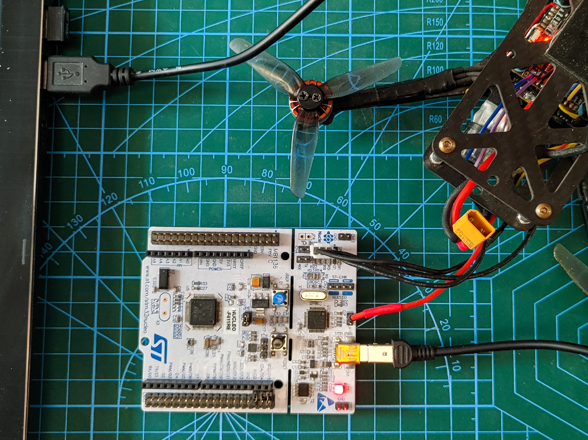](images/hardware/1663152568459945-1.jpg)<custom_caption>Nucleo board has ST-Link programmer</custom_caption>

[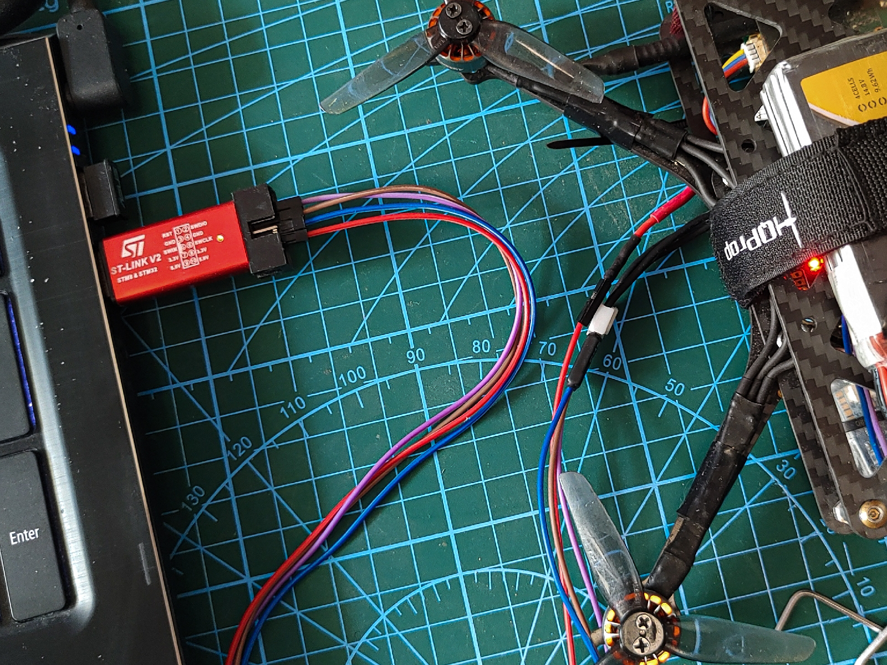](images/hardware/1663152573604436-0.jpg)<custom_caption>ST-Link dongle</custom_caption>

And this is all you need to flash your idea into embedded systems!

But sometimes (probably even often) you need to check your program at runtime, set breakpoints, see variables, find errors, etc. That's when you need a DEBUGGER. And yes, one debugger is on the programmer, but that's only one part. In addition, you need a debugger on your computer and for convenience, some software to display and interact with your code (usually IDEs have such built-in, but for VScode we need an extension such as Cortex-Debug).

# Let's make it work!

Key elements:

- Environment for code editing: Visual Studio Code
- Building (within compiling): CMake with Make/Ninja
- Flashing and Debugging: OpenOCD, Cortex-Debug, arm-none-eabi-gdb

## 1st step - VS code

Download VScode: [link](https://code.visualstudio.com/download)

In VScode add extensions: C/C++, CMake Tools, Cortex-Debug:

[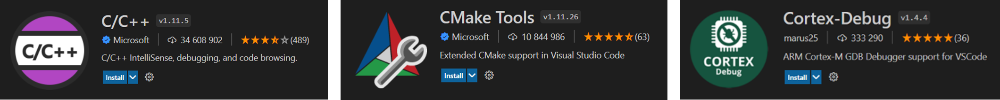](images/dev_1/Obraz15.png)

{: .warning}
If your Windows Username contains non-ASCII letters, before installation of the extensions, check the step with the debugging explanation (end of this chapter - [12th step](#twelfth_step)).

## 2nd step - new folders:

Create folders somewhere on your computer for the next steps:

For example:

- _C:\tools\OpenOCD_
- _C:\tools\CMake_
- _C:\tools\ Arm GNU Toolchain_

## 3rd step - Arm GNU Toolchain:

Download and install Arm GNU Toolchain: [link](https://developer.arm.com/downloads/-/gnu-rm)

<custom_caption>Choose the location on your computer</custom_caption>

<custom_caption>Remember to add the path to the environment variable (checkbox)</custom_caption>

Now you have and can use _arm-none-eabi-gdb_ which is a GNU debugger for ARM processors.

## 4th step - OpenOCD {#fourth_step}

Download OpenOCD: [link](https://openocd.org/pages/getting-openocd.html)

[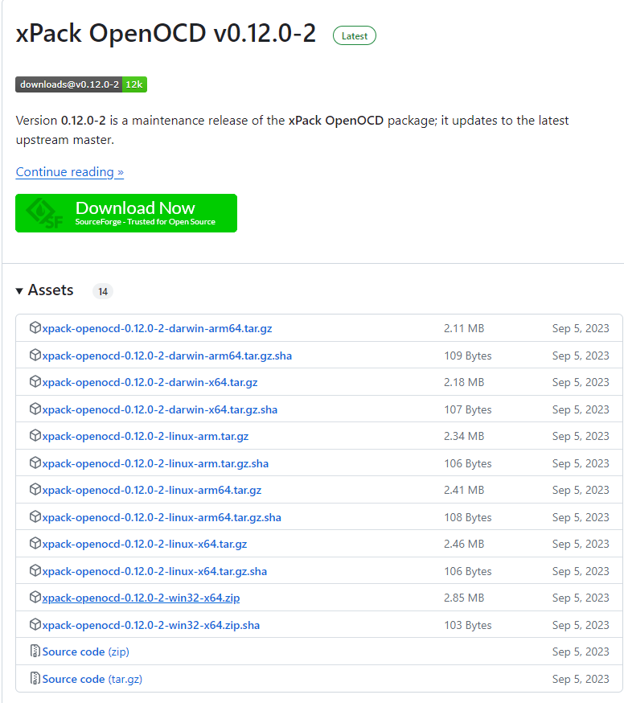](images/dev_1/openOCD.png)

Next, unzip and copy and paste into _C:\tools\OpenOCD_
This software supports flashing and debugging a wide variety of platforms.

## 5th step - CMake

CMake download and install: [link](https://cmake.org/download/)

Install it in your newly created folder _C:\tools\CMake_.

[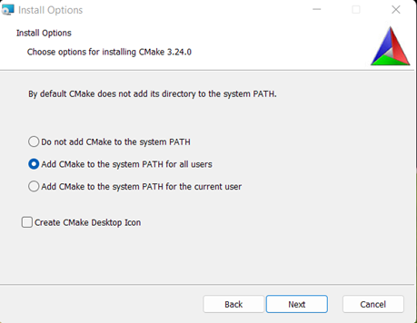](images/dev_1/image.png)
<custom_caption>Remember to add the path to the environmental variables</custom_caption>

### What is CMake?

{: .no_toc }

CMake is an extensible, open-source system that manages the build process in a platform-independent and compiler-independent manner.
This is not building software – those are: _Make_, _Ninja_… But CMake is a “build generator” allowing you to use any building program you like and create in a more convenient way final main.elf or _main.bin_ or _main.hex_ or any other executable programs.
More information here: [link](https://cmake.org/overview/)

## 6th step - Ninja or Make

Of course, you can use any other CMake-compatible building software but those 2 are popular and good enough to start.

Ninja download: [link](https://github.com/ninja-build/ninja/releases)
Next, unpack and save ninja.exe in one of the previous bin folders (I've saved it in _C:\tools\CMake\bin\ninja.exe_).

For "Make" you have a few options ([link](https://www.technewstoday.com/install-and-use-make-in-windows/)) but I've used MinGW downloaded from [link](https://osdn.net/projects/mingw/releases/):

MinGW is a little bit more complicated than Ninja: unpack (I've created a new folder _C:\tools/MinGW_) and install (uncheck GUI installation). Next, in the folder with “_mingw-get.exe_” (in my case C:\tools/MinGW/bin) open the cmd window and type: “_mingw-get install mingw32-make_”. After installation, you can save this (_mingw32-make.exe_ and all other files from _...\MinGW\bin directory_) together with _ninja.exe_. The rest of the MinGW folder can be deleted:

<custom_caption>Uncheck "... support for the graphical user interface"</custom_caption>

<custom_caption>Wait to the end of the installation</custom_caption>

[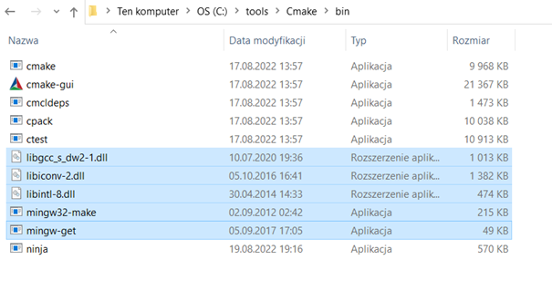](images/dev_1/Obraz16.png)
<custom_caption>Copy required files (I copied them into Cmake bin directory)</custom_caption>

Of course, you can make separate folders for these build programs or even for each individual, but remember to add their paths into environmental variables (see the next step on how to do it).

## 7th step - Environment variables

The next important step is to set up all environment variables and add all new tools to the PATH. In this step, we will show our system where it can find some useful tools so we can use them in many places and programs.

Firstly, open “_Edit environment variables_” and click “_Environment variables_”.

Now, you can see all the variables that your system recognizes in any program. On the top, you have variables assigned to the currently active user, and on the bottom variables for the whole system. If you checked in the installers to add paths to the environment variables you have to add the path to OpenOCD (_C:\tools\OpenOCD\bin_) and you should be ready to go. Nevertheless, you can check if everything is correct. Also, we want to make one change here.

If you’ve created similar folders, you should have similar paths (some of these paths can be saved as system variables - you can leave them there or move everything to one place):

<custom_caption>Click "Edit"</custom_caption>

<custom_caption>Check all of your paths</custom_caption>

To simplify further usage, I will delete the path to Arm Toolchain (_C:\tools\Arm GNU Toolchain\10 2021.10\bin_) and create my variable (_ARMGCC_DIR_):

<custom_caption>Create a new variable and fill in its name and the path</custom_caption>

This is not necessary (you can always use a full path) but can be useful.

## 8th step - Checking everything

Before configuration, we will check if everything is properly installed:
Go into the bin folder in your OpenOCD directory (_C:\tools\openOCD\bin_)
Next, turn on the cmd window:

[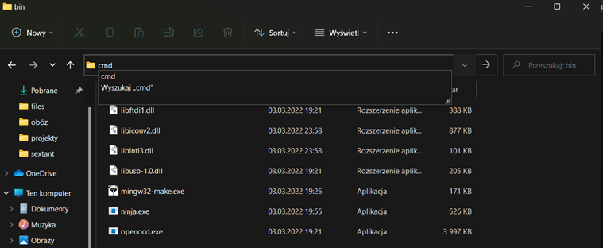](images/dev_1/Obraz8.png)<custom_caption>Open command window in specific directory</custom_caption>

And check if everything works (write `openocd.exe`):

[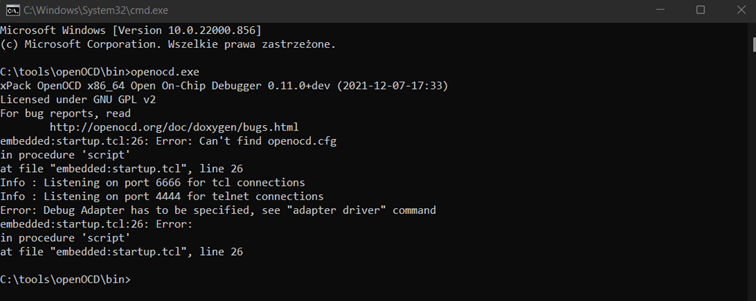](images/dev_1/Obraz9.png)

If everything works you can go further, if not repeat the earlier steps [4th](#fourth_step) step - OpenOCD installation](#fourth_step).

Then, go into the bin folder in your CMake directory (\*C:\tools\CMake\bin), and turn on the cmd window:

[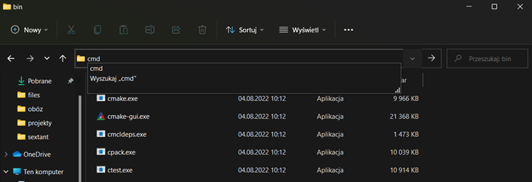](images/dev_1/Obraz10.png)

And check if everything works (write `cmake.exe`):

[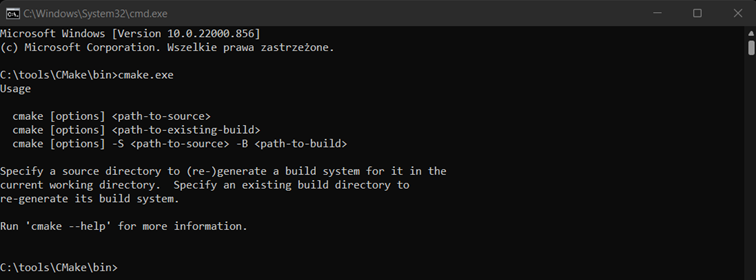](images/dev_1/Obraz11.png)

Then in the bin folder in your ARM GNU Toolchain directory (_C:\tools\Arm GNU Toolchain\10 2021.10\bin_), turn on the cmd window:

[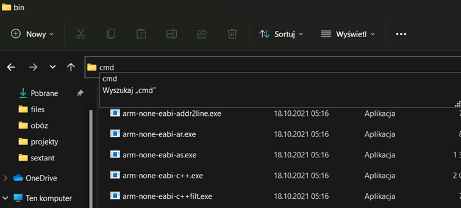](images/dev_1/Obraz12.png)

And check if everything works (write `arm-none-eabi-gdb.exe`):

[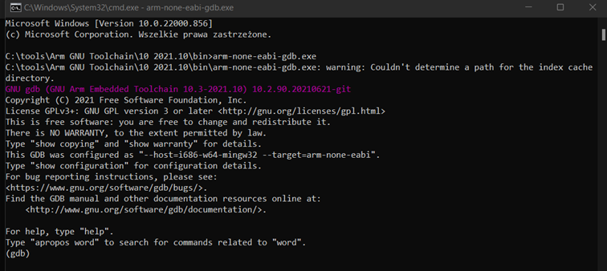](images/dev_1/Obraz13.png)

{: .note}
It can happen that you’re missing Python 2.7. If so - download and install it ([link](https://www.python.org/downloads/)). After that, everything should be working properly.

Also, you can check if everything is in the right place `where cmake` `where arm-none-eabi-gcc` `where openocd` `where ninja` `where mingw32-make`:

[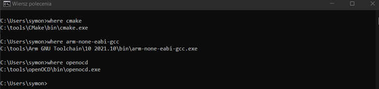](images/dev_1/Obraz14.png)<custom_caption>If environmental variables are set correctly you should be able to check it in any directory</custom_caption>

or just check the versions of installed programs `cmake --version` `ninja --version` `openocd -v` `mingw32-make -v` `arm-none-eabi-gcc -v`:

<custom_caption>Results depend on versions you have installed</custom_caption>

If you have problems in 2 last tests and no problems in the previous ones that means your environmental variables are not set correctly. Check them for missing paths and check if they are user variables or system variables. If user ones you should pay attention to which directory you call these commands since they are not visible for all users (in my case it has to be _C:\Users\symon_).

## 9th step - Setup Visual Studio Code

When you have everything installed, we can go to the configuration in VScode. First, check if you have all the essential extensions:

[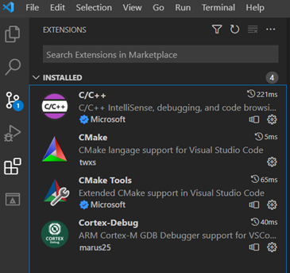](images/dev_1/Obraz17.png)

Now, is the perfect time to open a project. You can create a new one if you can (how to do this in [the next post](STM32_dev_part_2)). For now, we don’t want to configure everything from scratch, so it is better to clone my project from GitHub (if you don’t know how to do this check [the git chapter](#git_chapter)).

When you’ve opened the project, you can see all folders on the left side of the screen.

If everything is installed it is time to choose the compiler. You can either click on the bottom bar or press _Ctr+Shift+P_ (open Command Palette) and type: `CMake: Scan for Kits`:

If your _ARM_GCC_DIR_ variable is in the Path it should find your compiler and set it.

[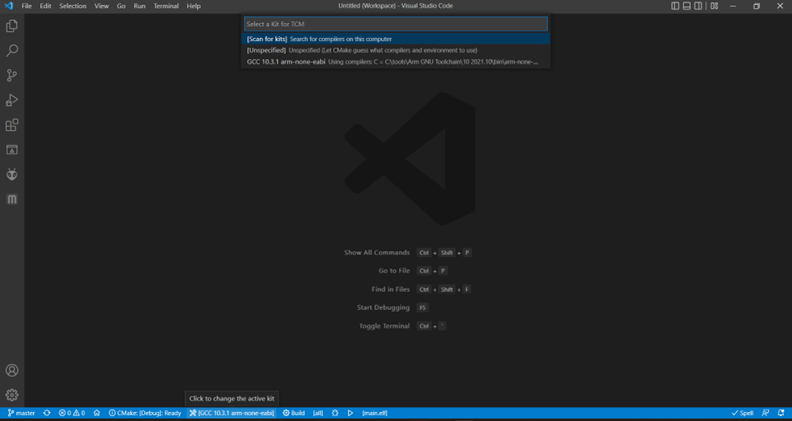](images/dev_1/scan_for_kits.png)

## 10th step - Configure CMake and build your program

If you want to use Ninja or any other program you need to change a value in “_cmake.generator_” in _/.vscode/settings.json_ (for the first time leave it as is if you’ve installed MinGW):

[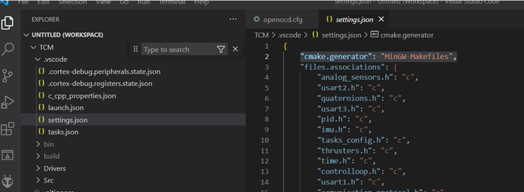](images/dev_1/Obraz7.png)

Now, open the command palette and type: `CMake: Configure` or `CMake: Delete Cache and Reconfigure`:

[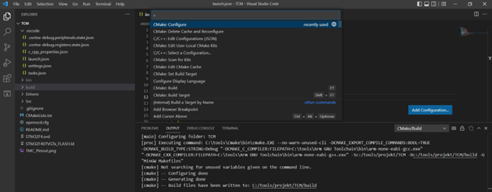](images/dev_1/Obraz18.png)

If there is no error, it is time to try building the project:

[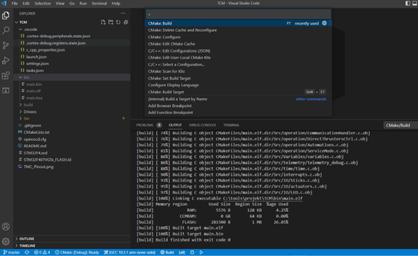](images/dev_1/Obraz19.png)

There should be no error and 3 files should be created in the bin directory - _main.bin_, _main.elf_, and _main.hex_.

## 11th step - flashing program into your device

After building we’re ready to flash our program into the microcontroller. But first, let’s see what is inside _/.vscode/tasks.json_:

Sometimes you want to have different options during building or flashing programs. Tasks are just sets of commands which you can execute at once. It allows you to declare a few different building processes and easily change between them. There are a lot of options, but in a nutshell, it makes things simpler and faster. I’ve created a few tasks for my project. Let's try one of them:

press _Ctr+Shift+B_ next choose _clean&build_:

[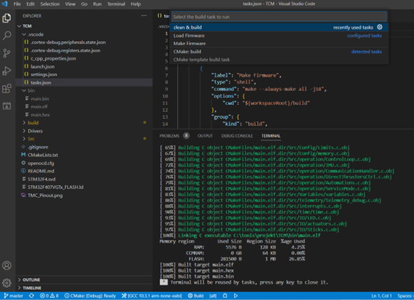](images/dev_1/Obraz20.png)

Now you’ve built the project with clearing at the beginning. As you can see there is an option to “_Load Firmware_” and since we’ve got a built project we can do this. So, connect your board to the Nucleo programmer (or any st-link programmer) and try “_Load Firmware_”.

{: .no_toc}

### If an error occurs: {#st_drivers}

Probably, you don’t have drivers for ST-Link. You can check it - by going into the device manager and see if your computer recognizes your device:

[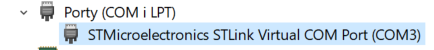](images/dev_1/Obraz21.png)
<custom_caption>If drivers are installed STM32 programmer should be recognized either as a COM port or USB device</custom_caption>

If not, you need to download either the STM32CubeProgrammer or the ST-LINK Utility: [link](https://www.st.com/en/development-tools/st-link-v2.html#tools-software). Download and install one of these programs:

After that, your computer should recognize the STLink device. Now, you should be able to flash your program without any problem.

## 12th step - Debugging {#twelfth_step}

After all this setup, it is time for debugging. Everything should be working, so press the green play button or press _F5_ and after a while, the program should stop at the beginning of the _main()_:

[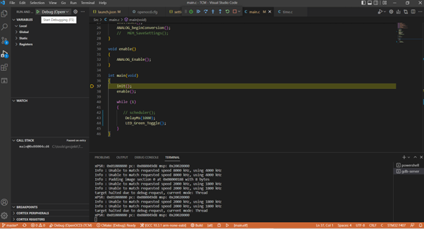](images/dev_1/Obraz23.png)

{: .warning}
Problem occurs when your User Name contains non-ASCII letters. No matter where have you installed VScode itself _.vscode_ directory always will be created _C:\Users\\**your_user_name**\.vscode_. Inside, there is a folder for all extensions _C:\Users\\**your_user_name**\.vscode\extensions_. The Cortex Debug extension will crash when the path contains any non-ASCII letter. Moreover, there is no possibility to move the _.vscode_ folder. At least the directory of extensions can be changed (see below).

Go into the environmental variables and add the new variable _VSCODE_EXTENSIONS_ with the path to the folder where you want to save all extensions:

[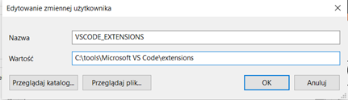](images/dev_1/Obraz24.png)

Now you can download all extensions for VScode and start debugging (If you installed them before you have to reinstall).

# How to use Git(Hub) with VScode? {#git_chapter}

For big projects, it is important to take care of new versions of software. Also, all contributors must be able to work on their copy of a program that will not affect the main version. On the other hand, often you need to upload new versions of software and it would be nice for others to be able to update code on their machine without disturbing their adjustments. The answer to all of these problems is Git. And it is really simple to set it up in VScode!

First of all download and install the Git: [link](https://git-scm.com/download/win)

I suggest creating a next folder: _C:\tools\GitHub_

{: .note}
If you use the installer as it is, Git will install on the default path _C:\Program Files\Git_. It is not a problem but if you want to specify a directory you need to open the cmd window in the folder where you’ve got git installer and type `git_installer_name.exe /DIR=“your\path\to\GitHub”` (see the screenshot below).

[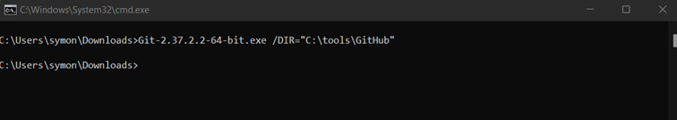](images/dev_1/Obraz25.png)

Once you've installed git. It’s time to add it to the Path. By default, Git is adding its path to system variables. If you want, you can delete that one and add the same path into variables for user variables to have everything in one place (but the default variable for a whole system is also perfectly fine):

[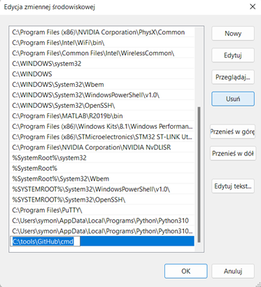](images/dev_1/Obraz26.png)

[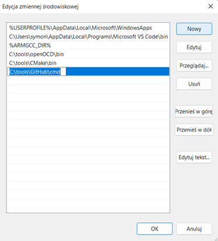](images/dev_1/Obraz27.png)

Now you can open the command window anywhere and use `git`:

[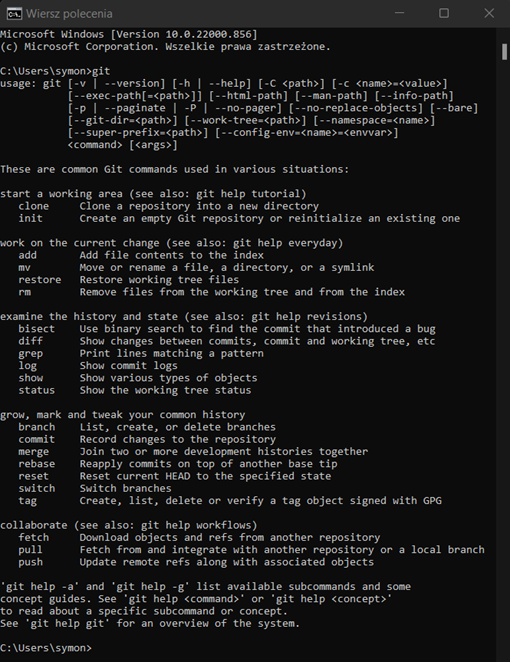](images/dev_1/Obraz28.png)

Now, we can use it to clone a repository into your local PC. For that, we need a link to this repository,
so go to the repository of interest:

Next, you create a folder for your project somewhere on your computer. Go there, turn on the cmd window, and type: `git clone http://github.com/your/repository/link`:

Usually, this is enough but sometimes you need to authenticate that you have got access to the repository.

At default, you clone the whole Repo with all branches but if you want to operate only on specified you can type: `git clone --branch <your-branch-name> --single-branch  <your-remote-repo-url>`:

More about cloning: [link](https://www.freecodecamp.org/news/git-clone-branch-how-to-clone-a-specific-branch/)

In the [next part](STM32_dev_part_2) of this post, I will explain how to create a new project for any STM32 MCU.
