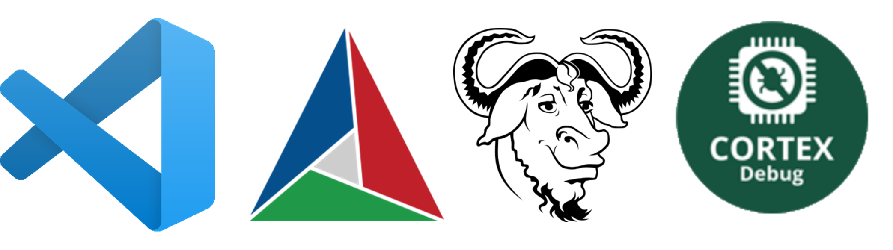

<!-- comment or image allows {: .no_toc} to work correctly  (don't ask me why) -->

{: .no_toc}
[](images/dev_1/noide.png)

{:.no_toc}

# STM32 development workflow part 2

<details open markdown="block">
  <summary>
    Table of contents
  </summary>
  {: .text-delta }
1. TOC
{:toc}
</details>

# Introduction

So far, everything was working only if you were using the same MCU as mine - STM32F405RGT. Since, arguably, not everybody is programming drones on this exact MCU, in this post I will show how to set up a project from scratch and along this way reveal a bit of the mystery of how everything works and what was the purpose of some files from a previous post. Luckily this will be the last part of this complicated process and ideally, after that, you should be able to develop any STM32-based board.

# Create a project structure

Open the folder where you want your project and create new folders: _Src_, _Drivers_, _bin_, _build_, _link_. I keep the same folder structure among all projects so that I can just copy an existing one and change only MCU-specific parts. Of course, you can have different folder structures, but be aware of that and make suitable adjustments throughout this post.

[](images/dev_2/Zrzut%20ekranu%202024-02-19%20144703.png)<custom_caption>Basic project's structure</custom_caption>

# Add files

The next step is downloading and adding all essential files to the project. Let's start with linker scripts (_.ld_ files). These provide instructions to the linker on how to combine object files (files generated by a compiler) into an executable program or a library. It contains information about stack, heap sizes, memory layout, etc. To get linker scripts you can either write them yourself or use pre-generated from some IDE (or copy them from someone's project).
Let's use CubeMX since you will likely be using it in some scenarios anyway. Just create a new empty project for your MCU and in the main branch, _.ld_ files can be found. Copy them into your project's _link_ folder.

[](images/dev_2/Zrzut%20ekranu%202024-02-19%20161529.png)<custom_caption>Copy linker scripts</custom_caption>

Next, to use CMSIS-Core we need to add a bunch of header files and two source files (more about it here: [link](https://www.keil.com/pack/doc/CMSIS/Core/html/using_pg.html)). In essence, they are necessary to start the microcontroller up, set default values, and provide constants, structures, and functions that you know from the reference manual. In my case, these files are:

- _startup_stm32f411xe.s_,
- _system_stm32f4xx.c_,
- _system_stm32f4xx.h_,
- _stm32f4xx.h_,
- _stm32f411xe.h_,
- all files from the _CMSIS/Include_ folder (see screenshot below).

[](images/dev_2/Zrzut%20ekranu%202024-02-20%20235956.png)

When you see 'x' in these names, files are relevant for any MCU that matches the name, disregarding parts where the 'x' is. It is possible because many MCUs are built similarly and only a few things need to be specified for the exact MCU and these are chosen by specifying a special constant during compilation (-DSTM32F411xE) - more about it later. I copied these files from the blank project in CubeIDE to my project:

[](images/dev_2/Zrzut%20ekranu%202024-02-21%20005215.png)

The last file is a _.svd_ file (_System View Description_) - it is not essential and you can compile, flash, and even debug code without it. However, if you want to have access to the registers' values, which are often essential for debugging purposes, this file is required. In general, you can find it in many places on the Internet ([an example](https://github.com/tinygo-org/stm32-svd/tree/main/svd)) but a good idea is to check the ST [site](https://www.st.com/content/st_com/en.html) and download it from the manufacturer.

[](images/dev_2/Zrzut%20ekranu%202024-02-19%20154347.png)<custom_caption>Look for your MCU</custom_caption>

[](images/dev_2/Zrzut%20ekranu%202024-02-19%20154617.png)<custom_caption>Choose the correct one</custom_caption>

[](images/dev_2/Zrzut%20ekranu%202024-02-19%20154739.png)<custom_caption>Download .svd files package</custom_caption>

Then choose the right file and copy it into the main branch:

[](images/dev_2/Zrzut%20ekranu%202024-02-19%20155304.png)<custom_caption></custom_caption>

# CMake

Next what you need is _CMakeList.txt_. This file contains all instructions for CMake to conduct a building process for your project. You can write it from scratch or copy mine and make some adjustments.

```cmake
cmake_minimum_required(VERSION 3.16)
set(CMAKE_SYSTEM_NAME Generic)

# turn off compiler checking (assume that the compiler is working):
set(CMAKE_C_COMPILER_WORKS TRUE)
# set C standard:
set(CMAKE_C_STANDARD 17)
# set path where binary files will be saved:
set(BUILD_DIR ${CMAKE_SOURCE_DIR}/bin)
set(EXECUTABLE_OUTPUT_PATH ${BUILD_DIR})

# create targets variables:
set(TARGET "main")
set(TARGET_ELF "${TARGET}.elf")
set(TARGET_HEX "${TARGET}.hex")
set(TARGET_BIN "${TARGET}.bin")

# create project name and define required languages for building (C and assembler - ASM should be at the end):
project(MY_PROJECT C ASM)

# assign paths into variables:
set(MAIN_SRC_DIR "${CMAKE_SOURCE_DIR}/Src")

set(LINKER_DIR "${CMAKE_SOURCE_DIR}/link")
set(LD_include "-lnosys -L${LINKER_DIR}")
set(linker_script "${LINKER_DIR}/STM32F411RETX_FLASH.ld")

set(MCU_flags   "-mcpu=cortex-m4 -mfpu=fpv4-sp-d16 -mfloat-abi=hard -mthumb ")

# C definitions (additional arguments parse with cmd line):
set(C_DEFS " -DSTM32F411xE ")
# C-specific flags:
set(C_flags     "${MCU_flags} ${C_DEFS} -Wall -fdata-sections -ffunction-sections -fanalyzer ")
# Assembler-specific flags:
set(AS_flags    "${MCU_flags} -Wall -fdata-sections -ffunction-sections ")
# Linker's flags:
set(LD_flags    "${MCU_flags} -specs=nano.specs -specs=nosys.specs -T${linker_script} ${LD_include} -Wl,--print-memory-usage -u _printf_float ")

# CMake variables setup:
set(CMAKE_C_FLAGS "${C_flags}")
set(CMAKE_ASM_FLAGS "${AS_flags}")
set(CMAKE_EXE_LINKER_FLAGS "${LD_flags}")

# add all your executable files:
add_executable(${TARGET_ELF}
    Src/startup/startup_stm32f411retx.s
    Src/startup/system_stm32f4xx.c
    Src/main.c
)

# include all directories where header files occur:
target_include_directories(${TARGET_ELF} PUBLIC
    Src
    Src/startup
    Drivers
    Drivers/Include
)

# link GNU c and m ("math") libraries (more here: https://www.gnu.org/software/libc/manual/pdf/libc.pdf):
target_link_libraries(${TARGET_ELF} PUBLIC c m)

# set shortcut for command:
set(OBJCOPY arm-none-eabi-objcopy)
# make new targets .hex and .bin from .elf file:
add_custom_target(${TARGET_BIN} ALL COMMAND ${OBJCOPY} -O binary -S ${BUILD_DIR}/${TARGET_ELF} ${BUILD_DIR}/${TARGET_BIN})
add_custom_target(${TARGET_HEX} ALL COMMAND ${OBJCOPY} -O ihex -S ${BUILD_DIR}/${TARGET_ELF} ${BUILD_DIR}/${TARGET_HEX})

# define dependencies so that .hex file is created after .elf and .bin as the last one:
add_dependencies( ${TARGET_HEX} ${TARGET_ELF})
add_dependencies(${TARGET_BIN} ${TARGET_ELF} ${TARGET_HEX})
```

For each project, you only need to adjust _MCU_flags_, _C_DEFS_, _linker_script_ name, and executables _paths_.

_MCU_flags_ are used to tell the compiler about the used family of MCU, FPU type, and some other things. How do you know which flags are required for your MCU? You can either check it on the Internet or use CubeMX and copy flags from the generated project.

For the second option, generate an empty project for your MCU again but remember to choose _Project Manager->Project->Toolchain/IDE = Makefile_.

[](images/dev_2/Zrzut%20ekranu%202024-02-27%20225830.png)<custom_caption></custom_caption>

Then search in the generated Makefile for _CFLAGS_ and copy them into your _CMakeLists.txt_.

[](images/dev_2/Zrzut%20ekranu%202024-02-27%20231122.png)<custom_caption></custom_caption>

In the same file, a few lines below you can find _C_DEFS_ from which only the first one is important (for more advanced projects you may want some of the other definitions). This defines some configurations that are specific to your MCU in _stm32f4xx.h_ file (or similar for your MCU family).

[](images/dev_2/Zrzut%20ekranu%202024-02-27%20232210.png)<custom_caption></custom_caption>

Next update the _linker_script_ variable accordingly to your _.ld_ file (_STM32F411RETX_FLASH.ld_ in my case) and add all of your executables - remember about the assembler startup file (_.s_-ended file).

[](images/dev_2/Zrzut%20ekranu%202024-02-27%20232904.png)<custom_caption></custom_caption>

# Building

Now it is time to build the project. We can use the terminal _Ctrl+Shift+\`_ in the build directory (`cd ./build`) and write: `cmake --build .`.

[](images/dev_2/Zrzut%20ekranu%202024-02-27%20233755.png)<custom_caption>If everything is ok you should have similar notifications</custom_caption>

# First task

You may presume that it is not particularly convenient to write everything in the cmd line each time you want to build your program (you need to be in the right directory and remember the commands). Therefore VScode allows you to set some presets (called tasks) and use them with shortcuts. Let's create the first task for building our program:

[](images/dev_2/Zrzut%20ekranu%202024-02-27%20234332.png)<custom_caption></custom_caption>

[](images/dev_2/Zrzut%20ekranu%202024-02-27%20234332.png)<custom_caption></custom_caption>

One file is added (_.vscode/tasks.json_) containing all your tasks. You can add more or modify the existing ones but for now, just press _Ctr+Shift+B_ and build your program. There should be the same notifications as building from the terminal (completed builds and statistics of used memory).
If you want to use my task "_Make Firmware_" for building, delete the existing one (from _.vscode/tasks.json_) and paste the code below (it gives no problems with other tasks that we will soon add).

```json
{
  "version": "2.0.0",
  "tasks": [
    {
      "label": "Make Firmware",
      "type": "shell",
      "detail": "build program",
      "command": "cmake --build .",
      "options": {
        "cwd": "${workspaceRoot}/build"
      },
      "group": {
        "kind": "build",
        "isDefault": true
      },
      "problemMatcher": {
        "base": "$gcc",
        "fileLocation": ["absolute"]
      }
    }
  ]
}
```

# OpenOCD

Having built our program it is time to load it into a microcontroller - so far everything was made on your host computer (you don't need to have your MCU connected).

The _bin_ folder contains binary files (zeros and ones) that could be transferred to any MCU (however it would transferred successfully only for your type of MCU). Moreover, different programming devices use various interfaces (_st-link-v1_, _st-link-v2_, _jtag_ ...) and openOCD supports many of these options. Consequently, you have to tell openocd what kind of target device and interface you want to use. You can write it in the terminal (in the project's main directory):
`openocd.exe -f interface/stlink-v2.cfg -f target/stm32f4x.cfg -c 'program ./bin/main.bin verify reset exit 0x08000000'`.

Remember to choose the target (stm32f4x.cfg) and interface (_stlink-v2.cfg_) respectively to the used MCU (you can find it [here](https://github.com/hikob/openocd/tree/master/tcl/target)) and programmer (for Nucleo's programmer leave _stlink-v2.cfg_).

[](images/dev_2/Zrzut%20ekranu%202024-02-28%20000931.png)<custom_caption></custom_caption>

## Task for flashing

For me, rather long command to write each time you want to flash your program, so let's make a task for that (remember to choose the correct interface and target):

```json
		{
            "label": "Load Firmware",
            "type": "shell",
            "detail": "flash into MCU",
            "command": "openocd.exe",
            "args": [
                "-f",
                "interface/stlink-v2.cfg",
                "-f",
                "target/stm32f4x.cfg",
                "-c",
                {
                    "value": "program ./bin/main.bin verify reset exit 0x08000000",
                    "quoting": "strong"
                }
            ],
            "options": {
                "cwd": "${workspaceRoot}"
            },
            "group": {
                "kind": "build",
                "isDefault": true
        	}
    	}
	]
}
```

## tasks.json

If you want, you can add 2 more tasks - one for rebuilding a whole project and the second one to combine building and flashing into one task:

```json
{
    "label": "Clean & Build",
    "type": "shell",
    "detail": "clean first and build program",
    "command": "cmake --build . --clean-first ",
    "options": {
      "cwd": "${workspaceRoot}/build"
    },
    "group":{
      "kind": "build",
        "isDefault": true
    },
    "problemMatcher": {
      "base": "$gcc",
      "fileLocation": ["absolute"]
  }
},
{
    "type": "shell",
    "label": "Build & Load",
    "dependsOrder": "sequence",
    "dependsOn": ["Make Firmware", "Load Firmware"],
    "group": {
      "kind": "build",
      "isDefault": true
    },
    "detail": "build and load program into MCU"
}
```

Now when you press _Ctrl+Shift+B_ and choose between the tasks:

[](images/dev_2/Zrzut%20ekranu%202024-02-28%20003936.png)<custom_caption></custom_caption>

# Debugging

For debugging, we need to provide some information: where cortex-debug extension can find the _.svd_ file, what kind of interface we are using, etc. For this purpose, VScode has a _launch.json_ file. Press _Ctrl+Shift+P_ and write `Debug: Add Configuration...`.

[](images/dev_2/Zrzut%20ekranu%202024-02-20%20184442.png)<custom_caption></custom_caption>

A new file is created (_.vscode/launch.json_). Delete the default config code and copy the below one:

```cmake
"version": "0.2.0",
    "configurations": [
     	{
          // name for debug settings:
          "name": "Debug (OpenOCD)",
          // use cortex-debug:
          "type": "cortex-debug",
          "request": "launch",
          // use openocd for connection:
          "servertype": "openocd",
          "cwd": "${workspaceFolder}",
          // where program will stop (at entrance to main function):
          "runToEntryPoint":"main",
          "showDevDebugOutput": "both",
          // before debugging build program (see task.json):
          "preLaunchTask": "Make Firmware",
          // path for .elf binary:
          "executable": "${workspaceFolder}/bin/main.elf",
          // turn on live variables:
          "liveWatch": {
          	"enabled": true,
          	"samplesPerSecond": 4
          },
          "configFiles": [
            "${workspaceFolder}/openocd.cfg"
          ],
          // .svd file name that you want to use:
          "svdFile":"STM32F411.svd"
    	}
	]
}
```

Remember to change the name of the .svd file to match with your. After that, we need to add the last file to the main branch - _openocd.cfg_ file, with 4 lines of code. Cortex-debug needs it to have info about the interface etc.. Anyway, create a file and copy my code into it (adjust for your interface and target):

[](images/dev_2/Zrzut%20ekranu%202024-02-26%20221514.png)<custom_caption></custom_caption>

Now, let's debug - press _F5_ and enjoy. On the left, you can find all the interesting stuff (live watch, registers' values, variables, etc.) but for now, you can set breakpoints and iterate through your code:

[](images/dev_2/Zrzut%20ekranu%202024-02-20%20191531.png)<custom_caption></custom_caption>

This is the end of the configuration. You can program, build, flash, and debug your code 😊

# Adding HAL library

It is worth remembering that using HAL for programming your MCU is not essential. I have personally created a whole software for a flying drone only on registers. However, at some point (for me, it was adding USB handling), it became too impractical not to use it. Therefore, as much as I think writing your libraries is enlightening and leads to a better understanding of algorithms and programming itself, it is not the way for casual projects. Having said that, let's add the HAL library to the project.

Once more, let's use an empty project from CubeMX. Things worth changing in CubeMX: clock configuration (to make your MCU run with desired frequency) and _Project Manager->Code Generator->STM32Cube MCU...packs = Copy all used libraries into the project folder_.

Doing so will generate a folder with a whole HAL library not only with basic functions (since the project is empty and no peripheries are used).

[](images/dev_2/Zrzut%20ekranu%202024-03-09%20103323.png)<custom_caption></custom_caption>

Next, we can copy all the necessary files: _stm32f4xx_hal_conf.h_, _stm32f4xx_it.h_, _stm32f4xx_hal_msp.c_, _stm32f4xx_it.c_ and a whole folder _STM32F4xx_HAL_Driver_:

[](images/dev_2/Zrzut%20ekranu%202024-03-09%20104637.png)<custom_caption></custom_caption>

You can put these files wherever you want (remember to change paths respectively) in my case, the structure looks like this:

[](images/dev_2/Zrzut%20ekranu%202024-03-09%20105220.png)<custom_caption></custom_caption>

Now you have all source code and header files to use HAL library but there are a few additional steps to make it work. Firstly, add all new paths into _CMakeLists.txt_ - you can write it by hand but the easiest way is to copy it from the CubeMX project. Go to Makefile and find "_C_SOURCES_". Now you have paths to all required HAL files:

[](images/dev_2/Zrzut%20ekranu%202024-03-09%20110645.png)<custom_caption></custom_caption>

Copy them with essential changes to your paths (in my case _stm32f4xx_hal_msp.c_ and _stm32f4xx_it.c_ have different paths). Also, add new headers directories (below executables):

[](images/dev_2/Zrzut%20ekranu%202024-03-09%20111347.png)<custom_caption>Add paths to executables and headers directories</custom_caption>

Secondly, we need to add 2 functions: `SystemClock_Config(void)` and `Error_Handler(void)`. Just copy them from the _main.c_ generated by CubeMX to your _main.c_:

[](images/dev_2/Zrzut%20ekranu%202024-03-09%20112207.png)<custom_caption></custom_caption>

Next, add definitions of these functions at the top of the _main.c_.
The last step is to replace `all #include "main.h"` with `#include "stm32f4xx_hal.h"` (in files: _stm32f4xx_it.h_, _stm32f4xx_hal_msp.c_ and _main.c_).

[](images/dev_2/Zrzut%20ekranu%202024-03-09%20115308.png)<custom_caption>Add functions and declarations, change #include "main.h" to #include "stm32f4xx_hal.h"</custom_caption>

Now, everything should be working (building with no problem) and you can use the HAL library. However, if you want to use any other peripheral you will need to add adequate paths in _CMakeLists.txt_ (I recommend configuring these peripherals in CubeMX and next copy-paste all paths from the generated _Makefile_ - check the example below).

## A simple example with HAL library

A simple example of toggling LED on my Nucleo (F411RE) board:

1.  Configure PA5 (LED2 is connected to it) as output,
1.  Configure the clocks,
1.  In _Project Manager->Advanced Settings_ check if you use only the HAL library, not the LL (let's keep it simple for now),
1.  Choose _Project Manager->Project->Toolchain/IDE = Makefile_,
1.  Generate the code,
1.  Copy all additional paths from the Makefile (HAL handling for GPIO was added before so only the path to _gpio.c_ needs to be added),
1.  Copy new files (_gpio.c_ and _gpio.h_) and change `#include "main.h"` to `#include "stm32f4xx_hal.h"`,
1.  Include _gpio.h_ into your _main.c_,
1.  Add `MX_GPIO_Init()` and write a toggle routine in the main loop,
1.  Build and flash your program.

[](images/dev_2/Zrzut%20ekranu%202024-03-09%20121228.png)<custom_caption>1.</custom_caption>

[](images/dev_2/Zrzut%20ekranu%202024-03-09%20121417.png)<custom_caption>2.</custom_caption>

[](images/dev_2/Zrzut%20ekranu%202024-03-09%20121552.png)<custom_caption>3.</custom_caption>

[](images/dev_2/Zrzut%20ekranu%202024-02-27%20225830.png)<custom_caption>4.</custom_caption>

[](images/dev_2/Zrzut%20ekranu%202024-03-09%20125035.png)<custom_caption>6. 7. 8.</custom_caption>

[](images/dev_2/Zrzut%20ekranu%202024-03-09%20125705.png)<custom_caption>9.</custom_caption>

[](images/dev_2/Zrzut%20ekranu%202024-03-09%20130223.png)<custom_caption>10.</custom_caption>

{: .no_toc}

<h1 style="text-align: center;">
 This is the end.
</h1>

# Summary

All in all, after these 2 posts, you can create the project from scratch for any MCU you want.

The project described in this post can be found on my GitHub: [link](https://github.com/symonb/Nucleo-F411RE-simple-project) - take anything you like.

There was a lot of information and many complicated tools, each of which could have a separate post. Therefore most of the descriptions and options are kept to a minimum. If you want to learn more, presumably you now understand enough to ask good questions and find the answer on your own. For a good start here are some links for materials that I found really interesting:

- [https://youtu.be/gdRmETe4QEo?si=BZKdhIi45LgpXG7V](https://youtu.be/gdRmETe4QEo?si=BZKdhIi45LgpXG7V)
- [https://github.com/MaJerle/stm32-cube-cmake-vscode](https://github.com/MaJerle/stm32-cube-cmake-vscode)

# Extras

## Compiler update

So far we have been using a compiler from 07.2021 but since then GCC has been upgraded a few times so why not take advantage of a new compiler and use it for our projects?

Everything is pretty simple - we need to download a new toolchain: [link](https://developer.arm.com/downloads/-/arm-gnu-toolchain-downloads).

[](images/dev_2/Zrzut%20ekranu%202024-02-19%20002829.png)<custom_caption></custom_caption>

Next, install it wherever you want. I decided to keep everything in one place _C:\tools\Toolchain GNU Arm_:

[](images/dev_2/Zrzut%20ekranu%202024-02-19%20003144.png)<custom_caption></custom_caption>

Then remember to check if the path to the _bin_ folder was added into environmental variables and we are ready to use our new compiler.

Finally, it is necessary to let to know CMake about a new compiler:

[](images/dev_2/Zrzut%20ekranu%202024-03-09%20185421.png)<custom_caption>Choose a compiler with the status bar </custom_caption>

[](images/dev_2/Zrzut%20ekranu%202024-03-09%20190036.png)<custom_caption>Or choose it using the CMake extension </custom_caption>

If you don't have a status bar visible you can change it in the settings:

[](images/dev_2/Zrzut%20ekranu%202024-03-09%20190256.png)<custom_caption></custom_caption>

## VScode tips

### red squiggles

Errors highlighting and autocompletion are handled in VScode by Intellisense. This software is downloaded with a C/C++ extension for VScode (we did it in [part 1](STM32_dev_part_1)). Unfortunately, it often doesn't work properly right after installation. If it doesn't see your header files despite that everything is working and the project can be built that means the Intellisence isn't properly configured. Fortunately, there is a quick solution for that. We need to inform Intellisense to use CMake's files to get paths for all headers that we include. Open _C/C++ Configurations_ (_Ctrl+Shift+P_) either JSON or UI and add `"configurationProvider": "ms-vscode.cmake-tools"` to your configuration.

[](images/dev_2/Zrzut%20ekranu%202024-02-22%20124822.png)<custom_caption>Add this line of code</custom_caption>

Now Intellisense should use information about included headers from _CMkaeLists.txt_ and red squiggles should be gone.

### auto-save and auto-format

VScode allows to set auto-save on each change of focus and simultaneously formatting code to maintain readability. To set it, go to settings and change the auto-save option as well as formatting on after saving option:

[](images/dev_2/Zrzut%20ekranu%202024-03-09%20180636.png)<custom_caption>Choose your favourite option</custom_caption>

[](images/dev_2/Zrzut%20ekranu%202024-03-09%20180503.png)<custom_caption>Enable formatting after saving </custom_caption>
