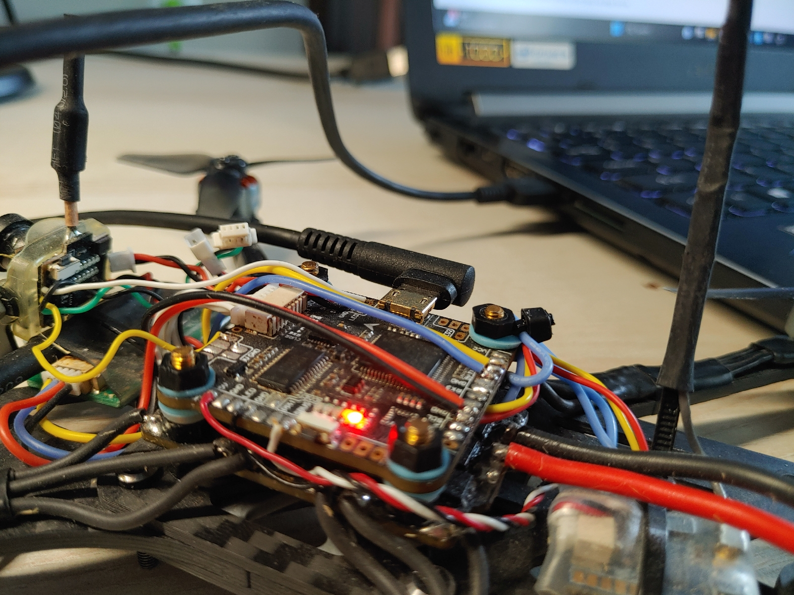
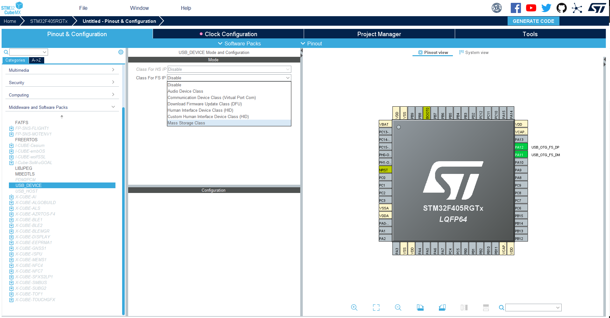
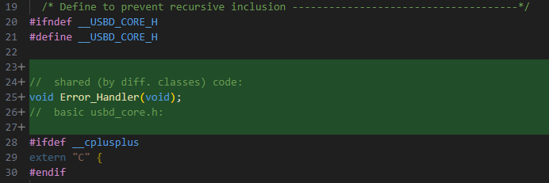
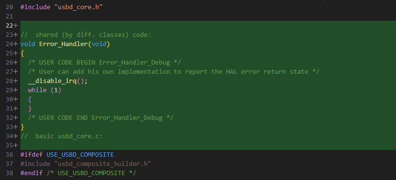
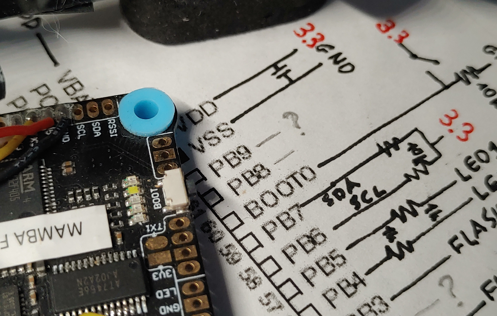

[](images/USB/1692358761772349-0.jpg)

<details open markdown="block">
  <summary>
    Table of contents
  </summary>
  {: .text-delta }
1. TOC
{:toc}
</details>

# USB - basic description

USB has become the predominant interface in contemporary times. This adaptable protocol supports a wide array of peripherals, including flash drives, printers, and keyboards. Its self-configuring nature eliminates the need for manual selection of data format or speed, ensuring reliability and high speed without data loss during transfer. Despite its comprehensiveness, implementing USB can be complex and nontrivial. Thankfully, the availability of ready-to-use libraries simplifies this process. These libraries handle intricate implementation details, allowing seamless integration into projects. In this post, I'll demonstrate how to utilize the STM library for USB and extend its functionality to accommodate multiple classes, enabling the creation of a straightforward "composite" device.

# How to get STM32 Library

USB connection is always held between one host and one or more devices connected to it. STM can handle both of these configurations but in this post, we will discuss only the device option.

Because the USB standard is widely used for multipurpose, a few classes were defined which decide how communication is realized in detail. For our purpose, _Communication Device Class_ (CDC), _Device Firmware Upgrade_ (DFU), and _Mass Storage Class_ (MSC) will be interesting (names are not universal and rather specific for STM32). You can download the libraries directly from the STM site or use CubeMX to generate code with the necessary libraries. Since I need to add the HAL library and generate an initialization code for it, let's use CubeMX.

Create a new project for your MCU. Then select _USB_OTG_FS_ from the _Connectivity_ tab and choose _Device_Only_ for _Mode_.

[](images/USB/Zrzut%20ekranu%202023-08-17%20130800.png)<custom_caption></custom_caption>

Then in the _Middleware and Software Packs_ tab, we select _USB_DEVICE_ and choose one of the interesting classes.

[](images/USB/class.png)<custom_caption></custom_caption>

Then you can choose your preferred settings and generate the code. In the created directory, besides the typical code, there are 2 new folders: _Middlewares_ and _USB_DEVICE_. HAL library (necessary for USB libraries) can be found in the _Drivers_ directory. If you want you can copy these 3 folders into your project (I've created a separate directory for all USB files). Then remember to add all executables and header files in _CmakeList.txt_. Now, if you want to use only one class you are ready to go and you can start using USB (check below [CDC, [MSC](#MSC_example), or [DFU](#DFU_examle) examples).

[](images/USB/Zrzut%20ekranu%202023-08-17%20134409.png)<custom_caption></custom_caption>

# How do you combine more classes {#combine_classes}

Naturally, for bigger projects, there is a need for the usage of 2 or more classes in one program. At the time this post was created, there was no official library from STM32 for the composite devices (combining a few classes). However, projects that use a few classes exist so at least it is possible, right? - Yes, it is possible but requires a bit of changes in libraries.

{: .note}
I highly recommend finding a well-described project with a well-tested and reliable library for USB composite devices (not mine). However, if, like me, you are unable to search for a ready-to-use and reliable solution and have something of the masochist in you - let's dive in!

For convenience, the process will describe combining MSC and CDC libraries but it can be done with any others (at least it worked with DFU).

1.  Use CubeMX and create a project with one of the classes (e.g. CDC), copy folders to your project,
1.  Use CubeMX and create a new project with the next desired class (MSC),
1.  The class folder (MSC) can be copied straight into _\Middlewares\ST\STM32_USB_Device_Library\Class\\_ or wherever you want to keep it,
1.  Files that don't duplicate can be copied _USB_files\USB_DEVICE\App\usbd_storage_if.c_ and _USB_files\USB_DEVICE\App\usbd_storage_if.h_,
1.  Add all of the new executables and headers directories in _CMakeList.txt_ (see code below),
1.  Some of the files need to be modified (see picture below).

<custom_caption>Add new executable files and headers directories CMakeLists.txt</custom_caption>

```cmake
/**...**/
add_executable(${TARGET_ELF}
    USB_files/USB_DEVICE/App/usb_device.c
    USB_files/USB_DEVICE/App/usbd_desc.c
    USB_files/USB_DEVICE/App/usbd_cdc_if.c
    USB_files/USB_DEVICE/App/usbd_storage_if.c
    USB_files/USB_DEVICE/Target/usbd_conf.c
    USB_files/STM32F4xx_HAL_Driver/Src/stm32f4xx_hal_pcd.c
    USB_files/STM32F4xx_HAL_Driver/Src/stm32f4xx_hal_pcd_ex.c
    USB_files/STM32F4xx_HAL_Driver/Src/stm32f4xx_ll_usb.c
    USB_files/STM32F4xx_HAL_Driver/Src/stm32f4xx_hal_rcc.c
    USB_files/STM32F4xx_HAL_Driver/Src/stm32f4xx_hal_gpio.c
    USB_files/STM32F4xx_HAL_Driver/Src/stm32f4xx_hal_cortex.c
    USB_files/STM32F4xx_HAL_Driver/Src/stm32f4xx_hal.c
    USB_files/Middlewares/ST/STM32_USB_Device_Library/Core/Src/usbd_core.c
    USB_files/Middlewares/ST/STM32_USB_Device_Library/Core/Src/usbd_ctlreq.c
    USB_files/Middlewares/ST/STM32_USB_Device_Library/Core/Src/usbd_ioreq.c
    USB_files/Middlewares/ST/STM32_USB_Device_Library/Class/CDC/Src/usbd_cdc.c
    USB_files/Middlewares/ST/STM32_USB_Device_Library/Class/MSC/Src/usbd_msc_bot.c
    USB_files/Middlewares/ST/STM32_USB_Device_Library/Class/MSC/Src/usbd_msc_data.c
    USB_files/Middlewares/ST/STM32_USB_Device_Library/Class/MSC/Src/usbd_msc_scsi.c
    USB_files/Middlewares/ST/STM32_USB_Device_Library/Class/MSC/Src/usbd_msc.c
)
target_include_directories(${TARGET_ELF} PUBLIC
    USB_files/Middlewares/ST/STM32_USB_Device_Library/Class/CDC/Inc
    USB_files/Middlewares/ST/STM32_USB_Device_Library/Class/MSC/Inc
    USB_files/Middlewares/ST/STM32_USB_Device_Library/Core/Inc
    USB_files/STM32F4xx_HAL_Driver/Inc
    USB_files/STM32F4xx_HAL_Driver/Inc/Legacy
    USB_files/USB_DEVICE/App
    USB_files/USB_DEVICE/Target
)
```

[](images/USB/Zrzut%20ekranu%202023-08-17%20150501.png)<custom_caption>List of added files (green) and modified (yellow)
</custom_caption>

Some functions are defined for both classes identically so I've moved them to the common file _usbd_core.c_

[](images/USB/coreh.png)<custom_caption>usbd_core.h added code</custom_caption>

[](images/USB/corec.png)<custom_caption>usb_core.c added code</custom_caption>

For others, there is a need to distinguish when we want to use a particular class. I've created another file: _usb.h_ with enumeration type. You can define it in any other file but I will be extending this file in the future so for me it was convenient. Additionally, I've created a struct for USB and global object `usb_t main_usb` (in _usb.c_) which contains the current class of the USB. Now you can add this header to the files where you want to use USB.

```c
// usb.h
#ifndef USB_H_
#define USB_H_

typedef enum {
    USB_CLASS_CDC,
    USB_CLASS_DFU,
    USB_CLASS_MSC
}usb_class_e;

typedef enum
{
    USB_STATE_NOT_CONNECTED,
    USB_STATE_COMMUNICATION,
    USB_STATE_IDLE,
    USB_COUNT
} usb_state_e;

typedef struct
{
    usb_class_e class;
    bool connected;
    usb_state_e status;
    uint8_t data_to_send[50];
    uint8_t data_to_send_len;
    uint8_t data_received[50];
    uint8_t data_received_len;
}usb_t;

extern usb_t main_usb;

#endif /* USB_H_ */
```

A descriptor is a struct that gives the host information about USB (name, manufacturer, etc.). For each class, it has to be a little different so I've changed _usbd_desc.c_ to handle different classes (`else if` statement):

```c
// usbd_desc.c
/**...**/
#define USBD_PID_FS_CDC     22336
#define USBD_PRODUCT_STRING_FS_CDC    "STM32 Virtual ComPort"
#define USBD_CONFIGURATION_STRING_FS_CDC     "CDC Config"
#define USBD_INTERFACE_STRING_FS_CDC     "CDC Interface"

#define USBD_PID_FS_MSC     22314
#define USBD_PRODUCT_STRING_FS_MSC     "STM32 Mass Storage"
#define USBD_CONFIGURATION_STRING_FS_MSC     "MSC Config"
#define USBD_INTERFACE_STRING_FS_MSC     "MSC Interface"
/** ... **/
//  by default values are set for CDC
//  before each initialization values will be set for desired class (see preinit() function)
__ALIGN_BEGIN uint8_t USBD_FS_DeviceDesc[USB_LEN_DEV_DESC] __ALIGN_END = {
  /**...**/
  LOBYTE(USBD_PID_FS_CDC),        /*idProduct*/
  HIBYTE(USBD_PID_FS_CDC),        /*idProduct*/
  /**...**/
  uint8_t * USBD_FS_ProductStrDescriptor(USBD_SpeedTypeDef speed, uint16_t * length)
{
  if (main_usb.class == USB_CLASS_CDC) {
    if (speed == 0)
    {
      USBD_GetString((uint8_t*)USBD_PRODUCT_STRING_FS_CDC, USBD_StrDesc, length);
    }
    else
    {
      USBD_GetString((uint8_t*)USBD_PRODUCT_STRING_FS_CDC, USBD_StrDesc, length);
    }
  }
  else if (main_usb.class == USB_CLASS_MSC) {
    if (speed == 0)
    {
      USBD_GetString((uint8_t*)USBD_PRODUCT_STRING_FS_MSC, USBD_StrDesc, length);
    }
    else
    {
      USBD_GetString((uint8_t*)USBD_PRODUCT_STRING_FS_MSC, USBD_StrDesc, length);
    }
  }
  return USBD_StrDesc;
}
/**...**/
uint8_t * USBD_FS_ConfigStrDescriptor(USBD_SpeedTypeDef speed, uint16_t * length)
{
  if (main_usb.class == USB_CLASS_CDC) {
    if (speed == USBD_SPEED_HIGH)
    {
      USBD_GetString((uint8_t*)USBD_CONFIGURATION_STRING_FS_CDC, USBD_StrDesc, length);
    }
    else
    {
      USBD_GetString((uint8_t*)USBD_CONFIGURATION_STRING_FS_CDC, USBD_StrDesc, length);
    }
  }
  else if (main_usb.class == USB_CLASS_MSC) {
    if (speed == USBD_SPEED_HIGH)
    {
      USBD_GetString((uint8_t*)USBD_CONFIGURATION_STRING_FS_MSC, USBD_StrDesc, length);
    }
    else
    {
      USBD_GetString((uint8_t*)USBD_CONFIGURATION_STRING_FS_MSC, USBD_StrDesc, length);
    }
  }
  return USBD_StrDesc;
}
/**...**/
uint8_t * USBD_FS_InterfaceStrDescriptor(USBD_SpeedTypeDef speed, uint16_t * length)
{
  if (main_usb.class == USB_CLASS_CDC) {
    if (speed == 0)
    {
      USBD_GetString((uint8_t*)USBD_INTERFACE_STRING_FS_CDC, USBD_StrDesc, length);
    }
    else
    {
      USBD_GetString((uint8_t*)USBD_INTERFACE_STRING_FS_CDC, USBD_StrDesc, length);
    }
  }
  else if (main_usb.class == USB_CLASS_MSC) {
    if (speed == 0)
    {
      USBD_GetString((uint8_t*)USBD_INTERFACE_STRING_FS_MSC, USBD_StrDesc, length);
    }
    else
    {
      USBD_GetString((uint8_t*)USBD_INTERFACE_STRING_FS_MSC, USBD_StrDesc, length);
    }
  }
  return USBD_StrDesc;
}
/**...**/
//	added preinitialization for descriptor (change values in global table before initialization):
void USBD_Descriptor_preinit(usb_class_e class)
{
  switch (class)
  {
  case USB_CLASS_CDC:
    main_usb.class = USB_CLASS_CDC;
    USBD_FS_DeviceDesc[4] = 0x02;                             /*bDeviceClass CDC*/
    USBD_FS_DeviceDesc[5] = 0x02;                             /*bDeviceSubClass CDC*/
    USBD_FS_DeviceDesc[10] = LOBYTE(USBD_PID_FS_CDC);         /*idProduct*/
    USBD_FS_DeviceDesc[11] = HIBYTE(USBD_PID_FS_CDC);         /*idProduct*/
    break;
  case USB_CLASS_MSC:
    main_usb.class = USB_CLASS_MSC;
    USBD_FS_DeviceDesc[4] = 0x00;                             /*bDeviceClass MSC*/
    USBD_FS_DeviceDesc[5] = 0x00;                             /*bDeviceSubClass MSC*/
    USBD_FS_DeviceDesc[10] = LOBYTE(USBD_PID_FS_MSC);         /*idProduct*/
    USBD_FS_DeviceDesc[11] = HIBYTE(USBD_PID_FS_MSC);         /*idProduct*/
    break;
  default:
    break;
  }
}
```

and a header _usbd_desc.h_:

```c
// usbd_desc.h
/* USER CODE BEGIN INCLUDE */
#include "usb.h"
/* USER CODE END INCLUDE */
/**...**/
/* USER CODE BEGIN EXPORTED_FUNCTIONS */
void USBD_Descriptor_preinit(usb_class_e class);
/* USER CODE END EXPORTED_FUNCTIONS */
```

In _usbd_device.c_ I've changed the initialization function. It takes one argument (desire class of USB) and also changes the descriptor (function `USBD_Descriptor_preinit(class)`):

```c
// usbd_device.c
/* USER CODE BEGIN INCLUDE */
#include "usbd_msc.h"
#include "usbd_storage_if.h"
/* USER CODE END INCLUDE */
/**...**/
/* USER CODE BEGIN 0 */
//	Error_Handler() definition and declaration moved to usbd_core.c
/* USER CODE END 0 */
/**...**/
void MX_USB_DEVICE_Init(usb_class_e class)
{
    /* USER CODE BEGIN USB_DEVICE_Init_PreTreatment */
    USBD_Descriptor_preinit(class);
    /* USER CODE END USB_DEVICE_Init_PreTreatment */
    /* Init Device Library, add supported class and start the library. */
    if (USBD_Init(&hUsbDeviceFS, &FS_Desc, DEVICE_FS) != USBD_OK)
    {
        Error_Handler();
    }
    switch (class)
    {
    case USB_CLASS_CDC:
        if (USBD_RegisterClass(&hUsbDeviceFS, &USBD_CDC) != USBD_OK)
        {
            Error_Handler();
        }
        if (USBD_CDC_RegisterInterface(&hUsbDeviceFS, &USBD_Interface_fops_FS) != USBD_OK)
        {
            Error_Handler();
        }
        break;
    case USB_CLASS_MSC:
        if (USBD_RegisterClass(&hUsbDeviceFS, &USBD_MSC) != USBD_OK)
        {
            Error_Handler();
        }
        if (USBD_MSC_RegisterStorage(&hUsbDeviceFS, &USBD_Storage_Interface_fops_FS) != USBD_OK)
        {
            Error_Handler();
        }
        //  to make writing to FLASH possible it is needed to change priorities of interrupts:
        NVIC_SetPriority(OTG_FS_IRQn, 10);
        NVIC_SetPriority(DMA1_Stream5_IRQn, 9);
        break;
    default:
        break;
    }
    if (USBD_Start(&hUsbDeviceFS) != USBD_OK)
    {
        Error_Handler();
    }
    /* USER CODE BEGIN USB_DEVICE_Init_PostTreatment */
    /* USER CODE END USB_DEVICE_Init_PostTreatment */
}
```

and a header _usbd_device.h_:

```c
// usbd_device.h
/* USER CODE BEGIN INCLUDE */
#include "usb.h"
/* USER CODE END INCLUDE */
/**...**/
void MX_USB_DEVICE_Init(usb_class_e class);
```

I've combined functions for static allocation in _usbd_conf.c_ (they are not used anywhere to my knowledge but they differ for each class so I've modified them):

```c
//	usbd_conf.c
/* USER CODE BEGIN Includes */
#include "usbd_msc.h"
#include "usb.h"
/* USER CODE END Includes */
/**...**/
void* USBD_static_malloc(uint32_t size)
{
  if (main_usb.class == USB_CLASS_CDC) {
    static uint32_t mem[(sizeof(USBD_CDC_HandleTypeDef) / 4) + 1];/* On 32-bit boundary */
    return mem;
  }
  else if (main_usb.class == USB_CLASS_MSC) {
    static uint32_t mem[(sizeof(USBD_MSC_BOT_HandleTypeDef) / 4) + 1];/* On 32-bit boundary */
    return mem;
  }
  else {
    return NULL;
  }
}
```

And that's all modifications needed to marry these 2 classes!

{: .warning}
To be honest it is not really a composite device (explanation below) but it works so for me it is ok.

When you want to use USB as CDC you initiate it with the argument _USB_CLASS_CDC_ and if you want MSC you will call the initialization function again with _USB_CLASS_MSC_ (check code below). So this implementation just toggles between classes. The host doesn't recognize it as a composite device.

The real composite device is probably possible to achieve with the STM32 library (it has functions and structures for it and you can turn it on with `#define USE_USBD_COMPOSITE`). However, for me, it's too complicated for now. I want USB to work as CDC most of the time and only when I want to read black box data I will change it into MSC, once upon a time turn on DFU and update the firmware. So it should be good enough to re-initialize the whole class.

<custom_caption>Simple example how to use two classes:</custom_caption>

```c
//	main.c
int main(void){
  setup();
  HAL_Init();
  /**...**/
  MX_USB_DEVICE_Init(USB_CLASS_CDC)
  //	use USB for communication
  USB_DevDisconnect(USB_OTG_FS);	//  end USB conection
  USB_ResetPort(USB_OTG_FS);		//  reset
  MX_USB_DEVICE_Init(USB_CLASS_MSC);	//  initialize MSC device
  //  do something with USB as MSC
  USB_DevDisconnect(USB_OTG_FS);	//  end USB connection
  USB_ResetPort(USB_OTG_FS);		//  reset
  MX_USB_DEVICE_Init(USB_CLASS_CDC);	//  initialize CDC device
  //  go back to communcation
  while(1){
    /**...**/
  }
}
```

# CDC class - forget about UART! {#CDC_example}

Usually, when we communicate Nucleo or Arduino with a PC we use UART. However, although we send a real UART signal from a microcontroller then it's converted to a USB signal by a built-in converter. Why? - because most of the modern PCs don't have an RS-232 interface. Instead, USB with _Communication Device Class_ creates a virtual COM port which behaves as RS-232. Microcontroller still sends a UART signal which is much simpler than USB protocol and PC applications can still read this signal as serial data (choose baud rate and other settings). However, for many STM32 we can use USB protocol directly and benefit from it (faster and more reliable connection). Let's do this!

Initialization was shown above. Next, after connecting your USB to the PC device should be recognized and a virtual COM port should be created. If not, you have to download drivers from the ST site (see [link](STM32_dev_part_1/#st_drivers)).

Now we need to handle data transmission - nothing simpler! Add header file _usbd_cdc_if.h_ and use function `uint8_t CDC_Transmit_FS(uint8_t *Buf, uint16_t Len)`.

<custom_caption>Example of how to use USB for communication:</custom_caption>Open your favorite Serial monitoring app (it can be an Arduino serial monitor or any other) set your COM port and don't care about anything else (bound rate, data size...) click Open.

[](images/USB/Zrzut%20ekranu%202023-08-17%20192140.png)<custom_caption>Data received through USB on PC</custom_caption>

Reception is a little more complicated. We need a buffer for received data and some kind of flag that data was received. Let's see the `main_usb` object and function for the reception.

```c
//	usb.h
typedef struct
{
  usb_class_e class;
  bool connected;
  usb_state_e status;
  uint8_t data_to_send[50];
  uint8_t data_to_send_len;
  uint8_t data_received[50];
  uint8_t data_received_len;
}usb_t;
extern usb_t main_usb;
//	usbb_cdc_if.c
static int8_t CDC_Receive_FS(uint8_t* Buf, uint32_t* Len)
{
  /* USER CODE BEGIN 6 */
  USBD_CDC_SetRxBuffer(&hUsbDeviceFS, &Buf[0]);
  USBD_CDC_ReceivePacket(&hUsbDeviceFS);
  //  my own code for handling received data:
  strlcpy((char*)main_usb.data_received, (const char*)Buf, (*Len) + 1);
  main_usb.data_received_len = *Len;
  //  end of my code
  return (USBD_OK);
  /* USER CODE END 6 */
}
```

Data will be transferred into the `main_usb.data_received` array and the length of the received data will be treated as a flag. Now we can add a function for sending back when we receive something.

<custom_caption>Example for handling reception:</custom_caption>

```c
//	main.c
int main(void){
	setup();
	HAL_Init();
	/**...**/
	MX_USB_DEVICE_Init(USB_CLASS_CDC);
	/**...**/
	while(1){
		if (main_usb.data_received_len > 0) {
			strcpy((char*)main_usb.data_to_send, "\n\rreceived:\n\r\"");
			strcat((char*)main_usb.data_to_send, (char*)main_usb.data_received);
			CDC_Transmit_FS(main_usb.data_to_send, strlen((char*)main_usb.data_to_send));
			main_usb.data_received_len = 0;
		}
	}
}
```

And this is what we see in the serial monitor:

[](images/USB/Zrzut%20ekranu%202023-08-18%20000244.png)<custom_caption></custom_caption>

# MSC - copy&paste data like a pro {#MSC_example}

Do you want to see your microcontroller like a flash drive and be able to create new folders or files, and copy and paste them from the PC level? _Mass Storage Class_ (MSC) is the right choice. It is specially designed for data transfer between memories. It ensures that any data migrations are uncorrupted.

After adding all necessary files (as it was described [above](#combine_classes)) we need to provide functions for writing and reading. The host (PC) wants to be able to write and read any number of bytes from the given address. From its perspective, Device memory has to be a continuous list of addresses. When the host writes 4 bytes (0xFA, 0xCD, 0x01, 0x34) to address 0x002, then it can read from 0x004 (3rd address) the third byte (0xCD).

From a Device perspective, there is no need to store those data in one place. As long they can be accessed with continuous addresses (from the Host's perspective) we can write these data wherever we want - whether it will be internal RAM, FLASH, or SD card, or even another microcontroller connected with ours through Bluetooth. The device's role is to provide continuous access to the data for the host.

[](images/USB/Zrzut%20ekranu%202024-03-20%20143826.png)<custom_caption></custom_caption>

## Internal RAM

The easiest solution is to use only internal RAM. First, we need to define an array for our storage (this way we will have defined continuous memory to access). In _usbd_storage_if.c_ we can define the size of the block and the number of blocks in our memory.

### What is a block and how to define it?

In reality, memory usually isn't one long list of addresses, more often it is divided into pages/sectors/blocks containing some amount of bytes (256, 512, 4096, ...). In the case of NOR or NAND memory writing operations need to be performed for a whole page or sector or block. Therefore it would be inconvenient to write chunks of data smaller than page, sector, or block. We can define a block size which will be the smallest data pack that USB protocol will access. The most important is that the number of blocks and their size define how much space we want to use. If the size of the block is let's say 512 bytes and we want to use 100KB of memory we define 200 blocks.

```c
//	usbd_storage_if.c
#define STORAGE_BLK_NBR 0xC8  	//  0xC8 -> 200 blocks
#define STORAGE_BLK_SIZ 0x200  //  0x200 -> 512-byte sector

/* USER CODE BEGIN PRIVATE_DEFINES */
uint8_t buffer[STORAGE_BLK_NBR * STORAGE_BLK_SIZ]; // allocate array for 100 KB of data
```

Now we have reserved 100KB of memory for an array (`buffer`). Then we need to define writing and reading functions. The host will call these functions with a pointer to data, the address of the block, and the number of blocks to read or write `int8_t STORAGE_[Read/Write]_FS(uint8_t lun, uint8_t* buf, uint32_t blk_addr, uint16_t blk_len)`. Since we are using RAM we can use `memcpy()` for that.

We defined sector size as `STORAGE_BLK_SIZE` so when the read or write function is called it is important to multiply the sector address (`blk_addr`) by `STORAGE_BLK_SIZE` to achieve the address in our memory (see an example below).

{: .example}
The host gives `blk_addr` = 3 but the third block has an address `3*STORAGE_BLK_SIZ` (0x600) in our memory and that is an address we want to access. The same situation is with an amount of data to copy - the host gives a number of blocks to copy (`blk_len`) but each block contains `STORAGE_BLK_SIZ` bytes so we copy `blk_len * STORAGE_BLK_SIZ` (0x200).

```c
// 	usbd_storage_if.c
/**...**/
int8_t STORAGE_Read_FS(uint8_t lun, uint8_t* buf, uint32_t blk_addr, uint16_t blk_len)
{
  /* USER CODE BEGIN 6 */
  UNUSED(lun);
  memcpy(buf, &buffer[blk_addr * STORAGE_BLK_SIZ], blk_len * STORAGE_BLK_SIZ);
  return (USBD_OK);
  /* USER CODE END 6 */
}

int8_t STORAGE_Write_FS(uint8_t lun, uint8_t* buf, uint32_t blk_addr, uint16_t blk_len)
{
  /* USER CODE BEGIN 7 */
  UNUSED(lun);
  memcpy(&buffer[blk_addr * STORAGE_BLK_SIZ], buf, blk_len * STORAGE_BLK_SIZ);
  return (USBD_OK);
  /* USER CODE END 7 */
}
```

Now we are ready to test it! Initiate USB as MSC and connect to the PC. The message should pop out that the driver has to be formatted - let's do this. We define the file system and allocation size (you can choose what you want or leave default).

[](images/USB/Zrzut%20ekranu%202023-08-19%20150844.png)<custom_caption>Format disk after first connection</custom_caption>

[](images/USB/Zrzut%20ekranu%202023-08-19%20150929.png)<custom_caption>Here you can define sector size</custom_caption>

After successful formatting, you should see your drive with free space available. Now you can create a file, save it, disconnect your USB, and connect it again - your file should be still there.

[](images/USB/Zrzut%20ekranu%202023-08-19%20152302.png)<custom_caption>You can change something if you want or leave it as default</custom_caption>

You can use files like usually with pen drives or SD cards. Copy to your desktop or modify it with Notepad.

## External flash

If you want to use an external flash memory just modify the block size and their number (to achieve the desired flash size). Next, you can enter your functions for reading and writing into the Flash module.

{: .warning}
By default USB interrupt is set as the most important (priority = 0). If your functions (for reading and writing to Flash) use interrupts you have to change priorities (see the code below). Additionally, USB disables other interrupts so we need to enable it before writing or reading (depends when you need interrupts).

<custom_caption>Initialization function:</custom_caption>

```c
// 	usbd_device.c
/**...**/
void MX_USB_DEVICE_Init(usb_class_e class)
{
  /**...**/
  case USB_CLASS_MSC:
    if (USBD_RegisterClass(&hUsbDeviceFS, &USBD_MSC) != USBD_OK)
    {
      Error_Handler();
    }
    if (USBD_MSC_RegisterStorage(&hUsbDeviceFS, &USBD_Storage_Interface_fops_FS) != USBD_OK)
    {
      Error_Handler();
    }
    //  to make writing to FLASH possible it is needed to change priorities of interrupts:
    NVIC_SetPriority(OTG_FS_IRQn, 10);
    NVIC_SetPriority(DMA1_Stream5_IRQn, 9);

    break;
    /**...**/
}
```

<custom_caption>Read and write functions:</custom_caption>

```c
// 	usbd_storage_if.c
/**...**/
#define STORAGE_BLK_NBR 0x1000  //  0x1000->4096 sectors (for W25Q128JV)
#define STORAGE_BLK_SIZ 0x1000   //  0x1000->4096-byte (4KB sector)

#define USE_EXTERNAL_FLASH         //  if you want use external flash module: USE_EXTERNAL_FLASH  and if internal RAM memory: USE_INTERNAL_RAM
/**...**/
int8_t STORAGE_Read_FS(uint8_t lun, uint8_t* buf, uint32_t blk_addr, uint16_t blk_len)
{
  /* USER CODE BEGIN 6 */
  UNUSED(lun);
#if defined(USE_INTERNAL_RAM)
  memcpy(buf, &buffer[blk_addr * STORAGE_BLK_SIZ], blk_len * STORAGE_BLK_SIZ);
#elif defined(USE_EXTERNAL_FLASH)
  W25Q128_read_data(blk_addr * STORAGE_BLK_SIZ, buf, STORAGE_BLK_SIZ * blk_len);
#endif
  return (USBD_OK);
  /* USER CODE END 6 */
}

int8_t STORAGE_Write_FS(uint8_t lun, uint8_t* buf, uint32_t blk_addr, uint16_t blk_len)
{
  /* USER CODE BEGIN 7 */
  UNUSED(lun);
#if defined(USE_INTERNAL_RAM)
  memcpy(&buffer[blk_addr * STORAGE_BLK_SIZ], buf, blk_len * STORAGE_BLK_SIZ);
#elif defined(USE_EXTERNAL_FLASH)
  NVIC_EnableIRQ(DMA1_Stream5_IRQn);  //  important because USB disable all interupts (and we want to use DMA int.)
  W25Q128_modify_data(blk_addr * STORAGE_BLK_SIZ, buf, STORAGE_BLK_SIZ * blk_len);
#endif
  return (USBD_OK);
  /* USER CODE END 7 */
}
```

As you can see, data from internal RAM or Flash module are copied into a buffer `buf` which then is accessed by USB protocol. This process of copying data depends only on your implementation. If you want to know more about my read and write functions for external Flash check [post](modules/extern_flash) about it.

# DFU - update the firmware with USB! {#DFU_example}

So far, for updating firmware, we have been using ST-LINK but what if we want to update soft in the released version of our hardware? We can leave the ST-LINK connector and do it as always but for many cases, this is not an option. Fortunately, Bootloader exists and we can use one of the serial interfaces to update software. What is a bootloader? it is software in ROM memory (you can not remove it) that allows us to write new data into FLASH of our microcontroller without any external programmer (upper part of Nucleo board or USB dongle or original ST programmer). STM can be programmed with UART, USB, SPI, I2C, or even CAN. Since this is a post about USB not bootloader, we will focus on USB. Keep in mind that if you have access to BOOT pins while powering up your device you can access a bootloader simply by pulling them to GND or VCC (the exact configuration of these BOOT0 and BOOT1 you have to check in the reference manual or [here](https://www.st.com/resource/en/application_note/an2606-stm32-microcontroller-system-memory-boot-mode-stmicroelectronics.pdf)).

[](images/USB/1692460180676836-0.jpg)<custom_caption>Powering up with this button pushed will enter DFU mode</custom_caption>

## DFU mode without BOOT pins

Now, we will see how to use USB DFU mode combined with a jump to system memory from user code. In such a way we will be able to access the bootloader without using BOOT pins and re-powering the device.

Firstly you need to add the necessary files (use CubeMX and choose DFU for USB). The same process as [combining CDC and MSC class](#combine_classes). After adding all files and modifying functions we can activate the USB in DFU mode:

```c
USB_DevDisconnect(USB_OTG_FS);
USB_ResetPort(USB_OTG_FS);
MX_USB_DEVICE_Init(USB_CLASS_DFU);
```

[](images/USB/Zrzut%20ekranu%202023-08-19%20172947.png)<custom_caption> Sometimes it can be visible as "STM32 BOOTLOADER"</custom_caption>

But this was only the USB configuration. The next thing is to turn on the bootloader code (jump from user code that is in Flash to bootloader code that is in ROM) and this requires a few steps. Luckily, we don't have to study the [datasheet](https://www.st.com/resource/en/application_note/an2606-stm32-microcontroller-system-memory-boot-mode-stmicroelectronics.pdf) (recommended after anyway) and can use the code from [link](https://community.st.com/t5/stm32-mcus/how-to-jump-to-system-bootloader-from-application-code-on-stm32/ta-p/49424). Just add this code and uncomment line for your board:

```c
// usb_dfu_if.c
void JumpToBootloader(void)
{
  uint32_t i = 0;
  void (*SysMemBootJump)(void);

  /* Set a vector addressed with STM32 Microcontrollers names */
  /* Each vector position contains an address to the boot loader entry point */

  uint32_t BootAddr;

  // BootAddr = 0x1FFF0000;  // MCU = C0
  // BootAddr = 0x1FFFEC00;  // MCU = F030x8
  // BootAddr = 0x1FFFD800;  // MCU = F030xC
  // BootAddr = 0x1FFFEC00;  // MCU = F03xx
  // BootAddr = 0x1FFFEC00;  // MCU = F05
  // BootAddr = 0x1FFFC800;  // MCU = F07
  // BootAddr = 0x1FFFD800;  // MCU = F09
  // BootAddr = 0x1FFFF000;  // MCU = F10xx
  // BootAddr = 0x1FFFB000;  // MCU = F105
  // BootAddr = 0x1FFFB000;  // MCU = F107
  // BootAddr = 0x1FFFE000;  // MCU = F10XL
  // BootAddr = 0x1FFF0000;  // MCU = F2
  // BootAddr = 0x1FFFD800;  // MCU = F3
  BootAddr = 0x1FFF0000;  // MCU = F4
  // BootAddr = 0x1FF00000;  // MCU = F7
  // BootAddr = 0x1FFF0000;  // MCU = G0
  // BootAddr = 0x1FFF0000;  // MCU = G4
  // BootAddr = 0x0BF87000;  // MCU = H503
  // BootAddr = 0x0BF97000;  // MCU = H563
  // BootAddr = 0x0BF97000;  // MCU = H573
  // BootAddr = 0x1FF09800;  // MCU = H7x
  // BootAddr = 0x1FF0A800;  // MCU = H7A
  // BootAddr = 0x1FF0A000;  // MCU = H7B
  // BootAddr = 0x1FF00000;  // MCU = L0
  // BootAddr = 0x1FF00000;  // MCU = L1
  // BootAddr = 0x1FFF0000;  // MCU = L4
  // BootAddr = 0x0BF90000;  // MCU = L5
  // BootAddr = 0x0BF88000;  // MCU = WBA
  // BootAddr = 0x1FFF0000;  // MCU = WBX
  // BootAddr = 0x1FFF0000;  // MCU = WL
  // BootAddr = 0x0BF90000;  // MCU = U5

  /* Disable all interrupts */
  __disable_irq();

  /* Disable Systick timer */
  SysTick->CTRL = 0;

  /* Set the clock to the default state */
  HAL_RCC_DeInit();

  /* Clear Interrupt Enable Register & Interrupt Pending Register */
  for (i = 0;i < 5;i++)
  {
    NVIC->ICER[i] = 0xFFFFFFFF;
    NVIC->ICPR[i] = 0xFFFFFFFF;
  }

  /* Re-enable all interrupts */
  __enable_irq();

  /* Set up the jump to boot loader address + 4 */
  SysMemBootJump = (void (*)(void)) (*((uint32_t*)((BootAddr + 4))));

  /* Set the main stack pointer to the boot loader stack */
  __set_MSP(*(uint32_t*)BootAddr);

  /* Call the function to jump to boot loader location */
  SysMemBootJump();

  /* Jump is done successfully */
  while (1)
  {
    /* Code should never reach this loop */
  }
}
```

Add declaration of `void JumpToBootloader(void)` to header _usbd_dfu_if.h_ and now you can enter DFU mode simply by setting:

```
            USB_DevDisconnect(USB_OTG_FS);
            USB_ResetPort(USB_OTG_FS);
            MX_USB_DEVICE_Init(USB_CLASS_DFU);

            JumpToBootloader();
```

Then we can open STM32Cubeprogrammer (you can download it from the ST [site](https://www.st.com/en/development-tools/stm32cubeprog.html)) and connect with a board (the device should be detected and some information about it will pop out in the right bottom corner). Now you are ready to flash your new software into a board.

[](images/USB/Zrzut%20ekranu%202023-08-19%20175716.png)<custom_caption>After connecting with the bootloader</custom_caption>

After building your project you will get the binary file with the whole project. STM32CubeProgrammer accepts files _.bin_, _.hex_, _.elf_. After enabling the bootloader and reaching the connection you give the path to a binary file, select preferred options (you can leave as default), and start programming.

[](images/USB/Zrzut%20ekranu%202023-08-19%20180508.png)<custom_caption></custom_caption>

And that's it! You have just programmed your MCU via USB!

# Summary

Now you know how to use the STM USB library. How to communicate via USB, use your microcontroller as a storage device, and even update the firmware without an external programmer. Moreover, you can do all these things in one program! All of these things were implemented and used in my drone so you can check it out in real application on my [github](https://github.com/symonb/Dron).
