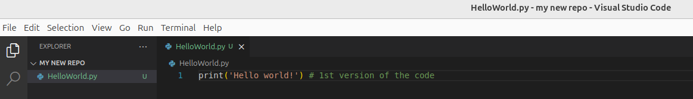

<!-- ---
layout: default
title: Git for beginners
permalink: /docs/STM32/git
nav_order: 1
parent: STM32
toc: true
--- -->

<!-- comment or image allows {: .no_toc} to work correctly  (don't ask me why) -->

[]

{: .no_toc }

# Git, GitHub or GitLab what is a difference?

<details open markdown="block">
  <summary>
    Table of contents
  </summary>
  {: .text-delta }
1. TOC
{:toc}
</details>

# Introduction
Git by definition is a distributed version control system  - in other words it is a software that tracks versions of the files in your project. When you make an update old version of the code or other files are kept and you can always go back to them, check what has changed between different saved versions. Thanks that you can really smoothly develop and add new feature to your code within one project also git keeps only the changes so you don't waste space for coping the same code for each version.
This can be done locally on your computer (you don't need anything else than git software) or on the online server (remote repository) of other softwares which are using *git* as a backbone of their structure and you use the same commands but besides that you have other feature which helps with collaboration on the projects and keeping everything on remote server so you have a backup in case of damaging your local project. And for that are platforms as GitHub or GitLab. You can also add issues to the project write a description, documentation, set up the tasks for the team etc.

# git locally
At first, we will start with the basic git commands which should give you general overview how it works and how to start. First step is to install git on your machine - for that follow the steps on the official [website](https://git-scm.com/downloads). If you use the installer as it is, Git will install in the default path (on Windows _C:\Program Files\Git_ and */usr/bin/* for Ubuntu). It is not a problem but if you want to specify a directory you need to open the cmd window in the folder where you’ve got git installer and type `git_installer_name.exe /DIR=“your\path\to\preferred\location”`. 
After that you should be able to check the version with the command ```git --version```. If git command is recognized thats good if not you probably need to add it to the environmental variables (to the ```PATH```). 

## Repository
Now lets initialize the new repository - the new project in which git should keep track of the changes that were made. ```git init 'name-of-the-repository'```
Then you can check the status of the repository - ```git status```, everything should be up to date and you should be in the "*main*" branch 
[](images/git/Screenshot%20from%202024-11-14%2016-31-16.png)<custom_caption>Initialize new repository and check status</custom_caption>
We have our project created now it is time to add first file. Inside a repository (directory you've just created) create any file - it can be .txt, python, .c, image or PDF. I go with classic ```HelloWorld.py``` with some code.
](images/git/image.png)<custom_caption></custom_caption> 
Then we have to add this changes from our working directory to staging area which is an intermediate area before making commit to the repository. To do so we use `git add 'path/to/file'` command (In my case it would be `git add HelloWorld.py`). Also we can use `git add .` to stage all changes. 
](images/git/image%20copy%202.png)<custom_caption>Before staging changes are seen in red and after `git add .` they are green</custom_caption>

If you want to unstage changes you can use `git rm --cached 'file to unstage'`.

](images/git/)<custom_caption></custom_caption>
## Commits 
When we created new code and it is staged we want to make a commit. For that we use `git commit -m 'message for this commit'` `-m` stands for "message" which is required for all commits. You can use just `git commit` but then you will be asked to provide this message using your default text editor (e.g. *vim*)

\* When you commit for the first time you will be asked to provide your name and adrress email 

## Branches
](images/git/)<custom_caption></custom_caption>
# Remote repository
So far all what we've done was kept on our computer. However when you want to collaborate with other people and have convenient access to your code remote repositories are the great solution. Moreover you have some redundancy since the code is stored not only on your local machine, which can be damaged, but on the server so you have some backup. 
](images/git/)<custom_caption></custom_caption>
# Useful app

# Workflow 
`
git init "name of the repository" #create new repository 
git status #check your current branch and if the HEAD is up to date
git add . 


define `.gitignore` file to ignore some files all even the whole folders during staging process. If you want to keep empty folder (Git tracks only the files) add `.gitkeep` and the folder will appear in your remote repository. *It can be any other file with any name - `.gitkeep` is just a standard name that people understand 
`

## Good practices
In general you can do whatever you want. For smaller projects these rules probably don't even makes sense and introduce more hassle than benefits but it is a good idea to practice with smaller project and then smoothly move on the bigger one than to try introduce unfamiliar concepts at ones when you want to start a big project and god organization is critical to maintain it and make it possible to collaborate with others.
* Commit often and small chunks of code,
* Provide sensible description for each commit,
* Use pull command to get newest updates before you start new code
* Use stash responsible and only for temporal changes
* Omit collective commits - if you worked on different things at once and want to commit them do it as separate commits (stage particular changes and commit with proper description)
* Do not store files that are automatically generated - when you use cmake to create `.make` files keep only the `CmakeList.txt` instead of all build files which changes during each compilation. Those files are not useful anyway and make repository grow really fast (all changes in those files would be saved). To discard some 

