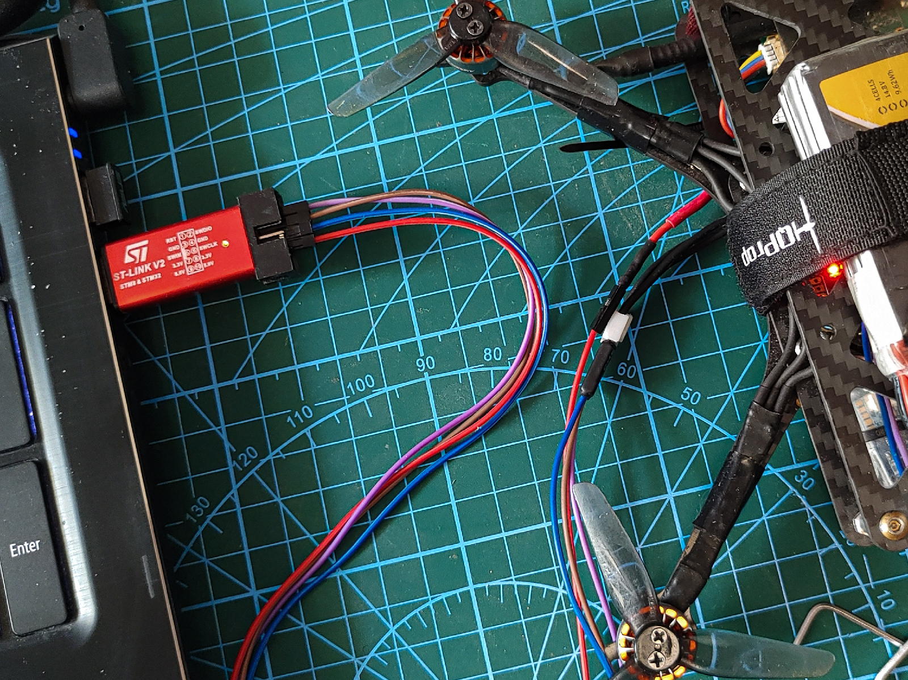

<!-- comment or image allows {: .no_toc} to work correctly  (don't ask me why) -->

{: .no_toc }

# How to start?

  

    Table of contents
  

  {: .text-delta }
1. TOC
{:toc}

# Introduction

The first problem when it comes to programming robots is what hardware should I use and how to set up everything. Nowadays, there are a lot of options and I am not qualified to provide any recommendations on what should you use. In this post, I want to tell you why I started using STM32 and how you can start too.

# Arduino vs STM32

The easiest solution is to use Arduino - plug in USB, open Arduino IDE, and program your robot. Also, on the Internet, there are thousands of tutorials for these boards.
However, sometimes Arduino is not powerful enough (usually is more than enough). But do you need to use something with more capabilities? Or you just want to be more "professional" than using a simple Arduino. The commonly known and willingly chosen solutions are STM32 microcontrollers. With HAL library and STM32 Cube IDE give tons of possibilities without being too overwhelming (nevertheless, this is a significant step up of complexity referring to the Arduino). Fortunately, there are many resources on how to start your first project. Start with something simple like blinking LED and then move on with more complicated projects. Don't copy me mistake of programming the flight control system for a drone as your first project.

# How I started

<custom_caption></custom_caption>

I started with the Nucleo board (L053R8) and that was great at the beginning but after the first iteration of the drone, I realized that I needed something more powerful. Next, I was looking for an F4 board, but I didn't like the size of the Nucleo. Also, the idea of connecting external modules (IMU, FLASH...) with gold pins and all these cables lying around was not so encouraging. Then I thought, why not use the existing FC and program it with my software? On these boards, there are IMU, flash modules, pinouts for PWMs, and much more well-thought design in a small package (about 30x30 [mm] or even smaller). So it was my next step. Moreover, when I'm using real FC my drone seems to be more professional, so it gives +10 to confidence.

# How to program off-shelf boards?

How to program FC if you only know how to connect the Nucleo to your computer?

If you ever programmed Nucleo board: you just plug USB into the computer, turn on IDE ([STM32CubeIDE](https://www.st.com/en/development-tools/stm32cubeide.html), Keil, [System Workbench for STM32](https://www.ac6-tools.com/content.php/content_SW4MCU/lang_en_GB.xphp), PlatformIO, or anything you like), select your board, and start programming.

<custom_caption></custom_caption>

Luckily, for any other boards based on STM32, this is no more complicated! Every STM32 microprocessor can be programmed via ST-link. To do this, you need to find a pinout for SWCLK, SWDIO, GND, and VCC. Then you connect those pins to the STM32 programmer. It can be an ST-Link v2 programmer or any Nucleo board ([how to use Nucleo as a programmer](https://jeelabs.org/book/1547a/index.html)).

<custom_caption>SCl, SDI and 3.3V pads</custom_caption>

<custom_caption>Simillar board with soldered wires</custom_caption>

<custom_caption>Another board with soldered wires</custom_caption>

## Software reset

There is a small catch, usually, the RESET pin is not provided on embedded systems, so you have to set software reset instead of hardware reset in your IDE. Next, you can program your FC as a traditional Nucleo board.

If you don't want to use any IDE and go deeper into compilation, building, and debugging microprocessors, there will be a [post](STM32_dev_part_1) about the configuration of Visual Studio Code for STM32 development.

# How to find connections between MCU and other components?

Since I am using off-shelf Flight Controllers, specific pins of microprocessors need to be programmed for specific functionality, There is a problem: which pins are for what? - Fortunately, a few things can help to find this information:

- Firstly check if on the Internet there is any documentation for your board. For example, my board (MAMBA F405 MK2) uses FURYF4OSD version of Betaflight software - so I could find the header file where most of the connections were described - [FURYF4OSD pinout](https://github.com/betaflight/betaflight/blob/master/src/main/target/FURYF4/target.h).
- You can manually check connections with a multimeter - just use probe mode and look for shortage. It is not very convenient, but those boards (Flight controllers) are not too complicated and even beginners (like me) after some time would find out the electronic scheme. Also, it is very interesting to learn the design of such boards.
- Look up on the Internet about all found components (many of them have names on the package). You will find out what protocols they are using and this way you can narrow down possible pins of the microcontroller.

<custom_caption>Looking for a "beep"</custom_caption>

You don't have to find a layout of every pin at once. Start with LEDs and as you will grow your program you will add new features.

<custom_caption>Reverse engineering datasheet of a board</custom_caption>
