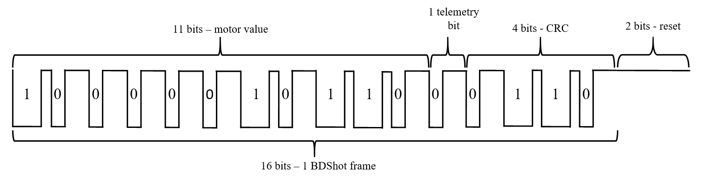
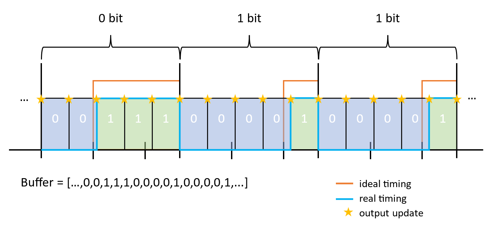
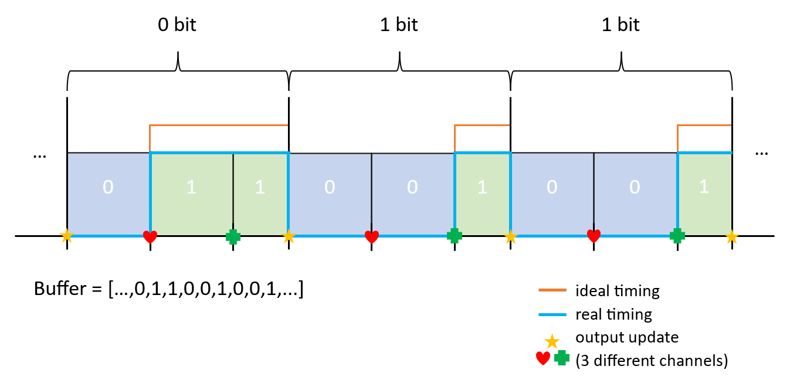
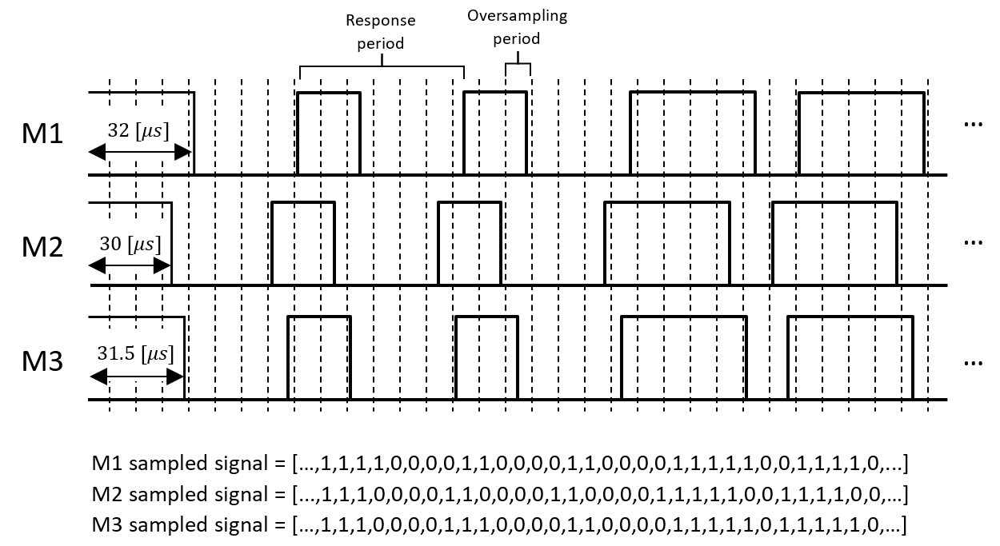

<details open markdown="block">
  <summary>
    Table of contents
  </summary>
  {: .text-delta }
1. TOC
{:toc}
</details>

# Why do we want to use it?

It stands for Bidirectional Dshot, allowing us to communicate with ESC in both directions. After you send a new motor value to ESC it will respond with the current RPM of the motor. But why do we even care about RPM? Well, for drones motors are the main source of vibrations, so they are the main source of noise in gyro's and accelerometer's measurements. If we knew all frequencies from motors we could apply surgically precise notch filters to cut off these noises. There is the main idea of RPM filtering and this topic will be also explained and implemented in [the other post](../Filters/RPM_filter_impl). For now, let's focus on BDShot since it is complicated enough on its own.

## Overview

The best explanation of what this protocol looks like and how it differs from the traditional DShot can be found [here](https://brushlesswhoop.com/dshot-and-bidirectional-dshot/).
Summing up, BDShot's frame is the same as DShot 11-bit of value 1-bit telemetry and 4-bit CRC but with inverted HIGH and LOW values. Response from ESC is made of 12-bit value and 4-bit CRC.

[](images/BDShot.png)

# Implementation - bit-banging

The first implementation of Dshot was based on the clever usage of PWM generators which are also used for Addressable LED strips. However, when you need to receive a response from ESC this idea becomes insufficient, and bit-banging technique is required. In short, this is nothing more than manually toggling GPIO ports. In order not to kill your CPU power we want to use DMA and timers for toggling GPIO values. There are 2 ways to do this:

1. We divide each bit into a few sections. Then for each section, we can decide whether to change or not change the GPIO value. We need only one timer channel to generate DMA requests (one interval). To achieve more precise timing (as you can see 5 sections is far from an ideal timing) we need to increase the number of sections which makes larger buffers (each section needs to have a value) and increase the DMA load (each of these section values needs to be sent to the peripheral's register).
   [](images/bdshot1.png)

1. We can use more timer channels to define specified time points and generate DMA requests only when we need to decide on GPIO's output value (respectively to achieve a DShot frame). In this case, we need only 3 sections for each bit and we can achieve any precision (the time of each request is freely selectable). However, this method is suitable only for sending data, and for receiving we would have to change to the first option.
   [](images/bdshot2.png)

## eRPM - response from ESC

The whole point of the above bit-banging is to provide a simple solution for receiving the response from ESC. We have to sample the input of each GPIO to get zeros and ones that next can be decoded into real bits. Since we use one timer for multiple motors (for all motors connected to the same GPIOx pins) we can not wait for the beginning of the response (with small desynchronization responses would be wrong). Therefore we have to start sampling the input signal right after the end of transmission.

[](images/bdshot3.png)

Since we can not use time-defined probes it is necessary to oversample our input and then decide on the response beginning and transform sampled signal into bits. To do this we will use a similar approach as for 1) bit-banging method. After the end of the transmission, GPIO pins will change mode from output into input and start reading values in defined intervals. When we are sure that the response has ended (defined time has passed) we will check all probed values. Then we can find the beginning of the response and check each bit value. After all 16 bits, we will have our response which can be further processed. With the given above example sampled signals would be converted into $$[00011...]$$ response.

Next, responses need to be converted into GCR value and mapped into real responses (we will not discuss it here but all steps are described [here](https://brushlesswhoop.com/dshot-and-bidirectional-dshot/) and are present in the code below).

## STM32 code

Usually, motors are connected to different GPIO groups (GPIOA/GPIOB/GPIOC/...) for each group we need a separate timer and DMA channel. For my FC I motors are connected to GPIOA and GPIOB so I need a second set of variables for buffers, functions, and DMA routines but for convenience, only one set will be shown below.

Let's start with all definitions, functions' declarations, and variables:

```c
#define MOTOR_1 3   // PA3
#define MOTOR_4 2   // PA2
#define MOTORS_COUNT 4  // number of motors
#define MOTOR_POLES_NUMBER 14   // number of poles in your motors (usually 14 or 12)

#define DSHOT_MODE 300 // 150/300/600/1200

#define DSHOT_BB_BUFFER_LENGTH 18   // 16 bits of Dshot and 2 for clearing - used when bit-banging dshot used
#define DSHOT_BB_FRAME_LENGTH 140   //	how many counts of the timer gives one bit frame
#define DSHOT_BB_FRAME_SECTIONS 7   // in how many sections is bit frame divided (must be factor of DSHOT_BB_FRAME_LENGTH)
#define DSHOT_BB_1_LENGTH 5 // number of sections for 1-bit
#define DSHOT_BB_0_LENGTH 2 // number of sections for 0-bit
#define BDSHOT_RESPONSE_LENGTH 21   // number of bits in ESC response
#define BDSHOT_RESPONSE_BITRATE (DSHOT_MODE * 4 / 3)    // in my tests this value was not 5/4 * DSHOT_MODE as documentation suggests but 4/3*DSHOT_MODE
#define BDSHOT_RESPONSE_OVERSAMPLING 3  // it has to be a factor of DSHOT_BB_FRAME_LENGTH * DSHOT_MODE / BDSHOT_RESPONSE_BITRATE

static uint16_t calculate_Dshot_checksum(uint16_t value);
static uint16_t prepare_Dshot_package(uint16_t value);
static void fill_bb_Dshot_buffers(uint16_t m1_value, uint16_t m4_value);
static bool BDshot_check_checksum(uint16_t value);
static uint32_t get_BDshot_response(uint32_t raw_buffer[], const uint8_t motor_shift);
static void read_BDshot_response(uint32_t value, uint8_t motor);

uint16_t motor_1_value = 2000;  // variable for motor 1 value (2000-4000)
uint16_t motor_4_value = 2000;  // variable for motor 4 value (2000-4000)
bool bdshot_reception_1 = true;
uint32_t dshot_bb_buffer_1_4[DSHOT_BB_BUFFER_LENGTH * DSHOT_BB_FRAME_SECTIONS];
// BDSHOT response is being sampled just after transmission. There is ~33 [us] break before response (additional sampling) and bitrate is increased by 5/4:
uint32_t dshot_bb_buffer_1_4_r[(int)(33 * BDSHOT_RESPONSE_BITRATE / 1000 + BDSHOT_RESPONSE_LENGTH + 1) * BDSHOT_RESPONSE_OVERSAMPLING];
//	motors' RPM values (from BDshot)
uint32_t motors_rpm[MOTORS_COUNT];
```

Next, set up all peripherals for this protocol. You have to adjust this for your hardware but in a nutshell, turn on the timer with a DMA request for one of the channels, set prescaler to your timer frequency, set up DMA, and enable interrupt for DMA:

```c
void setup_BDshot()
{
	//	TIM1 - only for generating time basement all outputs are set by GPIOs:
	// enable TIM1 clock:
	RCC->APB2ENR |= RCC_APB2ENR_TIM1EN;

	// register is buffered and overflow DMA request:
	TIM1->CR1 = 0x0;
	TIM1->CR1 |= TIM_CR1_ARPE | TIM_CR1_URS;

	// DMA request:
	TIM1->DIER |= TIM_DIER_CC1DE; // channel 1 request

	TIM1->CCR1 = DSHOT_BB_FRAME_LENGTH / DSHOT_BB_FRAME_SECTIONS;

	//	TIM1 is 168 [MHz]:
	TIM1->PSC = 168000 / DSHOT_MODE / DSHOT_BB_FRAME_LENGTH - 1;
	TIM1->ARR = DSHOT_BB_FRAME_LENGTH / DSHOT_BB_FRAME_SECTIONS - 1;

	//	TIM1 enable:
	TIM1->EGR |= TIM_EGR_UG;
	TIM1->CR1 |= TIM_CR1_CEN;

    //  DMA setup:
	RCC->AHB1ENR |= RCC_AHB1ENR_DMA2EN;
    //  for TIM1
	DMA2_Stream6->CR |= DMA_SxCR_MSIZE_1 | DMA_SxCR_PSIZE_1 | DMA_SxCR_MINC | DMA_SxCR_DIR_0 | DMA_SxCR_TCIE | DMA_SxCR_PL;
	//  all the other parameters will be set afterward

    //	NVIC setup:
    NVIC_EnableIRQ(DMA2_Stream6_IRQn);
	NVIC_SetPriority(DMA2_Stream6_IRQn, 3);
}
```

Now let's see the main function to send new values to ESC and receive responses. Function `update_motors()` is called in the main program. It starts with the conversion of the previous ESC response, then prepares new values as packages with zeros and ones for DMA to transmit, and at the end starts DMA transmission.

```c
void update_motors()
{
    //  prepare for sending

    update_motors_rpm();

    fill_bb_Dshot_buffers(
        prepare_Dshot_package(motor_1_value),
        prepare_Dshot_package(motor_4_value));

    //  set flag for interruption:
    bdshot_reception_1 = true;

    //  set GPIOs as output:
    GPIOA->MODER |= GPIO_MODER_MODER2_0;
    GPIOA->MODER |= GPIO_MODER_MODER3_0;

    //  configure DMA:
    DMA2_Stream6->CR |= DMA_SxCR_DIR_0;
    DMA2_Stream6->PAR = (uint32_t)(&(GPIOA->BSRR));
    DMA2_Stream6->M0AR = (uint32_t)(dshot_bb_buffer_1_4);
    DMA2_Stream6->NDTR = DSHOT_BB_BUFFER_LENGTH * DSHOT_BB_FRAME_SECTIONS;

    //  TIM1 setup:
    TIM1->CR1 &= ~TIM_CR1_CEN;
    TIM1->ARR = DSHOT_BB_FRAME_LENGTH / DSHOT_BB_FRAME_SECTIONS - 1;
    TIM1->CCR1 = DSHOT_BB_FRAME_LENGTH / DSHOT_BB_FRAME_SECTIONS;

    //  first start timer then DMA:
    TIM1->EGR |= TIM_EGR_UG;
    TIM1->CR1 |= TIM_CR1_CEN;
    DMA2_Stream6->CR |= DMA_SxCR_EN;
}
```

When DMA ends transmitting data, the main program enters an interrupt, reconfigures GPIO pins into input mode, and sets DMA to read signal from them (DMA will copy `GPIOA->IDR` register value to the `dshot_bb_buffer_1_4_r` buffer). After the end of the reception (`bdshot_reception_1==0`) DMA just turns off and waits for the next `update_motors()` call.

```c
void DMA2_Stream6_IRQHandler(void)
{

    if (DMA2->HISR & DMA_HISR_TCIF6)
    {
        DMA2->HIFCR |= DMA_HIFCR_CTCIF6;

        if (bdshot_reception_1)
        {
            // set GPIOs as inputs:
            GPIOA->MODER &= ~GPIO_MODER_MODER2;
            GPIOA->MODER &= ~GPIO_MODER_MODER3;
            // set pull up for those pins:
            GPIOA->PUPDR |= GPIO_PUPDR_PUPDR2_0 | GPIO_PUPDR_PUPDR3_0;

            // set timer:

            TIM1->ARR = DSHOT_BB_FRAME_LENGTH * DSHOT_MODE / BDSHOT_RESPONSE_BITRATE / BDSHOT_RESPONSE_OVERSAMPLING - 1;
            TIM1->CCR1 = DSHOT_BB_FRAME_LENGTH * DSHOT_MODE / BDSHOT_RESPONSE_BITRATE / BDSHOT_RESPONSE_OVERSAMPLING;

            DMA2_Stream6->CR &= ~(DMA_SxCR_DIR);
            DMA2_Stream6->PAR = (uint32_t)(&(GPIOA->IDR));
            DMA2_Stream6->M0AR = (uint32_t)(dshot_bb_buffer_1_4_r);
            // there is ~33 [us] gap before the response so it is necessary to add more samples:
            DMA2_Stream6->NDTR = ((int)(33 * BDSHOT_RESPONSE_BITRATE / 1000 + BDSHOT_RESPONSE_LENGTH + 1) * BDSHOT_RESPONSE_OVERSAMPLING);

            DMA2_Stream6->CR |= DMA_SxCR_EN;
            bdshot_reception_1 = false;
        }
    }

    if (DMA2->HISR & DMA_HISR_HTIF6){
        DMA2->HIFCR |= DMA_HIFCR_CHTIF6;
    }
    if (DMA2->HISR & DMA_HISR_DMEIF6){
        DMA2->HIFCR |= DMA_HIFCR_CDMEIF6;
    }
    if (DMA2->HISR & DMA_HISR_TEIF6){
        DMA2->HIFCR |= DMA_HIFCR_CTEIF6;
    }
}
```

Preparing a BDShot frame is the same as DShot one. The one difference is in calculating checksum when the signal is inverted to make it BDShot not DShot. Bear in mind that the first step is only required if your values are beyond the $$48-2047$$ range.

```c
uint16_t prepare_Dshot_package(uint16_t value)
{
    // value is in range of 2000-4000 so I need to transform it into Dshot range (48-2047)
    value -= 1953;
    if (value > 0 && value < 48)
    {
        value = 48;
    }
    return ((value << 5) | calculate_Dshot_checksum(value));
}

uint16_t calculate_Dshot_checksum(uint16_t value)
{
    // 12th bit for telemetry on/off (1/0):
    value = value << 1;
    return (~(value ^ (value >> 4) ^ (value >> 8))) & 0x0F;
}
```

Next, packages need to be converted into bit-banging values for DMA to transmit. As you may noticed before we only need to decide about the middle sections (whether it is 0 or 1 bit) because at the beginning signal is always falling and at the end, it is always rising (or just staying high for 1 bit). Therefore buffer is preset before the main program is started and in the main routine, only the middle section is set. Additionally, we only need to set registers for sections where the output needs to change its value, between those sections output stays the same by default.

```c
void preset_bb_Dshot_buffers()
{
    for (uint16_t i = 0; i < DSHOT_BB_BUFFER_LENGTH * DSHOT_BB_FRAME_SECTIONS; i++)
    {   // set all bits to 0x00. after that state of GPIOs outputs will stay the same:
        dshot_bb_buffer_1_4[i] = 0x00;
    }
    for (uint8_t i = 0; i < DSHOT_BB_BUFFER_LENGTH - 2; i++)
    {   //  2 last bit will stay always high for ESC to capture dshot frame to the end
        // each bit is starting with lowering edge and after DSHOT_BB_1_LENGTH is rising (for 0-bit it rises earlier but always is high after 1-bit time)
        // set low edge at the begining of each bit:
        dshot_bb_buffer_1_4[i * DSHOT_BB_FRAME_SECTIONS] = GPIO_BSRR_BR_0 << MOTOR_1 | GPIO_BSRR_BR_0 << MOTOR_4;
        // set high after 1-bit length:
        dshot_bb_buffer_1_4[i * DSHOT_BB_FRAME_SECTIONS + DSHOT_BB_1_LENGTH] = GPIO_BSRR_BS_0 << MOTOR_1 | GPIO_BSRR_BS_0 << MOTOR_4;
    }
}
```

After presetting the buffer, we can use the function below to update the buffer with new motors' values.

```c
static void fill_bb_Dshot_buffers(uint16_t m1_value, uint16_t m4_value)
{   // Each bit is preset (lowering edge at first and rising edge after DSHOT_1_length rest values are 0 so there will be no changes in GPIO uotput registers).
    // Now it is needed to only decide about rising edge after DSHOT_0_length (if bit is 0) or seting 0 so LOW state will stay until DSHOT_1_length.
    // In addition 2 last bits are set always high (ESC needs time for proper signal detection and those high values define end off the transmission).
    for (uint8_t i = 0; i < DSHOT_BB_BUFFER_LENGTH - 2; i++) // last 2 bits are always high (logic 0)
    {
        if (1 << (DSHOT_BB_BUFFER_LENGTH - 3 - i) & m1_value)
        {   // if bit is one send 0x00 so that GPIOs output will not change (will stay low):
            dshot_bb_buffer_1_4[i * DSHOT_BB_FRAME_SECTIONS + DSHOT_BB_0_LENGTH] = 0x00;
        }
        else
        {   // if bit is zero set rising edge after DSHOT_0_length:
            dshot_bb_buffer_1_4[i * DSHOT_BB_FRAME_SECTIONS + DSHOT_BB_0_LENGTH] = GPIO_BSRR_BS_0 << MOTOR_1;
        }
        if (1 << (DSHOT_BB_BUFFER_LENGTH - 3 - i) & m4_value)
        {   // if bit is one send 0x00 so that GPIOs output will not change (will stay low):
            dshot_bb_buffer_1_4[i * DSHOT_BB_FRAME_SECTIONS + DSHOT_BB_0_LENGTH] |= 0x00;
        }
        else
        {   // if bit is zero set rising edge after DSHOT_0_length:
            dshot_bb_buffer_1_4[i * DSHOT_BB_FRAME_SECTIONS + DSHOT_BB_0_LENGTH] |= GPIO_BSRR_BS_0 << MOTOR_4;
        }
    }
}
```

Now it is time to look at the function `update_motors_rpm()`. At a high level it seems easy, just convert all zeros and ones into bits and then read rpm accordingly with the provided instructions:

```c
void update_motors_rpm()
{
    // BDshot bit banging reads whole GPIO register.
    // Now it's time to create BDshot responses from all motors (made of individual bits).
    uint32_t motor_1_response = get_BDshot_response(dshot_bb_buffer_1_4_r, MOTOR_1);
    uint32_t motor_4_response = get_BDshot_response(dshot_bb_buffer_1_4_r, MOTOR_4);

    read_BDshot_response(motor_1_response, 1);
    read_BDshot_response(motor_4_response, 4);
}
```

But the devil is in the details, so let's go into the function `get_BDshot_response` which converts raw sampled signals into bits. I will not explain everything but in essence, this function is looking for the edge (zeros changing into ones or vice versa). Then it counts how many samples are between edges and decides whether it is 1 or 0 bit. Strange function `__builtin_expect` is for branch prediction and with unrolling (checking 4 conditions instead of one) speeds up the if-statements (you can use normal `if`).

```c
static uint32_t get_BDshot_response(uint32_t raw_buffer[], const uint8_t motor_shift)
{   // set end of search after 33 us so response would be observed if sent:
    uint32_t* buffer_end = raw_buffer + 33 * BDSHOT_RESPONSE_BITRATE / 1000 * BDSHOT_RESPONSE_OVERSAMPLING;
    while (raw_buffer < buffer_end)
    {
        // reception starts just after transmission, so there is a lot of HIGH samples. Find first LOW bit:
        if (__builtin_expect(!(*raw_buffer++ & 1 << motor_shift), 0) ||
            __builtin_expect(!(*raw_buffer++ & 1 << motor_shift), 0) ||
            __builtin_expect(!(*raw_buffer++ & 1 << motor_shift), 0) ||
            __builtin_expect(!(*raw_buffer++ & 1 << motor_shift), 0))
        {   // if LOW edge was detected:
            uint32_t* buffer_previous = raw_buffer - 1;
            // set buffer end as current buffer + length of BDshot response:
            buffer_end = raw_buffer + BDSHOT_RESPONSE_LENGTH * BDSHOT_RESPONSE_OVERSAMPLING;
            uint32_t motor_response = 0;
            uint8_t bits = 0;
            while (raw_buffer <= buffer_end)
            {
                // look for the high edge:
                if (__builtin_expect((*raw_buffer++ & (1 << motor_shift)), 0) ||
                    __builtin_expect((*raw_buffer++ & (1 << motor_shift)), 0) ||
                    __builtin_expect((*raw_buffer++ & (1 << motor_shift)), 0) ||
                    __builtin_expect((*raw_buffer++ & (1 << motor_shift)), 0))
                {
                    if (raw_buffer <= buffer_end) {
                        uint8_t len = MAX((raw_buffer - buffer_previous) / BDSHOT_RESPONSE_OVERSAMPLING, 1); // how many bits has the same value (for int rounding 1 is added)
                        bits += len;
                        motor_response <<= len;
                        buffer_previous = raw_buffer - 1;
                        // then look for the low edge:
                        while (raw_buffer < buffer_end)
                        {
                            if (__builtin_expect(!(*raw_buffer++ & (1 << motor_shift)), 0) ||
                                __builtin_expect(!(*raw_buffer++ & (1 << motor_shift)), 0) ||
                                __builtin_expect(!(*raw_buffer++ & (1 << motor_shift)), 0) ||
                                __builtin_expect(!(*raw_buffer++ & (1 << motor_shift)), 0)) {
                                if (raw_buffer <= buffer_end) {
                                    len = MAX((raw_buffer - buffer_previous) / BDSHOT_RESPONSE_OVERSAMPLING, 1); // how many bits has the same value (for int rounding 1 is added)
                                    bits += len;
                                    motor_response <<= len;
                                    motor_response |= 0x1FFFFF >> (BDSHOT_RESPONSE_LENGTH - len);
                                    buffer_previous = raw_buffer - 1;
                                }
                                break;
                            }
                        }
                    }
                }
            }
            // if last bits were 1 they were not added so far
            motor_response <<= (BDSHOT_RESPONSE_LENGTH - bits);
            if (*buffer_previous & (1 << motor_shift)) {
                motor_response |= 0x1FFFFF >> bits; // 21 ones right-shifted
            }
            return motor_response;
        }
    }
    // if LOW edge was not found return incorrect motor response:
    return 0xFFFFFFFF;
}
```

After that responses need to be mapped into new values with specific nibbles. Next RPMs can be extracted and used for RPM filtering.

```c
static void read_BDshot_response(uint32_t value, uint8_t motor)
{
    // BDshot frame contain 21 bytes but first is always 0 (used only for detection).
    // Next 20 bits are 4 sets of 5-bits which are mapped with 4-bits real value.
    // After all, value is 16-bit long with 12-bit eRPM value (actually it is a period of eRPM) and 4-bit CRC.
    // 12-bit eRPM value has 3 first bits od left shifting and 9-bit mantisa.

    // put nibbles in the array in places of mapped values (to reduce empty elements smallest mapped value will always be subtracted)
    // now it is easy to create real value - mapped value indicate array element which contain nibble value:
#define iv 0xFFFFFFFF
    static const uint32_t GCR_table[32] = {
        iv, iv, iv, iv, iv, iv, iv, iv, iv, 9, 10, 11, iv, 13, 14, 15,
        iv, iv, 2, 3, iv, 5, 6, 7, iv, 0, 8, 1, iv, 4, 12, iv };
    // if ESC has not sent frame value =0xFFFF FFFF (bigger than possible values):

    if (value < 0xFFFFFFF) {

        value = (value ^ (value >> 1)); // now we have GCR value

        uint32_t decoded_value = GCR_table[(value & 0x1F)];
        decoded_value |= GCR_table[((value >> 5) & 0x1F)] << 4;
        decoded_value |= GCR_table[((value >> 10) & 0x1F)] << 8;
        decoded_value |= GCR_table[((value >> 15) & 0x1F)] << 12;

        if (BDshot_check_checksum(decoded_value))
        {
            // if checksum is correct save real RPM.
            // value sent by ESC is a period between each pole changes [us].
            // to achive eRPM we need to find out how many of these changes are in one minute.
            // eRPM = (60*1000 000)/T_us next RPM can be achived -> RPM = eRPM/(poles/2):

            motors_rpm[motor - 1] = ((decoded_value & 0x1FF0) >> 4) << (decoded_value >> 13);      // cut off CRC and add shifting - this is period in [us]
            motors_rpm[motor - 1] = 60 * 1000000 / motors_rpm[motor - 1] * 2 / MOTOR_POLES_NUMBER; // convert to RPM
        }
    }
}
```

## Usage in your program

To use these functions you will need to set up everything and preset buffers. Next, you can use `update_motors()` to send new values `motor_1_value` and `motor_4_value` to ESC.

```c

void main(){
    // setup
    //...
    setup_BDshot();
    preset_bb_Dshot_buffers();
    //...
    while(1){
        // change motor_4_value or motor_1_value with PID or other algorithms
        //...
        // send new values to ESC and update motors_rpm array:
        update_motors();
        //...
        // take care of timing (bear in mind that you need to manage FC->ESC update frequency)
    }
}
```

If something is not working or just for the sake of your curiosity we can check the error level of responses (It should be very low for correct RPM filtering). To do so we need to add some code:

```c
float motors_error[MOTORS_COUNT];   // total response error
float BDshot_invalid_response[MOTORS_COUNT];    // bad response
float BDshot_no_response[MOTORS_COUNT]; // no response detected

void read_BDshot_response(uint32_t value, uint8_t motor)
{
    // BDshot frame contain 21 bytes but first is always 0 (used only for detection).
    // Next 20 bits are 4 sets of 5-bits which are mapped with 4-bits real value.
    // After all, value is 16-bit long with 12-bit eRPM value (actually it is a period of eRPM) and 4-bit CRC.
    // 12-bit eRPM value has 3 first bits od left shifting and 9-bit mantisa.

    // put nibbles in the array in places of mapped values (to reduce empty elements smallest mapped value will always be subtracted)
    // now it is easy to create real value - mapped value indicate array element which contain nibble value:
#define iv 0xFFFFFFFF
    static const uint32_t GCR_table[32] = {
        iv, iv, iv, iv, iv, iv, iv, iv, iv, 9, 10, 11, iv, 13, 14, 15,
        iv, iv, 2, 3, iv, 5, 6, 7, iv, 0, 8, 1, iv, 4, 12, iv };
    // if ESC has not sent frame value =0xFFFF FFFF (bigger than possible values):

    static uint32_t counter;
    static uint32_t counter_no_frames;
    static uint32_t counter_bad_frames;
    static timeUs_t time;

    counter++;

    if (counter >= 100000) {
        time = get_Global_Time() - time;
        time = get_Global_Time();
        counter = 0;
        counter_bad_frames = 0;
        counter_no_frames = 0;
    }

    if (value < 0xFFFFFFF) {

        value = (value ^ (value >> 1)); // now we have GCR value

        uint32_t decoded_value = GCR_table[(value & 0x1F)];
        decoded_value |= GCR_table[((value >> 5) & 0x1F)] << 4;
        decoded_value |= GCR_table[((value >> 10) & 0x1F)] << 8;
        decoded_value |= GCR_table[((value >> 15) & 0x1F)] << 12;

        if (BDshot_check_checksum(decoded_value))
        {
            // if checksum is correct save real RPM.
            // value sent by ESC is a period between each pole changes [us].
            // to achive eRPM we need to find out how many of these changes are in one minute.
            // eRPM = (60*1000 000)/T_us next RPM can be achived -> RPM = eRPM/(poles/2):

            motors_rpm[motor - 1] = ((decoded_value & 0x1FF0) >> 4) << (decoded_value >> 13);      // cut off CRC and add shifting - this is period in [us]
            motors_rpm[motor - 1] = 60 * 1000000 / motors_rpm[motor - 1] * 2 / MOTOR_POLES_NUMBER; // convert to RPM

            motors_error[motor - 1] *= 0.999f;                                  // reduce motor error
            BDshot_invalid_response[motor - 1] *= 0.999f;                                                // reduce motor error
            BDshot_no_response[motor - 1] *= 0.999f; // reduce error
        }
        else {
            counter_bad_frames++;
            BDshot_invalid_response[motor - 1] = 0.999f * motors_error[motor - 1] + 0.1f; // increase error
            motors_error[motor - 1] = 0.999f * motors_error[motor - 1] + 0.1f; // increase motor error
            BDshot_no_response[motor - 1] *= 0.999f; // dicrease error
        }
    }
    else
    {
        counter_no_frames++;
        BDshot_invalid_response[motor - 1] *= 0.999f;
        BDshot_no_response[motor - 1] = 0.999f * motors_error[motor - 1] + 0.1f; // increase error
        motors_error[motor - 1] = 0.999f * motors_error[motor - 1] + 0.1f; // increase motor error
    }
}
```

# Summary

Great, now we have motors RPMs but what next? The RPM value tells us about the frequency of the motors thus also about the frequency of the noise they produce. Now we can apply very selectable notch filters to cut out those noises from gyro or accelerometer measurements. How to implement this game-changing filter? - check [this post](../Filters/RPM_filter_impl).
