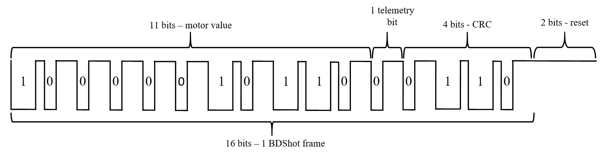

<!-- comment or image allows {: .no_toc} to work correctly  (don't ask me why) -->

{: .no_toc}

# ESC protocols

  

    Table of contents
  

  {: .text-delta }
1. TOC
{:toc}

# What is ESC protocol?

When our flight controller calculates new values for each of the motors they need to be sent to the ESC microcontroller which can then process these values and control MOSFETs. How exactly signals are received and then sent to motors is ESC's software secret, which is another really interesting and complicated topic. For now, let's know that we can not control the motors or even MOSFETs from our FC, we need to send new values between two microcontrollers. And here is our topic: how to exchange this information efficiently and correctly?

# Analog way

The oldest and probably the most recognizable protocol is the PWM signal, taken from servo controlling. All the analog protocols are based on this signal. Period and duty cycle changes, but the idea remains the same: the FC sends a signal, and the ESC measures the time of the high and low signal, and this measured value is treated as a new set for the motor. The main features of this approach are:

- simplicity of implementation
- low load on the transmitting and receiving device
- sensitivity to interference
- required calibration

## Traditional PWM

The standard PWM signal used in servos has a period of 20 [ms] and a duty cycle of 1 - 2 [ms]. This gives a refresh rate of 50 [Hz]. For servos, this value is quite sufficient. Also, ground vehicles, aircraft, helicopters, or submarines often use a refresh rate of 50 [Hz]. Multi-rotorcraft needs higher frequencies for proper operation, but ESC would work with this signal perfectly fine. You can test it and connect a traditional PWM radio receiver directly to ESC and test if the motors would spin (please do it without props on).

## Modification of PWM

The first and obvious improvement of the above signal can be increasing frequency. Since we use only 1-2 [ms] for the duty cycle we can send new values close to 500 [Hz] (for real applications 490 [Hz]). This solution was the gold standard for a long time and allows for pretty good quadcopter steering. The next simple improvement of this protocol is increasing the resolution. Instead of 1000 steps for 1 [µs], we can use 2000 steps for 0.5 [µs]. We can make it even more precise but it has an impact only if ESC will sample our signal with a high enough resolution.

## OneShot125 and OneShot42

A significant limitation of the above PWM signal is the duration of the duty cycle (1 - 2 [ms]). This not only limits the maximal frequency of the protocol but also introduces a delay that negatively affects the control of the entire drone. When new values are calculated ESC has to wait a duty-cycle time before can process measured values and steer motors. To improve this the OneShot125 and OneShot42 protocols reduce the duty cycle 8 times and 24 times accordingly. It gives 125-250 [µs] (OneShot125) and approx. 42 - 84 [µs] (OneShot42). This increases the maximum possible main loop frequency to 4 [kHz] or 12 [kHz].

OneShot also solves another problem arising from the lack of synchronization of the main loop and PWM signal generator. In an ideal situation after determining the correction in the main loop, the new motor values are sent to the ESC. In reality, there may be some delays in the PID loop and the update of the PWM duty cycle can occur a bit later. Normally the PWM signal starts with a fixed period and the new values that were calculated slightly later will be taken into account only in the next loop (the previous values of the settings are repeated and only after they are transmitted new ones will be sent). In this way, a delay is added, which will only increase until the PWM period is exceeded (then it will start accumulating again). Therefore, the maximum time from the moment the new corrections are determined until the signal is received by the ESC is $2∗T_{PWM}$.

_Ideal situation_

_Real-world situation_

To prevent this in the OneShot protocol, after the signal is transmitted, PWM generation stops. It is resumed only when the main loop sends new correction values. In this way, the delay is only the duration of the signal frame (125 -250 or 42-84 [µs]). We lose the averaging effect of sending the same value to the ESCa a few times but it is not a big deal - more about it later. Anyway, OneShot125 is one of the most widely used analog protocols for now.

_OneShot example_

## MultiShot

MultiShot is 10 times faster than the OneShot125. In addition, the range of the signal changes from a minimum of 5 [µs] to a maximum of 25 [µs] (range 20 [µs]). The remaining operation is analogous to the OneShot protocol. Due to the very short duration of the signal in this protocol, not all ESCs support it.

# Digital way

Analog protocols have several major drawbacks. The desire to eliminate them pushed to create a new protocol. The main motivations:

- reduce susceptibility to interference,
- lack of need for calibration,
- desire to send other messages than just motor setpoints.

Since it was necessary to use the same hardware for transmission (PWM used before), a solution, well-known from addressable LEDs, was adopted.

## Dshot 150/300/600/1200

This solution is based on the usage of 2 different PWM fills as 0 and 1-bit values. The PWM signals sent in succession are received as 0 or 1 bits. There are 11 bits of motor value, 1 bit for the telemetry flag, and 4 bits of CRC. In this order, the DShot frame is transmitted after which a reset signal is required - low signal for 2 bit's time. Then it can be decoded and if the CRC check is valid it is used for motor control. The below diagrams show the construction of 0 and 1-bit:

_0-bit_

_1-bit_

As you probably guessed numbers 150, 300, 600, and 1200 correspond with bits per second sent with these protocols. We know how each bit is constructed and the number of bits in the frame so we know the timing of the DShot protocol. In the table, the durations of the frame are presented for each version. As you can see these timings are not much superior to analog protocols but it is not the most important thing. Since the value is digital there is no room for measurement inaccuracies and if some bits are not transmitted correctly the whole frame is discarded. Of course, there is no need for calibration also.

protocol | T0H [µs] | T1H [µs] | bit [µs] | frame [µs]
DShot150 | 2.5 | 5 | 6.67 | 106.72*
DShot300 | 1.25 | 2.5 | 3.33 | 53.28*
DShot600 | 0.625 | 1.25| 1.67 | 26.72*
DShot1200 | 0.313 | 0.625 | 0.83 | 13.28*

{: .note}
\*A longer time is necessary to add 2 bits of reset

After transmission low signal has to be set for at least a 2-bit period for ESC to reset. The first 11 bits give a range of values 0-2047 possible to send to ESC. 0 value is reserved for arming motors (after powerup this has to be sent to ESC). 1-47 values give some control over ESC but depend on the software on ESC. 48-2047 is the range of motor value so there are 2000 steps for controlling its speed. Most of the modern ESC regulators have a UART output, through which they can send data from sensors (temperature, current measurement, etc.). For this data to be sent, the ESC must receive a request from the FC. This is done by bit 12 in the DShot frame, if it is set high the data telemetry data will be sent. The last 4 bits are the checksum. The way CRC is calculated and a much more detailed explanation of this protocol can be found here.

## BDShot

This protocol allows for communication in both directions FC<->ESC. It is very similar to DShot but the signal itself is inverted (the high parts of DShot are low in BDShot). This gives real-time access to the RPM of each motor which is great for filtering noise from sensors and allows for great flight improvement. Unfortunately, this feature is a bit heavy on the processor and some ESCs can't handle it. More about implementing this feature in the next post.

After transmission, ESC will wait a bit (20-35 [µs]) and will start sending the eRPM value which allows calculating the real motor RMP value. It is not so simple to receive this value but more about it in the next post.

# Frequency, resolution, delays

We can say: that higher frequency gives smaller delays and the higher resolution allows for better control of the quad. Let's try to dive a bit deeper and understand what matters for better flight performance.

Let's understand the resolution problems. For STM you have to set up a PWM clock prescaler which defines the smallest time step which is counted by the counter. This way you define your signal resolution and for the step of 1 [µs] it gives 1000 values between 1-2 [ms]. Lower prescaler and you will have 2000 steps or even 8000 for 1 [ms]. But regardless of the sent signal resolution signal received by the ESC will have a resolution with which will be sampled by the ESC. This can differ from ESC software but unfortunately, it usually is 1000 steps. In that case, your high-resolution signal sent from FC will not introduce any benefit. Digital protocols give a fixed resolution of 2000 steps (48-2047). For convenience in my code, I use always 2000 steps for both analog and digital to keep the main loop the same for all protocols (there are no drawbacks to sending signals with higher resolution to ESC with analog protocols).

When it comes to the frequency we need to understand that our quadcopter can not react immediately (inertia of motors and a whole quad). So there is some max frequency above which our commands will have no effect before the next commands come. The lighter the drone, the higher this frequency is. For a 5-inch quad, it probably will be about 1-3 [kHz]. If so, what's the point of the 4, 8, or even 12 [kHz] frequency for protocols such as OneShot?
The first advantage of a shorter duty cycle is a smaller delay between new values calculation (by FC) and applying them to the motors (by ESC). And this is true even if you use those protocols with lower frequencies than their max.
Moreover, there is a benefit of sending the same values to motors more often than they can react when we use analog protocols. Since the measurements of send values can vary, new values sent to the motors can be not exactly what we sent from FC. However, if we send those values a few times the value measured by ESC (so the value sent to the motors) will fluctuate around the desired, sent from FC. Since motors can't react to each new value they will act like averaging filters and an outcome will be closer to the desired value. This is true for analog protocol but irrelevant for digital since there is no fluctuation of the received signal. But regardless of the protocol type, this averaging effect will work for new values sent to ESC and may be the reason why we want to use a higher PID loop even if motors can't react for 4 [kHz] changes sent from FC.

In the end the delays. Imagine that your copter is upside down and falling to the ground. You move your sticks new desired movement is sent to the copter and received by software. Next, data are processed and motor values are calculated. They started to be transmitted and after some time (protocol frame) are taken by ESC to calculate PWM to control MOSFETs. Only now the engines can start changing their rotational speed to save your drone from crashing. As you can imagine if the time between the change of position and applying corrections is too long drone will crash or at least fly poorly. That's why on each part of the steering quadcopter we want to reduce the time it takes. It's worth noting that analog protocols' delays vary between the min and the maximum value sent by them when digital frames always last the same.

<custom_caption> Maximal time of the frame </custom_caption>

| protocol       | min. signal length [µs] | max. signal length [µs] | max. frequency [Hz] | recommended max. frequency [Hz] |
| -------------- | ----------------------- | ----------------------- | ------------------- | ------------------------------- |
| **servo PWM**  | 1000                    | 2000                    | 50                  | 50                              |
| **faster PWM** | 1000                    | 2000                    | 500                 | 490                             |
| **OneShot125** | 125                     | 250                     | 4000                | 3900                            |
| **OneShot42**  | 42                      | 84                      | 12000               | 11900                           |
| **MultiShot**  | 5                       | 25                      | 32000               | 31900                           |
| **DShot150**   | 106.7                   | 106.7                   | 8000\*              | 4000                            |
| **DShot300**   | 53.3                    | 53.3                    | 16000\*             | 8000                            |
| **DShot600**   | 26.7                    | 26.7                    | 33000\*             | 16000                           |
| **DShot1200**  | 13.3                    | 13.3                    | 66000\*             | 32000                           |

{: .note}
\*with 2 bits of reset (recommended more bits for reset)

For implementation on STM32 check [part 1](ESC_prot_impl_1_2) (PWM, OneShot125, and DShot) and [part 2](ESC_prot_impl_2_2) (BDShot).
