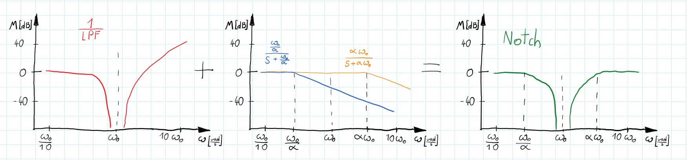

<!-- comment or image allows {: .no_toc} to work correctly  (don't ask me why) -->

{:class="img-responsive"}

{: .no_toc }

# Filters

  

    Table of contents
  

  {: .text-delta }
1. TOC
{:toc}

# Intro

In this post, I want to present the theory needed for digital filter design. Firstly, a quick description of mainly used filters in the continuous domain - I want to give you some intuition in interpreting the transform functions. Next, I will present practical discretization from the '$s$' domain into the '$z$' (discrete time). Finally, a difference equation will be provided which can be directly programmed on any microprocessor. In a future post, I will show the possible implementation of described filters.

In essence, the filter should block undesirable frequencies and let others pass through without distortion. For our applications, we can divide filters into 4 main categories:

- Low-pass filters
- High-pass filters
- Band-pass filters
- Notch filters

# Low-pass filter {#low_pass_filter}

As the name suggests this filter allows low frequencies to pass and suppress high ones. The simplest LPF is a system with one pole:

$$
\begin{gather}
H(s)=\frac{\omega_{0}}{s+\omega_{0}}
\end{gather}
$$

A typical model of LPF is rather a 2nd order system (steeper slope in transition band):

$$
\begin{gather}
H(s)=\frac{\omega_{0}^{2}}{s^{2}+\frac{s}{Q}+\omega_{0}^{2}}
\end{gather}
$$

$Q$ is the quality factor and influences the selectivity of the filter. Greater value makes sharper characteristics but also introduces more gain in resonance frequency. Because of simplicity, this form is often used (with $Q= \frac{1}{\sqrt{2}}$ and $\omega_{0}= 1$ it becomes a normalized 2nd-order Butterworth filter).

{:class="img-responsive"}

However, sometimes when more requirements have to be met we can use some well-defined methods to achieve a more specified filter.

**Butterworth** - gives the best Taylor Series approximation to the ideal lowpass filter response at $\omega = 0$ and $\omega = \infty$. It has the flattest magnitude frequency response in the passband, which is often a decisive parameter. In general, it is a monotonic filter with not the steepest transition between pass and stopband. Also, it has a more linear phase response than the rest of the filters.
[more info](https://en.wikipedia.org/wiki/Butterworth_filter)

**Chebyshev type I** - steeper roll-off than Butterworth at the cost of ripple in the passband. Gain of the ripple can be designed to meet specific requirements.
[more info](https://en.wikipedia.org/wiki/Chebyshev_filter)

**Chebyshev type II** - it is the same as type I but with a ripple in the stopband. Although smooth response in the passband is an advantage the roll-off is not as steep as in type I and therefore it is less often used.

**Elliptic** - gives the steepest slope in the transition band and usually meets requirements in the lowest order. Ripple occurs in both pass and stopband and can be independently adjusted. As the ripple in the passband approaches zero the filter becomes type II Chebyshev. Similarly, when the ripple in the stopband disappears the filter becomes type I Chebyshev, and when both ripple values approach zero the filter becomes Butterworth filter.
[more info](https://en.wikipedia.org/wiki/Elliptic_filter)

The main differences between these filters can be seen when comparing gain plots of the same order filters:

{:class="img-responsive"}

## What is the Q factor?

To better understand the $Q$ factor we rewrite 2nd order system as so:

$$
\begin{gather}H(s)=\frac{\omega_{0}^{2}}{s^{2}+\zeta s \omega_{0}+\omega_{0}^{2}}\end{gather}
$$

This transfer function describes a mass on a spring with damping ($\zeta $ is a damping ratio). When damping approaches zero, the system in resonance becomes unstable this is also the case when $Q = \infty$. Therefore we can think about $Q$ as an inverse of the damping - greater $Q$ equals less damping and smaller $Q$ corresponds to a bigger damping ratio.

# High-pass filter

It is similar to LPF but blocks low frequencies and passes through high ones. In the '$s$' domain it is achieved by adding zeros (for $s=0$) to the system.

$$
\begin{gather}H(s)=\frac{s}{s+\omega_0}\end{gather}
$$

and 2nd order:

$$
\begin{gather}H(s)=\frac{s^{2}}{s^{2}+\frac{s}{Q}+\omega_{0}^{2}}\end{gather}
$$

# Band-stop and Band-pass filters

If we first let the input signal throw LPF we get an output signal without high frequencies Analogically if we use HPF we get an input signal but without low frequencies. If we add these two we will get some of the low frequencies and some of the higher. With well-designed cut-off frequencies for both: LPF and HPF we can reject a specific range of the frequencies. Those filters are named band-stop filters.

$$
\begin{gather}
H(s)=H_{LPF}(s) + H_{HPF}(s)
\end{gather}
$$

{:class="img-responsive"}

Similarly, we can create band-pass filters. This time however we want to let the input signal throw one and the other filter in series (not parallel as earlier).

$$
\begin{gather}
    H(s)=H_{LPF}(s) * H_{HPF}(s)
\end{gather}
$$

{:class="img-responsive"}

These filters are at least 2nd order and since each zero needs a pole to cancel each other they are always even-order filters. Of course, it is possible to use any of the earlier-mentioned filters to satisfy more rigorous requirements.

# Notch filter

Sometimes we want to cut off only specified frequency. It can be 50 [Hz] from the power supply or frequency of the spinning motor of the drone. Let's use the band-stop filter with a narrow band and done you may think. There is one problem - the slope of a 1st order system is $\pm 20[\frac{dB}{decade}]$ and if we want to use a narrow band there would be a marginal decrease of the signal. Maybe 2nd order (total 4th order) system? but there would be still just $\pm40[\frac{dB}{decade}]$. We need something else!
Let's consider 2nd order LPF:

$$
\begin{gather}
H(s)=\frac{\omega_{0}^{2}}{s^{2}+\frac{s}{Q}+\omega_{0}^{2}}
\end{gather}
$$

As we discussed earlier Q is an inverse of damping. If it is too big a peak appears at a resonance frequency which increases to infinity along with $Q$. And what would happen when we flip this transfer function? Now we have infinite attenuation of the inputs' signals for a narrow band of frequencies- looks promising. However this system is impossible to achieve - its nominator's equation order is greater than the denominator's, so it is not a real-life system. Moreover, higher frequencies are amplified and that is not what we want.
We know that poles added to the system decrease frequency response by $20[\frac{dB}{dec}]$. Thus, adding 2 poles will flatten characteristics and it will make the denominator's order equal nominator's! All problems are gone - total success.

$$
\begin{gather}
H(s) = \frac{s^{2}+\frac{s}{Q}+\omega_{0}^{2}}{\omega_{0}^{2}}* \frac{\omega_{0}\alpha}{s+\omega_{0}\alpha} *\frac{\frac{\omega_{0}}{\alpha}}{s+\frac{\omega_{0}}{\alpha}} = \frac{s^{2}+\frac{s}{Q}+\omega_{0}^{2}}{s^{2} + s\omega_{0} (\frac{1}{\alpha}+\alpha) + \omega_{0}^{2}}
\end{gather}
$$

{:class="img-responsive"}

Now, that we have known the basic principles behind the notch filters we can think about a more specific design.

First of all, we can simplify the above filter. Assuming that $Q$ factor from inverted LPF is approaching infinity we can say $\frac{s}{Q} \approx 0$. In this way, we have close to infinity attenuation in center frequency. Then let's combine $(\frac{1}{\alpha}+\alpha)$ into one parameter $\frac{1}{Q}$ which defines the width of the filter. Also, we can assume the central frequency as $1[\frac{rad}{s}]$ - see normalized frequency chapter (below). After that, we've got 2nd order normalized notch filter:

$$
 \begin{gather}
 H(s) = \frac{s^{2}+\frac{s}{Q}+\omega_{0}^{2}}{s^{2} + s\omega_{0} (\frac{1}{\alpha}+\alpha) + \omega_{0}^{2}}\Rightarrow   \frac{s^{2}+1}{s^{2} + \frac{s}{Q} + 1}
 \end{gather}
$$

# Transfer functions - gain some intuition

It is useful to think about the transfer function not as a BlackBox but just like any mathematical equation. It is possible to see some of the characteristics of the described system just by looking at the transfer function.

In general, the transfer function tells us the amplification of the input signal depending on its frequency. In the $s$ domain, input '$s$' can be any imaginary number but if we consider frequency response then $s=j\omega$ where omega is interesting to us frequency. Not going into details we can see that if the frequency is going up '$s$' also is growing.

For Low-pass filters, we want that transform function to be 1 for low frequencies and 0 for high ones. In that way, signal input will be unchanged for LF and suppressed for HF. Remembering that '$s$' is the frequency we can write:

$$
 \begin{gather}
 \lim_{s\to 0} H_{LPF}(s)=1 \nonumber \\ \lim_{s\to\infty} H_{LPF}(s)=0 \nonumber
\end{gather}
$$

We can see that it is indeed the case for our LPF equations. Also, you can see why the nominator is not equal to 1:

$$
\begin{gather}
\lim_{s\to 0} H_{LPF}(s)=\lim_{s\to 0}\frac{\omega_{0}^{2}}{s^{2}+\frac{s}{Q}+\omega_{0}^{2}} =1 \nonumber
\end{gather}
$$

The above thoughts can be applied to any of the equations and give you an easy way to define the basic characteristics of the system. Just plug to $s$ as 0 or $\infty$ and see the results:

$$
 \begin{gather*}
 \lim_{s\to \infty} H_{HPF}(s)=1\\ \lim_{s\to 0} H_{Notch}(s)=1\\ \lim_{s\to j\omega_0} H_{Notch}(s)=0
 \end{gather*}
$$

**One more**

Also, you should remember that the transfer function is not created from thin air. It describes the relationship between input and output but in the '$s$' domain. Nevertheless, we can transfer into the '$t$' domain using inverse Laplace transfer.

$$
\begin{gather*}H(s) =\frac{Y(s)}{X(s)}= \frac{1}{s^2 + 2s +2} \end{gather*}
$$

$$
\begin{gather*}H(t) =\mathcal{L}^{-1}\left\{H(s)\right\}= e^{-t}sin(t) \end{gather*}
$$

But what does it mean $H(t)$? We would like to see the output function of '$t$' - how to do this? In general, $H(t)$ can not tell you about the output for any input function since its form depends on the input function:

$$
\begin{gather*}
Y(t) =\mathcal{L}^{-1}\left\{Y(s)\right\}= \mathcal{L}^{-1}\left\{\frac{X(s)}{s^2 + 2s +2}\right\}
\end{gather*}
$$

But if we consider input as an impulse $x(t)=\delta (t)$ and $$X(s)=\mathcal{L} \left\{ x(t)
\right\} = 1 $$:

$$
\begin{gather*}
Y(s) = \frac{X(s)}{s^2 + s +1} =\frac{1}{s^2 + s +1} = H(s)
\end{gather*}
$$

so:

$$
\begin{gather*}
Y(t) = H(t) = e^{-t}sin(t)
\end{gather*}
$$

An inverse Laplace transform of the system transfer function is just an impulse response of the system in the time domain!
Let's try the step response. $x(t)= u(t)$ and $X(s)= \frac{1}{s}$:

$$
\begin{gather*}
Y(s) = \frac{X(s)}{s^2 + 2s +2} =\frac{1}{s}\frac{1}{s^2 + 2s +2}
\end{gather*}
$$

$$
\begin{gather*}
Y(t) = \int_{0}^{t} e^{-\tau}sin(\tau)d \tau
\end{gather*}
$$

So, the step response should be equal to the area below the impulse response curve:

{:class="img-responsive"}

you can try it for any other inputs:

- "ramp" function: $x(t)=t\Rightarrow X(s) = \frac{1}{s^2}$
- $x(t)= sin(\omega t)\Rightarrow X(s) = \frac{\omega}{s^2 -\omega^2}$
- ...

# Discretization

When we compare discretized and continuous plots - clearly one of them contains more information than the other. We can decide how much data is lost during discretization by choosing sampling frequency but anyway, some won't be collected.
Given a first-order system, the impulse response in the time domain is described as $e^{-t}$, when we discretize this response we have: $e^{-nT}$ where $T$ is the sampling period and $n $ are consecutive samples. What value is in between samples? For well-known systems like this, it is obvious but for an unknown system with sparse sampling - it can be challenging.

{:class="img-responsive"}

In real-life scenarios, we usually deal with continuous systems that we can sample at some frequency (with different sensors), then perform a digital control loop on it to achieve desired control signals (discrete values for sampled inputs), and at the end send these control signals as continuous signals (with DAC _Digital to Analog Converter_) to our analogue plant. During the designing process, we want to see how our plant behaves and responds to different input signals (to accurately design the controller or to understand its properties). To do so we need to discretize our system and then perform analyses with digital signals or design a digital controller. Since it is impossible to match analogue prototypes with digital versions perfectly, there are a few methods of discretization. Each one gives a slightly (sometimes more than slightly) different final transform function (in $z$ domain):

- Impulse invariance
- Zero-Order-Hold
- First-Order-Hold
- Matched Z-transform
- Bilinear transform (Tustin)
- ...

For different input signals (impulse, step, ramp...) discrete systems will have different responses between each other and, what's maybe more important, different responses than the analogue system. So for different applications, we need to choose the right discretization method.
It is worth mentioning that with a sufficiently high sampling frequency, all the above methods give identical results with analogue plants.

## Impulse invariance

This method is based on impulse response. The main idea is that the impulse response of the discretized system has to match the sampled impulse response of the analogue system.

{:class="img-responsive"}

First of all, transform the analogue transfer function into the sum of the first-order terms (it works for strictly proper transfer function and without repeated poles\*):

$$
\begin{gather*}
H(s) = \frac{N(s)}{D(s)} = \sum_{i=1}^{N}\frac{k_{i}}{s-s_{i}}
\end{gather*}
$$

Next, apply the inverse Laplace transform (remember that $H(t) = Y(t)$ for impulse response):

$$
\begin{gather*}
H(t)=\mathcal{L}^{-1}\{H(s)\} =  \sum_{i=1}^{N}\mathcal{L}^{-1}\left\{\frac{k_{i}}{s-s_{i}}\right\}= \sum_{i=1}^{N} k_{i}e^{s_{i}t}
\end{gather*}
$$

Then we sample at $T$ intervals to obtain the digital impulse response:

$$
\begin{gather*}
H(nT) = \sum_{i=1}^{N} k_{i}e^{s_{i}nT}
\end{gather*}
$$

Finally, compute Z-transform (look up in the table):

$$
\begin{gather*}
H(z) = \mathcal{Z}\{H(s)\} =  \sum_{i=1}^{N}\frac{k_{i}}{1-e^{s_{i}T}z^{-1}}
\end{gather*}
$$

However, step response in such a designed system does not match with the response of a continuous system. Also, a combination in a series of two impulse-invariant systems doesn't have to be impulse-invariant (usually isn't). This is because a convolution of two sampled signals is not the same as a sampled convolution of those signals.

\*For repeated poles you still perform decomposition of the transfer function. But since you have not only first-order parts it is needed to find $\mathcal{L}^{-1}$ for your fraction. The easiest way is to look up into the tables.

## Zero-Order-Hold and First-Order Hold

When we control motors or another analogue plant with a discrete controller we don't use impulses to to control our plant. Usually, computed control signals are sent to DAC (_Digital to Analog Converter_) which transforms discrete impulses into step functions. Then these step functions can be fed into an analogue plant. Therefore we are more interested into tho response of the plant with a DAC.

{:class="img-responsive"}
<custom_caption>How typical DAC transform signal from discrete (red) to continuous (green)</custom_caption>

{:class="img-responsive"}
<custom_caption>We want to discretize our plant with DAC</custom_caption>

The DAC influences the transfer function of our system and thus changes the response. To take into account we need to add the transfer function of ZOH. Equation for that is pretty simple:

$$
\begin{gather}
\label{eq:ZOH1}H_{ZOH}(z)= (1-z^{-1}) \mathcal{Z} \left\{\mathcal{L}^{-1}\left\{\frac{H(s)}{Ts}\right\}\right\}
\end{gather}
$$

### Derivation 
Let's see how this was achieved - start with the Laplace transform of sampled continuous response:

$$
\begin{gather}
H(s) = \mathcal{L}\left\{h(t)\right\}= \mathcal{L}\left\{\sum ^{\infty}_{k=0} x(kT)\delta(t-kT)\right\}=\sum ^{\infty}_{k=0} x(kT)\mathcal{L}\left\{\delta(t-kT)\right\}=\nonumber\\=\sum ^{\infty}_{k=0} x(kT)e^{-kTs}
\end{gather}
$$

Between samples, the signal can be approximated as a polynomial:

$$
\begin{gather}
\label{eq:ZOH2}h_{ZOH}(kT+\tau)=a_{n}\tau ^{n}+a_{n-1}\tau ^{n-1}+...+a_{1}\tau + a_{0}\quad where:\ \tau \in (0,\ T)
\end{gather}
$$

For sample points at $kT$ we know values $h_{ZOH}(kT) = x(kT)$ so we can write:

$$
\begin{gather*}h_{ZOH}(kT+\tau)=a_{n}\tau ^{n}+a_{n-1}\tau ^{n-1}+\cdots+a_{1}\tau + a_{0} +x(kT) \end{gather*}
$$

Then, as we consider the zero-order case we write:

$$
\begin{gather*}
h_{ZOH}(kT+\tau)=a_{0} +x(kT) =x(kT)
\end{gather*}
$$

Define step function as $u(t)$ which is zero for $t<0\ $ and 1 for positive time. Therefore our function becomes:

$$
\begin{gather*}
h_{ZOH}(t)=\frac{1}{T}\sum _{k=0}^{\infty}x(kT)[u(t-kT)-u(t- (k+1)T)]
\end{gather*}
$$

\*$\frac{1}{T}$ before the sum is to make the area below the rectangular functions equal 1. This way amplitude will be preserved.

The above function may look complicated but it is really simple. Step functions create a rectangular signal which is multiplied by $x(kT)$ which is the sample value for $t=kT$. Next, we add these scaled-up rectangles and that's it:

<custom_caption>The left green rectangular signal is made out of 2 step-function. Next, those rectangular functions are multiplicated by some constants and combined (right plot)</custom_caption>

From table we can take $\mathcal{L}\{u(t-kT)\} = \frac{e^{-kTs}}{s}$, so:

$$
\begin{gather}
\mathcal{L}\{ h_{ZOH}(t)\}=H_{ZOH}(s)= \frac{1}{T}\sum _{k=0}^{\infty}x(kT)\frac{e^{-kTs}-e^{-(k+1)Ts}}{s}=\nonumber\\=\underbrace{\frac{1-e^{-Ts}}{Ts}}_{G_{ZOH}(s)}\underbrace{\sum _{k=0}^{\infty}x(kT)e^{-kTs}}_{H(s)}
\end{gather}
$$

Now if you use substitution $z=e^{sT}$ you will get the equation used at the beginning (eq.(\ref{eq:ZOH1})):

$$
\begin{gather}
H_{ZOH}(z)= (1-z^{-1}) \mathcal{Z} \left\{\mathcal{L}^{-1}\left\{\frac{H(s)}{Ts}\right\}\right\}\nonumber
\end{gather}
$$

If we use this method of discretization our system will have the same step response as analogue one. If you want to use the step functions as the input for your system use the ZOH method to discretize your plant.

## FOH
The ZOH method gives proper responses for step function but what if we want to check responses for smoother inputs? Maybe ramp function?  

If we consider higher order of eq.(\ref{eq:ZOH2}) we can write:

$$
\begin{gather*}
h_{FOH}(kT+\tau)=a_{1}\tau +x(kT),\quad \tau \in <0,\ T), \quad k=0,1,2,\cdots
\end{gather*}
$$

we don't know value of $x((k+1)T)$ but we can use $x((k-1)T)$ to approximate:

$$
\begin{gather} \label{eq:FOH_p1}
h_{FOH}(kT)=x(kT)=a_{1}T+x((k-1)T)\Rightarrow a_{1} = \frac{x(kT)-x((k-1)T)}{T}
\end{gather}
$$

after some transformations (similar to these done for ZOH) we get:

$$
\begin{gather*}
h_{FOH}(t)=\frac{1}{T}\sum_{k=0}^{\infty} \left( x(kT) + \frac{x(kT)-x((k-1)T)}{T} (t-kT)\right) \left(u(t-kT) - u(t-(k+1)T)\right)
 \end{gather*}
$$

let's apply a Laplace transform:

$$
\begin{gather*}
\mathcal{L}\{ h_{FOH}(t)\}=H_{FOH}(s)=\\= \frac{1}{T}\sum _{k=0}^{\infty}\left( x(kT) +\frac{x(kT)-x((k-1)T)}{T}\left(- \frac{\partial}{\partial s}-kT\right) \right) \frac{e^{-kTs}-e^{-(k+1)Ts}}{s}=\\  = \frac{1}{T}\sum _{k=0}^{\infty}\left( x(kT)  \frac{e^{-kTs}-e^{-(k+1)Ts}}{s}\right.+ \\+ \frac{x(kT)-x((k-1)T)}{T}\frac{e^{-kTs}-e^{-(k+1)Ts}}{s^2} -\nonumber \\ \left.- \frac{x(kT)-x((k-1)T)}{s}e^{-(k+1)Ts}\right)
\end{gather*}
$$

Not encouraging, but let's rearrange this and notice that $$x((k-1)T) \overset{k=0}{=} x(-T) = 0$$:

$$
\begin{gather}
H_{FOH}(s)=\frac{1}{T}\sum _{k=0}^{\infty}x(kT) e^{-kTs} \left(\frac{1-e^{-Ts}}{s}- \frac{e^{-Ts}}{s}+\frac{1-e^{-Ts}}{Ts^2}\right) \nonumber +\\ +\frac{1}{T} \sum _{k=0}^{\infty}x((k-1)T) e^{-kTs} \left(\frac{e^{-Ts}}{s}- \frac{1-e^{-Ts}}{Ts^{2}} \right)= \nonumber \\ =\frac{1}{T}\sum _{k=0}^{\infty}x(kT) e^{-kTs} \left(\frac{1-2e^{-Ts}}{s}+\frac{1-e^{-Ts}}{Ts^2}\right) \nonumber +\\ +\frac{1}{T} \sum _{k=0}^{\infty}x(kT) e^{-(k+1)Ts} \left(\frac{e^{-Ts}}{s}- \frac{1-e^{-Ts}}{Ts^{2}}\right)\nonumber = \\ = \frac{1}{T} \sum _{k=0}^{\infty}x(kT) e^{-kTs} \left(\frac{1-2e^{-Ts}+e^{-2Ts}}{s}+\frac{1-2e^{-Ts}+ e^{-2Ts}}{Ts^2}\right)= \nonumber \\  = \frac{1}{T} \sum_{k=0}^{\infty} x(kT) e^{-kTs} \left( \frac{(1-e^{-Ts})^2}{s}+\frac{(1-e^{-Ts})^2}{Ts^2}\right)=\nonumber \\  =\underbrace{\sum _{k=0}^{\infty}x(kT) e^{-kTs}}_{H(s)}\underbrace{\left(\frac{1-e^{-Ts}}{s}\right)^2\frac{Ts+1}{T^2}}_{G_{FOH}(s)} 
\end{gather}
$$

Finally, we can write:

$$
\begin{gather}
H_{FOH}(s) =  \mathcal{L}\{ h_{FOH}(t)\} =\underbrace{\sum _{k=0}^{\infty}x(kT) e^{-kTs}}_{H(s)}\underbrace{\left(\frac{1-e^{-Ts}}{Ts}\right)^2(Ts+1)}_{G_{FOH}(s)}\nonumber \\ H_{FOH}(z) =\left(\frac{z-1}{z}\right)^2 \mathcal{Z}\left\{ \mathcal{L^{-1}}\left \{H(s)\frac{Ts+1}{T^2s^2} \right\} \right\}\label{eq:FOH_pred}
 \end{gather}
$$

Ok, so we can use eq.(\ref{eq:FOH_pred}) to discretize our system and receive the same values as the analogue for the ramp function? - Not really

The results are a bit off (see the graph at the end). That's because this method called "predictive first-order hold" tries to predict the next sample value with current input and one previous (see eq.(\ref{eq:FOH_p1})). So basically we analyze the case when FOH works like this:

{:class="img-responsive"}
<custom_caption>System with predictive FOH as DAC</custom_caption>

{:class="img-responsive"}
<custom_caption>Impulse input (left) and some other input (right) after predictive FOH </custom_caption>

It works for smooth monotonic outputs but fails on sharp curves. However, if we accept a delay of 1 sample we will know $x((k+1)T)$ sample and interpolate between known values. You can make math yourself (similar to this above), but in the end, we have:

$$
\begin{gather}
H_{FOH}(s) =  \mathcal{L}\{ h_{FOH}(t)\} =\underbrace{\sum _{k=0}^{\infty}x(kT) e^{-kTs}}_{H(s)}\underbrace{\left(\frac{1-e^{-Ts}}{Ts}\right)^2}_{G_{FOH}(s)}\nonumber \\ H_{FOH}(z) =\left(\frac{z-1}{z}\right)^2 \mathcal{Z}\left\{ \mathcal{L^{-1}}\left \{\frac{H(s)}{T^2s^2} \right\} \right\}
 \end{gather}
$$

which produces this:

{:class="img-responsive"}<custom_caption>Impulse input (left) and some other input (right) after casual FOH</custom_caption>

Better, but this is still not the same result as Matlab gives (see yellow line \ref{fig:fig1}). Values are correct but shifted by 1 period. That is because we wanted to interpolate between points as a linear function. We need to wait 1 period to get the next value and then interpolate. To remove that delay let's just add one z to the nominator and call it a day.

Stop for a minute.

When we added z to the nominator this transfer function became non-casual. Can we use the non-casual functions if they are impossible to realize in real life? 

Our goal is to recreate values of the sampled output signal received from our plant for given input signals - in this case, ramp functions. We want to recreate in the discrete domain the same outputs as in continuous - this isn't possible in real life but can be simulated. Therefore we can analyze our system response in a discrete version with values matching the analogue plant response although there is no possibility of creating a digital version which would behave exactly as the analogue (the same response without any delay). 

$$
\begin{gather} H_{FOH}(z) =\frac{(z-1)^2}{z} \mathcal{Z}\left\{ \mathcal{L^{-1}}\left \{\frac{H(s)}{T^2s^2} \right\} \right\} \end{gather}
$$

This method is also called the ramp-invariant or triangle-hold method (impulse response gives some clue why). As you can suspect this method gives identical discrete values as a sampled response of the continuous system when we apply a ramp input. Let's compare ramp responses of all FOH methods we've described:

{:class="img-responsive"}<custom_caption>Ramp response fro different discretization methods</custom_caption>\label{fig:fig1}

As you can see Matlab version of FOH discretization gives the same values as the original continuous response for sample points. Yellow points are the same as the previous but shifted one period (as we expected for one more $z$ in the denominator). Quite interesting is the predictive FOH response which at first gives a bit of error but then it catches up and is pretty similar to a "Matlab version".

[more info](http://web.cecs.pdx.edu/tymerski/ece452/Chapter3.pdf)

## Matched Z-transform

Previous methods were focused on matching responses of discretized systems with responses of continuous systems (impulse/step/ramp). It is reasonable cause we want to have similar outputs with both systems. On the other hand, there is a transfer function from '$s$' to '$z$' ($z=e^{sT}$) and it seems natural to just apply it and transfer all poles and zeros from '$s$' to '$z$' domain. Let's try it:

Map all zeros and poles with $z=e^{sT}$ (for ease $T=1[s]$):

$$
\begin{gather*}
H(s) = \frac{s+20}{(s+1)(s+1.5)(s+2)}\Rightarrow H(z) = \frac{z-e^{-20}}{(z-e^{-1})(z-e^{-1.5})(z-e^{-2})} \approx \\ \approx \frac{z-2.06*10^{-9}}{(z^{-3} -0.726 z^2 +0.1621 z - 0.011)}
\end{gather*}
$$

This transfer function has to be factored by some value to achieve the same DC gain as a continuous system but we will take care of it later. Now, we mapped all poles and zeros into $z$-plain but all responses and bode plots are way off. However, the question is - did we transfer all zeros? When we consider the root locus for the system where there are more poles than zeros, there are theoretical zeros in infinity (exactly as many as the difference between poles and zeros). Since a whole left half-plain is mapped onto a unit circle we need to add somewhere those zeros. Unfortunately, this transfer function for all frequencies $f>\frac{1}{2T}$ produce the same points as for frequencies in range $<0, \frac{1}{2T}>$. Therefore for zeros in infinity, we can arbitrarily put them in $(-1, 0)$, which is the point for Nyquist frequency. Next, we remove one of these zeros to achieve a strictly proper system (the number of zeros is less than the poles). Now it descends a little less in higher frequencies.

Finally, we can adjust the DC gain. To do this we need to find a continuous system gain for $s=0$ and since $z=e^{sT}$ gain for a discrete system for $z=1$. Next, we can add a factor to the $H(z)$ to match the gain of $H(s)$.

$$
\begin{gather*}H_{new}(z) = \frac{H(s)_{s=0}}{H(z)_{z=1}}H(z)\end{gather*}
$$

After these steps, the final system is similar to the continuous one (DC gain is the same). However, it doesn't preserve any special properties either in the time or frequency domain. This is the reason that this method is not widely used although a quite simple algorithm.

[great visualization](https://youtu.be/TPNiLqsdwNI)

## Tustin

When we use the Tustin transform left half-plane is projected onto the unit circle differently than the direct form:

$$
\begin{gather*}
s=\frac{2}{T}\frac{z-1}{z+1}
\end{gather*}
$$

This way discretized system preserve their characteristics for some frequency (and their surroundings) but for more distant frequencies characteristics are a bit different. You can see this in the Bode plots:

{:class="img-responsive"}

When we use the Tustin transform for systems with one specified important frequency: notch filters - central frequency or LPF - cutoff frequency it is great. But if we want to transform a system with a few characteristic frequencies (for example bandpass filter with a high cutoff close to Nyquist frequency and low-cut frequency close to 0) it is not a great idea. There would be much distortion since we can pre-warp only for one frequency.

**Pre-warping - how to use it?**

The bilinear transform maps the left plane differently than the z-transform. For frequencies much smaller than Nyquist frequency it makes no difference but as closer to this value, differences become more and more visible. Furtanetly we can add some corrections in advance to match our desired frequency. A modified version of the Tustin transform is:

$$
\begin{gather*}
s=\frac{\omega_{0}}{tan(\frac{\omega_{0}T}{2})}\frac{z-1}{z+1}
\end{gather*}
$$

where $\omega_0$ is the desired frequency (cut-off or central frequency).

{:class="img-responsive"}

The advantage of warping is an absence of aliasing since each point of a left plane has a different point in a unit circle.

# Summary

So which one is the best? - It depends...
It is impossible to achieve the same responses for the discretized and continuous system for all inputs. Therefore there are a lot of discretization methods to meet different requirements. Impulse invariant, HOF, or FOH gives the same responses as a continuous system for specified inputs (for different inputs responses are different). Z-matched transform does not save any specific properties but it is a simple method and when you just want a discretized system with similar properties it can be applied. The Tustin method is one of the most popular methods since it gives almost identical characteristics for specified frequency and its surroundings. This makes it useful for all kinds of filters or compensators. And never forget that all the methods give better approximations with a higher sampling frequency (for big enough they give the same outputs).

[Matlab forum](https://ch.mathworks.com/matlabcentral/answers/627953-im-confused-by-matlab-s-dontinuous-to-discrete-conversion-methods-and-how-they-work)

Real-life implementation - difference equation
Math is great, but we want to implement these filters in the microcontrollers. If we rearrange $H(z) \Rightarrow H(z^{-1})$ we can write:

$$
\begin{gather*}H(z^{-1}) = \frac{Y(z^{-1})}{X(z^{-1})}= \frac{b_{0}+b_{1}z^{-1}+b_{2}z^{-2}+...}{a_{0}+a_{1}z^{-1}+a_{2}z^{-2}+...}\end{gather*}
$$

Next, assuming $a_{0} =  1$:

$$
\begin{gather*}Y+a_{1}Yz^{-1} +a_{2}Yz^{-2}+... =  b_{0}X + b_{1}Xz^{-1} +b_{2}Xz^{-2}+...\end{gather*}
$$

And now, it is easy to achieve a difference equation. $Yz^{-m}=y[n-m]$ - where $y$ is a signal value m-samples earlier from current n-sample:

$$
\begin{gather}y[n] = b_{0}x[n] +b_{1}x[n-1]+a_{1}y[n-1]+b_{2}x[n-2]+a_{2}y[n-2]+...\end{gather}
$$

This implementation is called _Direct Form 1_ and works fine but the same result can be achieved by 3 other formulas ([more info here](https://en.wikipedia.org/wiki/Digital_biquad_filter#Direct_form_2)). Some of them are better for floating-point implementation some for fixed-point - in general, all is about increasing precision - rounding intermediate results and omitting overflow.

# Normalized frequency

Imagine a sinusoidal signal $sin(\omega t)$ with period time $T$ ($f_{0}=\frac{1}{T}$ and $\omega = 2\pi f_{0}$). When we sample this signal (e.g. reading gyro measurements) with frequency $F_{s} = 4f_{0}$ we will get a series of points. Assume that we start sampling with $x=1$ then our measurements are $\mathbf{x}= [1,0,-1,0,1...]$. If we consider a faster signal with $f_{1} = 2f_{0}$ with sampling also 2 times faster than previous signal $F_{2s} = \frac{2}{T}$. We will get the same measurements $\mathbf{x}= [1,0,-1,0,1...]$.

{:class="img-responsive"}

Therefore there is no difference in what the real frequency was, as long as the ratio of sampling and an input signal is a constant value. That is an important observation and since the difference equation in general form looks like this:

$$
\begin{gather*}
y[n] =b_{0}x[n] +b_{1}x[n-1]+a_{1}y[n-1]+b_{2}x[n-2]+a_{2}y[n-2]+...
\end{gather*}
$$

coefficients would be the same either when we want to filter $f_{0}=100 [Hz]$ with sampling $F_{s}=300 [Hz]$ or $f_{0}=1 [Hz]$ and $F_{s}=3 [Hz]$.

Ratio $\frac{f_{0}}{F_{s}}$ defines which frequencies will be filtered. We can create an analog prototype for any specification and next during discretization decide about $F_{s}$ to achieve the desired ratio. Let's see an example:

Consider LPF with cut-off frequence $\omega = 1 [\frac{rad}{s}] = 2\pi f_{c}$:

$$
\begin{gather*}
H(s)=\frac{1}{s^{2}+\frac{s}{Q}+1}
\end{gather*}
$$

Arbitrarily chosen, parameters of real-life application:

- desired cut-off frequency - $f_{0} = 80 [Hz]$
- desired sampling frequency - $F_{s} = 640[Hz]$ $\rightarrow \omega_{0} = 2\pi\frac{f_{0}}{F_{s}} = \frac{1}{4}\pi[\frac{rad}{s}]$

Tustin transfer function (with pre-warping):

$$
\begin{gather*}s=\frac{\omega}{tan(\frac{\omega T}{2})}\frac{z-1}{z+1}\end{gather*}
$$

If we choose a specific frequency of sampling $F_{x} = \frac{1}{T}$ for discretization of the filter, $\omega T$ can get the same value as $\omega_{0}$:

$$
\begin{gather*}
\omega T = \frac{\omega}{F_{x} }= 2\pi\frac{f_{c}}{F_{x}}= \omega_{0}\end{gather*}
$$

Here you can see that any analog filter design can be discretized for any desired frequencies
now we can write some simplifications of the Tustin transform:

$$
\begin{gather}
s=\frac{\omega}{tan(\frac{\omega T}{2})}\frac{z-1}{z+1} =\frac{1}{tan(\frac{\omega_{0}}{2})}\frac{z-1}{z+1} = \frac{cos(\frac{\omega_{0}}{2})}{sin(\frac{\omega_{0}}{2})}\frac{z-1}{z+1}
\end{gather}
$$

This substitution can be used for any analog filter designed for $\omega =1 [\frac{rad}{s}]$ and the final filter will work for any normalized frequency $\omega_{0} = 2\pi\frac{f_{0}}{F_{s}}$.
Similarly, we can design an analog prototype with any cut-off frequency $\omega$, and substitution would look as so:

$$
 \begin{gather}s =\omega \frac{ cos(\frac{\omega_{0}}{2})}{sin(\frac{\omega_{0}}{2})}\frac{z-1}{z+1}\end{gather}.
$$

Summing up, for digital filters real frequency of analog filters doesn't matter, and important only is the ratio of the desired frequency with sampling frequency. Filters' characteristics can be presented in the normalized frequency domain. According to [Nyquist-Shannon theory](https://en.wikipedia.org/wiki/Nyquist%E2%80%93Shannon_sampling_theorem) for sampling frequency $F_{s}$, the maximal frequency that can be modified by the filter is $f_{max.}=F_{N} = \frac{F_{s}}{2}$. Therefore max. value of $\frac{f_{0}}{F_{s}}= 0.5$ that's why $(0,\ 0.5)$ is usually chosen as normalized domain. However, it can be scaled up by any number and often is used $(0,\ 1)$ or $(0,\ \pi)$.

# IIR and FIR

All the above filters are based on previous outputs - the current response is a combination of the previous inputs and outputs. These filters are called IIR - _Infinite Impulse Response_ after one impulse input they will generate a response different from zero forever. This is a consequence of using feedback.

However, in the discrete-time domain, there is a way to omit the back loop and create filters only with inputs. Those are called FIR - _Finite Impulse Response_ because for any finite input, they always go back to zero after the finite time (well-defined ahead). This is achieved by using only zeros with no poles - output is created only from current and previous inputs with appropriate coefficients.

More information and references:

- [link](https://www.ele.uva.es/~jesman/BigSeti/ftp/DSPs/FilterDesign_toolbox.pdf) (filters design)
- [link](https://www.ti.com/lit/an/slaa447/slaa447.pdf) (biquad filters implementation)
- [link](http://shepazu.github.io/Audio-EQ-Cookbook/audio-eq-cookbook.html) (cookbook for 2nd order filters)
- [link](https://youtu.be/tpAA5eUb6eo) (notch filter - great explanation)
- Franklin, G.F., Powell, D.J., and Workman, M.L., Digital Control of Dynamic Systems (3rd Edition), Prentice Hall, 1997 - [link](https://drive.google.com/file/d/0BxoLxBK157rgZWpUNk85YXc0MXM/view?resourcekey=0-wNFTEP_aX8cge5T4M82egA)
- Brian Douglas films - [yt](https://www.youtube.com/@ControlLectures/about)
- Laplace table - [link](https://web.stanford.edu/~boyd/ee102/laplace-table.pdf)
