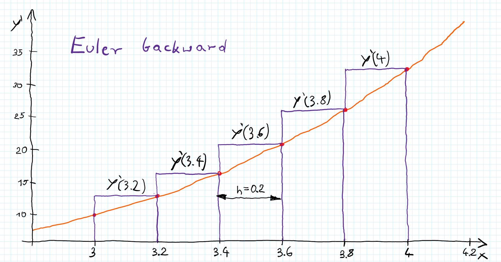

<!-- comment or image allows {: .no_toc} to work correctly  (don't ask me why) -->


{: .no_toc }

# Numerical methods for ODEs (ordinary differential equations)

<details open markdown="block">
  <summary>
    Table of contents
  </summary>
  {: .text-delta }
1. TOC
{:toc}
</details>

# Introduction
At the beginning let's explain what even are ODEs? - All differential equations that dependent on only a single independent variable. Examples of ODEs:


$$\begin{gather}
\frac{dy}{dt} = \dot{y}= -ky,
\end{gather}
$$

$$\begin{gather}
\frac{d^2y}{dt^2}+  
\frac{dy}{dt}- k^2 y = \ddot{y} + \dot{y} - k^2 y =0,
\end{gather}
$$

$$\begin{gather}
\frac{d^2y}{dx^2} = x^2 +(1+x)y^2+ \frac{y'}{y}.
\end{gather}
$$

Sometimes (pretty often) those differential equations simply don't have analytical solution or it is too complex to solve them. Then we can use numerical methods to approximate the solution. In this post we will learn about a few simplest and solve some examples from scratch. 

{: .note}
No analytical solution mean that we can not express a solution with finite combination of elementary functions - it doesn't mean there is no solution! Indeed we will use numerical methods to approximate it.


## Euler forward method

### Simplest example 
Let's start with the simplest method. We have some derivative defined as: 

$$\begin{gather} 
  \frac{dy(t)}{dt} = \dot{y}(t) = f(t,y(t)) \label{eq:euler_forw_1}
\end{gather}
$$

and initial conditions: 

$$\begin{gather}
y(t_0) = y_0   
\end{gather}
$$

Then, we want to know the value of $y$ at time $t_1$ ($y(t_1)$). The simplest solution is to calculate time difference between $t_1$ and $t_0$ ($\Delta t = t_1 -t_0$) and assume the same rate of change (constant value of $\dot{y}$ during $\Delta t$):

$$\begin{gather}
y_1 = y_0 + \Delta t \dot{y}_0 = y_0 + \Delta t f(t_0,y_0)
\end{gather}
$$


But if $\Delta t$ is big and $\dot{y}(t)$ is changing during this time, above approximation will be pretty inaccurate. The simplest solution is to make time step smaller and calculate $y_1$ in a few steps. We can set $\Delta t = \frac{t_1-t_0}{10}$ so we will calculate the value of $y_1$ in $10$ steps. We start as before:

$$\begin{gather}
y(t_0 + \Delta t) = y_0 + \Delta t f(t_0,y_0)
\end{gather}
$$

And then continue until we reach $t_1$

$$\begin{gather}
y(t_0 + 2\Delta t) = y(t_0 + \Delta t) + \Delta t f(t_0 + 
\Delta t,y(t_0 + \Delta t))\\
...\nonumber \\
y_1 = y(t_0 + 9\Delta t) + \Delta t f(t_0 + 9\Delta t,y(t_0 + 9\Delta t))
\end{gather}
$$

### General algorithm
In general equation $\ref{eq:euler_forw_1}$) can be any derivative:

$$\begin{gather}
\frac{dy(x)}{dx} = y'(x) = f(x,y(x))
\end{gather}
$$

with initial conditions: 

$$\begin{gather}
y(x_0) = y_0 
\end{gather}
$$

Then we decide about step size $h$ and start calculation:

$$\begin{gather}
y_{1} = y_{0} + hy_{0}'
\end{gather}
$$

and update variables:
  
$$\begin{gather}
  i=i+1 \label{eq:euler_forw_2}
\end{gather}
$$

$$\begin{gather}
x_{i} = x_{i-1} + h  
\end{gather}
$$

for them, calculate a value of the derivative:

$$\begin{gather}
  y'_{i}=y'(x_{i}) = f(x_{i},y_{i})
\end{gather}
$$

and calculate a next value of $y$: 

$$\begin{gather}
  y_{i+1} = y_{i} + hy'_{i}\label{eq:euler_forw_3}
\end{gather}
$$

Then repeat $\ref{eq:euler_forw_2}$)-$\ref{eq:euler_forw_3}$)  until you reach desired $x$ (and $y(x)$ of course).


### Example with numbers
Derivative is given with below equation:
$$
y' = y +3 x
$$

and initial conditions:

$$
y(3) = 1
$$

let's set the step $h= 0.2$ and calculate value of $y(4)$:

$$
y(3.2) = y(3) + hy'(3) = 1 + 0.2 *(1+3*3) = 3
$$

then repeat it 4 times and calculate $y(4)$:

$$\begin{gather*}
\begin{aligned}
y(3.4) & = y(3.2) + hy'(3.2) = 3 + 0.2 *(3+3*3.2) = 5.52\\
y(3.6) & = y(3.4) + hy'(3.4) = 5.52 + 0.2 *(5.52+3*3.4) = 8.664\\
y(3.8) & = 8.664 + 0.2 *(8.664+3*3.6) = 12.5568\\
y(4) & = 17.34816
\end{aligned}
\end{gather*}
$$

### Exact solution
Above equation has analytical solution given by: 

$$
y(x)= 13e^{x-3} -3x -3
$$

so exact solution is:

$$
y(4) \approx 20.3377
$$ 

As we can see our approximation is not so close. To improve, we can choose smaller step (eg. $h=0.01$) then we get much closer approximation ($y(4)= 20.4842$). 

## Euler backward method 
Similar method to the Euler forward one but for calculating $y_{i+1}$ instead of derivative $y_i'$ we want to use derivative from the next step:

$$\begin{gather}
y_{i+1} = y_{i} + hf(x_{i+1},y_{i+1})  
\end{gather}
$$

As you can see $y_{i+1}$ is on both sides of the equation and thats why this method is called implicit (there is no simple formula $y_{i+1}=...$). Sometimes when you rearrange variables you can get $y_{i+1}=...$ equation but for many problems it is not possible and therefore you need to also approximate value of the $y_{i+1}'$ for each step. Plus of this method is better stability than the forward one. 

### General algorithm
It is basically the same as before with a catch. Derivative:

$$\begin{gather}
\frac{dy(x)}{dx} = y'(x) = f(x,y(x))
\end{gather}
$$

initial conditions: 

$$\begin{gather}
y(x_0) = y_0 
\end{gather}
$$

Then we decide about step size $h$ insert derivative into equation:

$$\begin{gather}
y_{1} = y_{0} + hy_{1}' = y_{0} +h f(x_1,y_1)
\end{gather}
$$

If possible, rearrange above equation to get explicit formula:

$$\begin{gather}
y_{1} = g(y_{0}, x_1, h)  \label{eq:euler_back_1}
\end{gather}
$$

If not, $y_{1}'$ needs to be approximated with other methods (eg. you can calculate value of the $y_{1}'$ with Euler forward method). Then update variables:
  
$$\begin{gather}
  i=i+1  \label{eq:euler_back_2}
\end{gather}
$$

$$\begin{gather}
x_{i+1} = x_{i} + h  
\end{gather}
$$

And calculate next values of $y_{i+1}$:

$$\begin{gather}
  y_{i+1} = g(y_{i}, x_{i+1}, h)\label{eq:euler_back_3}
\end{gather}
$$

Then continue with $\ref{eq:euler_back_2})$-$\ref{eq:euler_back_3})$.

### Example with numbers

The same derivative as before:

$$
y' = y +3 x
$$

and initial conditions:

$$
y(3) = 1
$$

As before let's set the step $h= 0.2$ and find the value of $y(4)$

Because it is the implicit method we need to make some adjustment to get $\ref{eq:euler_back_1})$. Luckily, for this example we can just rearrange variables:

$$\begin{gather*}\begin{aligned}
y_{i+1} &= y_{i} + hf(x_{i+1},y_{i+1}) =  y_{i} + h(y_{i+1}  + 3x_{i+1}) \\
y_{i+1} -hy_{i+1}&= y_{i} +  3hx_{i+1} \\
y_{i+1}(1-h)&= y_{i} +  3hx_{i+1} \\
y_{i+1} &= \frac{y_{i} +  3h(x_{i}+h)}{1-h}
\end{aligned}
\end{gather*}
$$

Now we have the formula to update $y$ on each step.

Then, repeat it 5 times and calculate $y(4) = 24.6729$.

## Trapezoidal method
Euler methods are 1st order, so error of the estimation is proportional to the size of the step. As you may guess, we can do better with 2nd order method - Trapezoidal one.

### Example
Let's go back to this time derivative which may be easier to understand. So far we were using only one value of derivative (either from $i_{th}$ step or $(i+1)_{th}$) assuming that during the step $\Delta t$ it stays relatively constant. The trapezoidal method take both values and calculate the average, which can be interpreted as a slope between two values (check [Interpretation](./numerical_methods_for_ODEs#interpretation)).

As before derivative with initial conditions:

$$\begin{gather*} 
  \dot{y}(t) = f(t,y(t))\\
  y_0 = y(t_0)
\end{gather*}
$$

then we want to calculate 

$$
\begin{gather}
  y_{i+1} = y_{i} + \frac{\Delta t}{2}(\dot{y}_i+\dot{y}_{i+1}) = y_{i} + \frac{\Delta t}{2}(f(t_i,{y}_i)+f(t_{i+1}+{y}_{i+1}))\label{eq:trap_1}
\end{gather}
$$

Clearly this method is also implicit and often the $\dot{y}_{i+1}$ needs to be approximated with other numerical methods. However if possible we rearrange $\ref{eq:trap_1})$ to form similar to $\ref{eq:euler_back_1})$:

$$
\begin{gather}
   y_{i+1} = g(y_{i},\Delta t, t_i,t_{i+1})\label{eq:trap_2}
\end{gather}
$$

and then continue as usual.

### General algorithm 

Similarly to Euler backward method:

$$\begin{gather}
\frac{dy(x)}{dx} = y'(x) = f(x,y(x))
\end{gather}
$$

initial conditions: 

$$\begin{gather}
y(x_0) = y_0 
\end{gather}
$$

Then we decide about step size $h$ insert derivative into equation:

$$
\begin{gather}
y_{1} = y_{0} + \frac{h}{2}(y_0' + y_{1}') = y_{0} +\frac{h}{2}(f(x_0,y_0)+ f(x_1,y_1))
\end{gather}
$$

If possible, rearrange above equation to get explicit formula:

$$\begin{gather}
y_{1} = g(y_{0},x_0, x_1, h)  \label{eq:trap_3}
\end{gather}
$$

If not, $y_{1}'$ needs to be approximated with other methods. Then update variables:
  
$$
\begin{gather}
  i=i+1  \label{eq:trap_4}
\end{gather}
$$

$$
\begin{gather}
x_{i+1} = x_{i} + h  
\end{gather}
$$

And calculate next values of $y_{i+1}$:

$$
\begin{gather}
  y_{i+1} = g(y_{i},x_{i}, x_{i+1}, h)\label{eq:trap_5}
\end{gather}
$$

Then continue with $\ref{eq:trap_4})$-$\ref{eq:trap_5})$.

### Example with numbers
Let's find again $y(4)$ for given:

$$
y' = y +3 x
$$

and initial conditions:

$$
y(3) = 1
$$

The step is $h= 0.2$ and we rearrange implicit formula to get $\ref{eq:trap_5})$:

$$\begin{gather*}
  y_{i+1} = y_{i} + \frac{h}{2}(f(x_{i},y_{i})+f(x_{i+1},y_{i+1})) =\\ = y_{i} + \frac{h}{2}(y_{i}  + 3x_{i} + y_{i+1}  + 3x_{i+1})
\end{gather*}
$$

$$\begin{gather*}
y_{i+1} = \frac{2y_{i} +  h(y_i + 6x_{i}+3h )}{2-h}  
\end{gather*}
$$
 
and then we continue starting with initial conditions:

$$
\begin{gather*}
  \begin{aligned}
    y(3.2) &= \frac{2*1 +  0.2*(1 + 6*3+3*0.2 )}{2-0.2} = 3.2889\\
    y(3.4) &= 6.2198\\
    y(3.6) &=  9.9353\\
    y(3.8) &=  14.6098\\
    y(4) &=  20.4564\\
    \end{aligned}
\end{gather*}
$$

Which is much better than previous examples (analytical solution $y(4) = 20.3377 $).

## Runge-Kutta methods
Runge-Kutta (RK) methods comprise a family of numerical techniques used to approximate the solutions of ordinary differential equations (ODEs). We will not delve into the derivation of these methods, but rather focus on explaining the core idea and how they work.

The central concept behind RK methods is to approximate the solution at the next time step by taking **a weighted average of slopes** (derivatives) evaluated at **different points within the current time step**. This approach can be visualized as taking multiple "samples" of the derivative to obtain a more refined estimate of the overall change in the solution over the interval.

The general update formula for an s-stage Runge-Kutta method is:

$$\begin{equation}
  y_{i+1} = y_i + h \sum_{j=1}^{s} b_j k_j\label{eq:RK_1}
\end{equation}
$$

where:

*   $y_{i+1}$  is the approximation of the solution at the next time step, $t_{i+1}$.
*   $y_i$ is the approximation of the solution at the current time step, $t_i$.
*  $h$ is the step size (the time step), where $h = t_{i+1} - t_i$.
*  $s$ is the number of stages (the number of intermediate derivative evaluations within a single time step).
*   $b_j$ are the weights for each stage. These weights are constant for a given RK method and satisfy the condition $\sum_{j=1}^s b_j = 1$. This ensures that the method integrates a constant function exactly.
*   $k_j$ are the stage values, representing approximations of the derivative at different points within the time step. These are calculated using the following formulas:
  
$$
\begin{gather}
  \begin{aligned}
    k_1 &= f(t_i, y_i)\\
    k_2 &= f(t_i + c_2h, y_i + ha_{21}k_1)\\
    k_3 &= f(t_i + c_3h, y_i + h(a_{31}k_1 + a_{32}k_2))\\
    &\ ...\\
    k_s &= f(t_i + c_sh, y_i + h(a_{s1}k_1 + a_{s2}k_2 + ... + a_{s,s-1}k_{s-1}))
    \end{aligned}\label{eq:RK_2}
\end{gather}
$$
*   $f(t, y)$ is the function defining the ODE (i.e., $y'(t) = f(t, y(t))$).
*   $c_j$ are the abscissae, representing the points in time (relative to $t_i$) where the derivatives are evaluated.
*   $a_{ji}$ are coefficients that determine how the previous stage values are used to calculate the current stage value.

The coefficients $a_{ji}$, $b_j$, and $c_j$ are often organized in a **Butcher tableau**, which provides a compact and convenient way to represent a specific RK method.  The Butcher tableau encodes all the information needed to implement the method. You can find the Butcher tableau for many common RK methods in textbooks and online resources.

$$
\begin{array}
{c|cccc}0 & & & & \\
c_2 & a_{21} & & & \\
c_3 & a_{31} & a_{32} & & \\
\vdots & \vdots & & \ddots & \\
c_s & a_{s1} & a_{s2} & \cdots& a_{s,s-1} & \\
 \hline
 & b_1 & b_2 & \cdots & b_{s-1} & b_s
\end{array}
$$

**Example: Butcher Tableau for the Classical 4th-Order Runge-Kutta Method**

$$
\begin{array}{c|cccc}
0   & 0    & 0    & 0    & 0    \\
\frac{1}{2} & \frac{1}{2}  & 0    & 0    & 0    \\
\frac{1}{2} & 0    & \frac{1}{2}  & 0    & 0    \\
1   & 0    & 0    & 1    & 0    \\
\hline
    & \frac{1}{6}  & \frac{1}{3}  & \frac{1}{3}  & \frac{1}{6}
\end{array}
$$

and then you can calculate $k_j$ with $\ref{eq:RK_2})$ and $y_{i+1}$ with $\ref{eq:RK_1})$:

$$\begin{gather*}
\begin{aligned}
k_1 &=f(t_i, y_i)\\
k_2 &=f(t_i + \frac{h}{2}, y_i + \frac{h}{2}k_1)\\
k_4 &= f(t_i + h, y_i + hk_3)\\
k_3 &= f(t_i + \frac{h}{2}, y_i + \frac{h}{2} k_2)\\
y_{i+1} &= y_i + h (\frac{1}{6}k_1 + \frac{1}{3}k_2 + \frac{1}{3}k_3 + \frac{1}{6}k_4)
\end{aligned}
\end{gather*}
$$


### Explicit vs. Implicit Runge-Kutta Methods

RK methods can be classified as either explicit or implicit, depending on how the stage values ($k_j$) are evaluated.

*   **Explicit RK Methods:** In explicit methods, the stage values can be calculated sequentially, with each $k_j$ depending only on previously calculated $k$ values. This makes explicit methods straightforward to implement. The matrix $A$ (with $a_{i,j}$ coefficients) in the Butcher tableau is strictly lower triangular (all elements on and above the main diagonal are zero). Examples include the Forward Euler method (the first method described in this post), Heun's method, and the Classical 4th-Order Runge-Kutta method.

*   **Implicit RK Methods:** In implicit methods, the stage values depend on each other, requiring the solution of a system of equations at each time step. This makes implicit methods more computationally expensive, but they often exhibit superior stability properties, particularly for *stiff ODEs* (term used for system of ODEs for which some of the solvers will fail unless they use really small step - solutions of those equations contain usually terms with very different decay rates).

### Adaptive Step Size Control

To achieve a desired level of accuracy and efficiency, RK methods are often implemented with adaptive step size control. This means the method automatically adjusts the step size $h$ based on an estimate of the local error at each step.  The goal is to use **a step size that is small enough to maintain accuracy but large enough to minimize computational cost**.

Instead of predefining a fixed step size, we define a maximum acceptable error ($e_{max}$) and a minimum acceptable error ($e_{min}$). The algorithm then attempts to keep the estimated error within this range.

Since we typically don't know the exact solution (after all we are using numerical method), we need to ***estimate* the error of our numerical solution**. A common approach is to calculate two approximations of the solution at each step using two RK methods of different orders (e.g., a 5th-order method and a 4th-order method). The higher-order solution is generally more accurate, and **the difference between the two solutions provides an estimate of the local error**. This is the basis of embedded Runge-Kutta methods like Runge-Kutta-Fehlberg (RKF).

**Pseudocode for Adaptive Step Size Control:**

```python
define:
    e_max  # Maximum acceptable error
    e_min  # Minimum acceptable error
    h      # Current step size (initial value)
    t_end  # End time of the simulation
    t      # Current time (starts at t_0)
    max_iterations #Maximum number of iterations

1) Calculate:
    R_n(t+h)  # nth-order Runge-Kutta approximation at t+h
    R_m(t+h)  # mth-order Runge-Kutta approximation at t+h (m < n)

2) Calculate error estimate:
    e = abs(R_n(t+h) - R_m(t+h))  # Estimate of the local error

3) Check if error is too large:
    if e > e_max:
        h = h / 2  # Reduce step size
        if (h < minimum_h):
            print("Minimum step size reached, exiting")
            exit
        goto 1)  # Recompute with smaller step size

4) Check if error is small enough:
    if e < e_min:
        h = min(h * 2, maximum_h)  # Increase step size (but limit the maximum)

5) Advance time:
    t = t + h

6) Check end conditions:
    if iteration_count >= max_iterations:
        print("Maximum iterations reached, exiting")
        exit
    if t >= t_end:
        return R_n(t)  # Return the final approximation

7) Prepare for next iteration:
    iteration_count = iteration_count + 1
    goto 1)  # Repeat for the next time step
```


### ODE45
Classic Matlab function, used so many times but why it is so popular and used so often?

This method is an explicit 5th order RK method with adaptive step - it uses additional 4th order approximation to estimate the error (as it was described before).

Steps of **ODE45:**
1. Start with Initial Conditions: You provide the ODE, the initial conditions ($y(t_0) = y_0$), and the desired time span.

2. Calculate Two Approximations: At each time step, ODE45 calculates two approximations of the solution at the next time step:
  * $y_{i+1}^{(4)}$: A 4th-order approximation.
  * $y_{i+1}^{(5)}$: A 5th-order approximation (which is generally more accurate).

3. Estimate the Error: The difference between these two approximations is used as an estimate of the local error:
$error = ||y_{i+1}^{(5)} - y_{i+1}^{(4)}||$

4. Compare to Tolerance: The estimated error is compared to a user-specified tolerance (or a default tolerance).

5. Adjust Step Size:
  * If the $error$ is greater than the tolerance, the step size is reduced, and the calculations are repeated.
  * If the $error$ is smaller than the tolerance, the step size is increased (up to a maximum value).

6. Accept the Solution: If the error is within the acceptable range, the 5th-order approximation $y_{i+1}^{(5)}$ is accepted as the solution at the next time step.

7. Repeat: Steps 2-6 are repeated until the end of the desired time span is reached.

Basically it is classic RK method so what is so special? - the devil is in the details. 

ODE45 typically refers to the specific implementation based on the **Runge-Kutta-Dormand-Prince** (RKDP) method. The RKDP method is clever in that it shares many of the same function evaluations between the 4th-order and 5th-order approximations. This makes **the error estimation very efficient**. Below you can see Butcher Tableau for this method (yes, I know, the numbers are horrible), the first row of $b$ coefficients is for 4th-order approximation and below for the 5th. As you can see it is enough to compute **only 6 parameters** ($k_i$) and then you can achieve 4th and 5th approximation in one equation (and for computers it doesn't matter if you multiply by 2 or $- \frac{92097}{339200}$). Moreover, for this method **coefficients are such chosen to minimize the error of the fifth-order solution** (which is ultimately used for the approximation).

$$
\begin{array}{c|ccccccc}
0 & 0 \\
\frac{1}{5} & \frac{1}{5} \\
\frac{3}{10} & \frac{3}{40} & \frac{9}{40} \\
\frac{4}{5} & \frac{44}{45} & -\frac{56}{15} & \frac{32}{9} \\
\frac{8}{9} & \frac{19372}{6561} & -\frac{25360}{2187} & \frac{64448}{6561} & -\frac{212}{729} \\
1 & \frac{9017}{3168} & -\frac{355}{33} & \frac{46732}{5247} & \frac{49}{176} & -\frac{5103}{18656} \\
1 & \frac{35}{384} & 0 & \frac{500}{1113} & \frac{125}{192} & -\frac{2187}{6784} & \frac{11}{84} \\
\hline
b^{(4)} & \frac{5179}{57600} & 0 & \frac{7571}{16695} & \frac{393}{640} & -\frac{92097}{339200} & \frac{187}{2100} & \frac{1}{40} \\
\hline
b^{(5)} & \frac{35}{384} & 0 & \frac{500}{1113} & \frac{125}{192} & -\frac{2187}{6784} & \frac{11}{84} & 0 \\
\end{array}
$$

**When not to use ODE45**

While ODE45 is a great general-purpose solver, it's not always the best choice for every problem:

* **Stiff ODEs:** For highly stiff ODEs, implicit methods (e.g., `ODE15s` in `MATLAB/Octave`, `solve_ivp` with `method='BDF'` in `SciPy`) are often more efficient because they are more stable and allow for larger step sizes.

* **Very High Accuracy Requirements:** If you need very high accuracy, you might consider using a higher-order method or a method with more sophisticated error control.

* **Specific Problem Structure:** For some problems with specific structure (e.g., Hamiltonian systems, problems with conservation laws), there might be specialized methods that are more efficient (check "symplectic integrator").

* **Computational Constraints:** when your system is relatively simply and the step is small enough there is no need to use this complex method and sometimes you can even use simplest Euler forward method.


# Interpretation 
Since picture is worth a thousand words let's try to visualize above methods. For simplicity we will stick with the same example as before.

We know that area under the plot of derivative is equal to the value of the function to that point. And we can interpret above methods as different way of approximating that area. Euler forward take value of the derivative in $i_{th}$ step and multiply by $h$ we can visualize it as rectangle with sides length $y'_{i}$ and $h$. 

[](images/euler_forw.png){:class="img-responsive"} <custom_caption>Euler forward method</custom_caption>

For backward Euler method we still use rectangle but with sides $y'_{i+1}$ and $h$.

[](images/euler_back.png){:class="img-responsive"} <custom_caption>Euler backward method</custom_caption>

Trapezoidal method use average of $y_{i}'$ and $y_{i+1}'$ which can be interpret as rectangle (see dashed line) or trapezoid where bases are $y_{i}'$ and $y_{i+1}'$ and height is $h$ (solid line).

[](images/trapezoidal.png){:class="img-responsive"} <custom_caption> Trapezoidal method</custom_caption>

It is important to remember that the average of the derivative for some inputs, in general is not the same as derivative for average of the points. To better understand this check picture below. 
 
[](images/achtung.png){:class="img-responsive"} <custom_caption>Trapezoidal method (dashed lines)</custom_caption>

# Higher order equations 
Probably you noticed that all examples so far were 1st order, but how to solve higher order equations? 

\- I don't know, but we can transform them into the set of 1st order equations and then use previous methods. Let's do it!

Let's solve this 3rd order equation:

$$\begin{gather*}
\dddot{y}(t) + 2\ddot{y}(t) - \dot{y}(t) + y(t) = 0\\
y(0) = 1\\
\dot{y}(0) = 0\\
\ddot{y}(0) = -1
\end{gather*}
$$

Then we can define set of 1st order equations (for clarity I will abandon notation $y(t)$ for $y$):

$$
\begin{cases}
y_1 = y\\
y_2 = \dot{y}_1\\
y_3= \dot{y}_2\\
\dot{y}_3 + 2y_3 - y_2 + y_1 = 0 
\end{cases}
$$

Then we can just apply **Euler forward method:**

$$\begin{gather*}
y_{1_{i+1}} = y_{1_i} + h y_{2_i}\\
y_{2_{i+1}} = y_{2_i} + h y_{3_i}\\
y_{3_{i+1}} = y_{3_i} + h (-2y_{3_i} + y_{2_i} - y_{1_i})
\end{gather*}
$$

Let's do first 2 steps. Initial conditions:

$$\begin{gather*}
y_{1_0} = 1\\
y_{2_0} = 0\\
y_{3_0} = -1
\end{gather*}$$

1st step:

$$\begin{gather*}
  t_1 =& t_0 + h = 0 + 0.1 = 0.1\\
y_{1_1} =& y_{1_0} + h  y_{2_0} = 1 + 0.1 * 0 = 1\\
y_{2_1} =& y_{2_0} + h  y_{3_0} = 0 + 0.1 * (-1) = -0.1\\
y_{3_1} =& y_{3_0} + h  (-2y_{3_0} + y_{2_0} - y_{1_0}) =\\ =& -1 + 0.1 * (-2*(-1) + 0 - 1)= -0.9
\end{gather*}
$$

2nd step:

$$ 
\begin{gather*}
t_2 =& t_1 + h = 0.1 + 0.1 = 0.2\\
y_{1_2} =& y_{1_1} + h y_{2_1} = 1 + 0.1 * (-0.1) = 0.99\\
y_{2_2} =& y_{2_1} + h y_{3_1} = -0.1 + 0.1 * (-0.9) = -0.19\\
y_{3_2} =& y_{3_1} + h (-2y_{3_1} + y_{2_1} - y_{1_1}) =\\ =& -0.9 + 0.1 * (-2*(-0.9) - 0.1 - 1) = -0.83
\end{gather*}
$$

And so on...

If you're wondering how it would be for **trapezoidal:**

$$\begin{gather*}
y_{1_{i+1}} = y_{1_i} + \frac{h}{2}(y_{2_i}+y_{2_{i+1}})\\
y_{2_{i+1}} = y_{2_i} + \frac{h}{2}(y_{3_i}+y_{3_{i+1}})\\
y_{3_{i+1}} = y_{3_i} + \frac{h}{2} ((-2y_{3_i} + y_{2_i} - y_{1_i})+(-2y_{3_{i+1}} + y_{2_{i+1}} - y_{1_{i+1}}))
\end{gather*}
$$

In this case we can rearrange it to get explicit form (see below) but in general to approximate $y_{n_{i+1}}$ you may need to use other methods which are not covered in this post. 

$$\begin{gather*}
y_{1_{i+1}} = y_{1_i} + \frac{h}{2}(y_{2_i}+y_{2_i} + \frac{h}{2}(y_{3_i}+y_{3_{i+1}}))\\
y_{2_{i+1}} = y_{2_i} + \frac{h}{2}(y_{3_i}+y_{3_{i+1}})\\
y_{3_{i+1}} = \frac{(1 - h + \frac{h^2}{4} - \frac{h^3}{8})y_{3_i} + (h - \frac{h^2}{2})y_{2_i} - h y_{1_i}}{1 + h - \frac{h^2}{4} + \frac{h^3}{8}}
\end{gather*}
$$

# Summary
This post provides a brief overview of numerical methods for solving ODEs, highlighting key considerations for practical application.

1) **Step Size Matters:** While all numerical methods converge to the true solution as the step size approaches zero ($h \rightarrow 0$), the simple forward Euler method is often adequate for applications where high accuracy is not required. Don't automatically reach for sophisticated solvers like `ODE45` for every project ([practical example for drone attitude calculation](../quaternions/quaternion_update)).

2) **Handling Vector-Valued Functions:** The techniques discussed extend naturally to vector-valued functions. For instance, if you're estimating position in 3D space with velocity $\boldsymbol{v}(t) = \dot{\boldsymbol{x}}(t)$, the Euler forward method becomes:

$$
\boldsymbol{x}(t_x +\Delta t) = \boldsymbol{x}(t_x) + \Delta t \boldsymbol{v}(t_x)
$$

3) **Beware of Instability:** Numerical methods can become unstable if the step size is chosen poorly (a topic beyond the scope of this post). Some methods, like the forward Euler, are significantly less stable than others (e.g., backward Euler). If your simulation exhibits unexpected behavior, consider stability as a potential cause. For a deeper dive into the stability of Euler methods, see this excellent resource from Steve Brunton: [link](https://www.youtube.com/watch?v=RdXCGnTT6UY).

4) **Implicit Methods Require Iteration**: Unlike explicit methods, implicit methods often require solving an equation to find the solution at the next time step. When a direct solution is not possible (as with the backward Euler example), iterative methods like Newton-Raphson are necessary to approximate the solution.

5) **Further Exploration**: This post is merely an introduction to a vast field. Numerous other numerical methods exist, each with its own strengths and weaknesses, suitable for different types of ODEs and applications.


