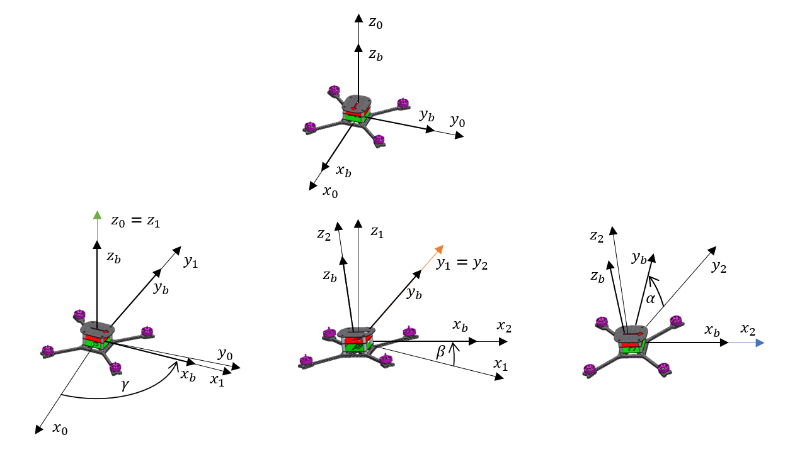
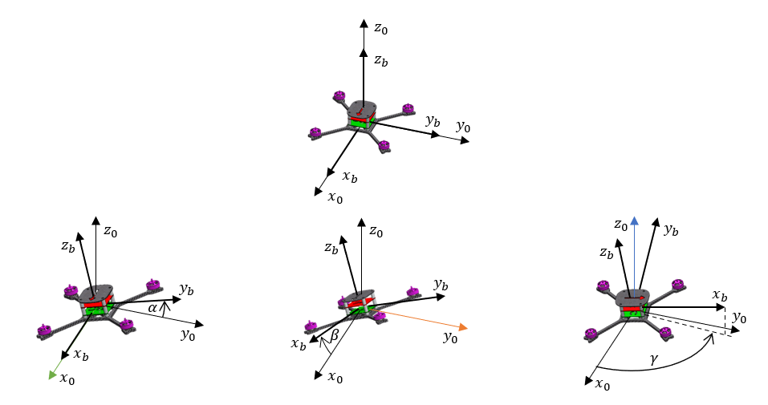
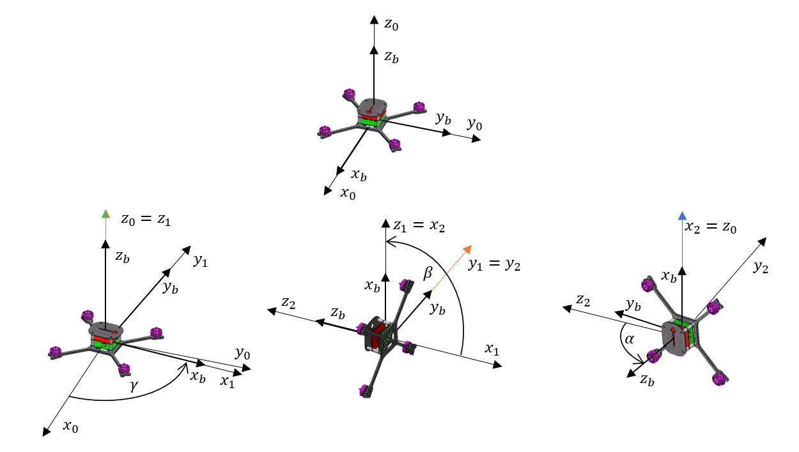

<!-- comment or image allows {: .no_toc} to work correctly  (don't ask me why) -->

{: .no_toc}

# Euler angles

  

    Table of contents
  

  {: .text-delta }
1. TOC
{:toc}

# Euler or Tait-Bryan angles?

The most intuitive way to describe orientation is through Euler angles. The 3 angles tell about successive rotations about fixed axes. In these free rotations, you can achieve any orientation from every other. There are 12 possible combinations of these rotations. In 6 of them the first and third rotation is performed about the same axis (x-z-x, x-y-x, y-x-y, y-z-y, z-y-z, z-x-z) this convention was introduced by Leonhard Euler and these angles are called Euler angles. The other 6 possible combinations of rotations are about 3 different axes (x-y-z, x-z-y, y-x-z, y-z-x, z-y-x, z-x-y), called Tait-Bryan angles after their creators (these are also sometimes called Euler angles and to make it simpler will be included in this name).

Note that each of these rotations can be performed in the system associated with the object (extrinsic rotations) or in an external, static system (intrinsic rotations). The mutual equivalences are as follows (left - rotations about the internal axes, right - rotations in the external system)

Euler angles:

$$
\begin{gather*}    x_1-z'-x_2^{"}\ or\ x_2-z-x_1\\x_1-y'-x_2^{"}\ or\ x_2-y-x_1\\y_1-x'-y_2^{"}\ or\ y_2-x-y_1\\ y_1-z'-y_2^{"}\ or\ y_2-z-y_1\\z_1-y'-z_2^{"}\ or\ z_2-y-z_1\\ z_1-x'-z_2^{"}\ or\ z_2-x-z_1\\ \end{gather*}
$$

Tait-Bryan angles:

$$
\begin{gather*}    x-y'-z^{"}\ or\ z-y-x\\ x-z'-y^{"}\ or\ y-z-x\\ y-x'-z^{"}\ or\ z-x-y\\ y-z'-x^{"}\ or\ x-z-y\\ z-y'-x^{"} \ or\ x-y-z\\ z-x'-y^{"}\ or\ y-x-z\\ \end{gather*}
$$

{: .note}
The set $$z-y'-x^{"}$$ is also called yaw-pitch-roll angles and will be used in my project

Below you can see how Euler angles work in a real situation:

<custom_caption>Euler angles in body frames</custom_caption>

<custom_caption>Euler angles in a world frame</custom_caption>

The first picture shows the yaw-pitch-roll convention which is commonly used in aviation and aerospace because of the intuitive nature of its movements: at first, the aircraft positions itself on the runway (yaw angle change), then it starts to climb (pitch angle), and finally it adjusts the roll (roll angle). The only difference in the reference system used in aviation, from the one shown in this picture is the sign of the Z-axis. This has its justification since the aircraft ascends and increases the pitch angle (at the Z-axis pointing down). In the case of drones, it is not necessary to raise the "nose of the plane" during take-off, so the Z-axis directed upwards seems to be more intuitive. In addition, the forward movement of the drone involves tilting the front of the drone, which in the assumed reference system increases the angle of pitch. This arrangement seems to be the most intuitive for drones and will be used. To ensure the readability of the equations, instead of the angles yaw, pitch and roll will be used in Greek letters: yaw = $\gamma$, pitch = $\beta$, roll = $\alpha$.

# Gimbal Lock

Although Euler angles are pretty easy to understand there is one big problem. Regardless of the rotation scheme chosen, in the case of Euler angles, there is always a position for which it is impossible to determine the 1st and 3rd angles separately. Looking at the figure below, it can be seen that after the 2nd rotation, the 3rd rotation axis ($x_2$) coincides with the 1st rotation axis ($z_0$). Further rotation is equivalent to a rotation of a larger angle ($\gamma+\alpha$) during the 1st rotation. This specific position can be reached by using any combination of 1st and 3rd rotations, as long as their sum is constant. For this position, it is not possible to determine one pair of angles of 1st and 3rd turns. Moreover, the problem with determining these angles starts to appear already in the surroundings of this position.

<custom_caption>Gimbal lock in a real situation</custom_caption>

So, to answer the title question - all of these names describe the same idea but Euler angles are the most common and the widely known, Tait-Bryan angles are those Euler angles where every rotation is about a different axis and yaw-pitch-roll is one specific set of movement used in aerospace.
