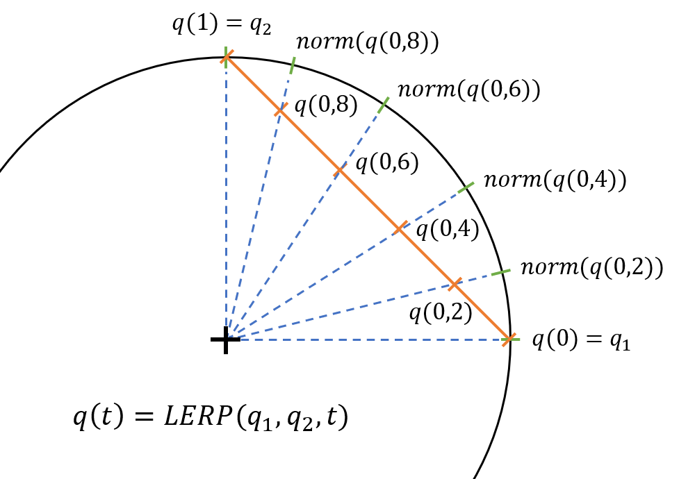
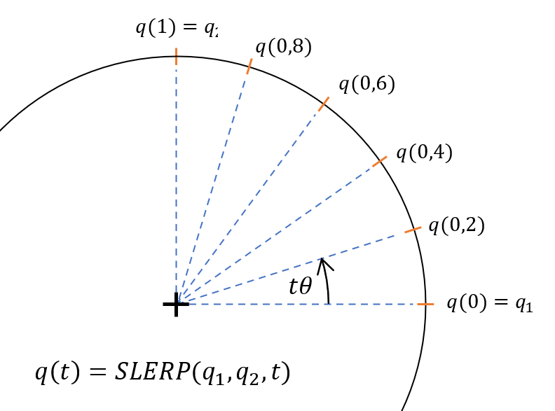
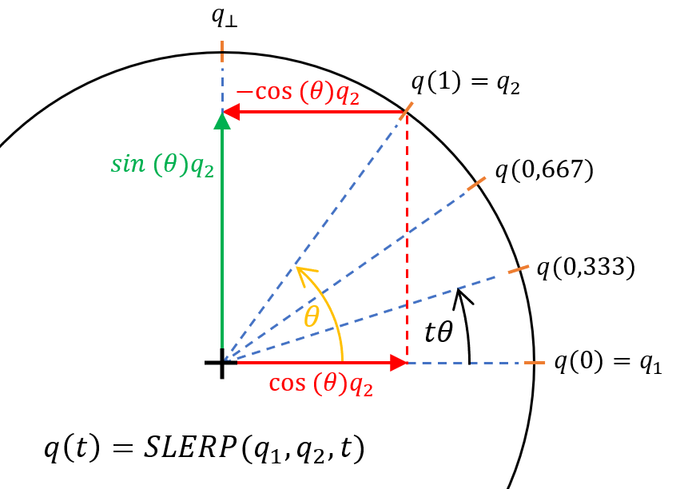

  

    Table of contents
  

  {: .text-delta }
1. TOC
{:toc}

# Intro

Whenever you've got 2 numbers and you want something between them, you want some kind of interpolation. You want a quaternion that is a combination of two given. So you can use the simplest idea of combining two numbers:

$$
\begin{gather}
\mathbf{q}_{3}=\alpha \mathbf{q}_{1} +(1-\alpha)\mathbf{q}_{2} \label{eq:LERP}
\end{gather}
$$

This is LERP (_Linear Interpolation_) but since, for orientation purposes quaternion needs to have a norm of 1, after this interpolation you need to normalize the result:

$$
\begin{gather}
\mathbf{q}_{3}=norm(\alpha \mathbf{q}_{1} +(1-\alpha)\mathbf{q}_{2}) \label{eq:NLERP}
\end{gather}
$$

and that is NLERP (*Normalized Linear Interpolation*).

# Interpretation and consequences

If we imagine a circle with a radius of 1 which is going across quaternions that we want to interpolate that would be the great arc that should be followed to achieve quaternions between those two. But if we use (\ref{eq:LERP}) $\mathbf{q}_{3}$ will not have a norm of 1. Why? - because with LERP we assume that quaternions between $\mathbf{q}_1$ and $\mathbf{q}_2$ lay on a straight line, but in reality, they are on the arc, and components of these quaternions don't change linearly. We can make the norm of quaternion go back to 1 by normalization (see (\ref{eq:NLERP})). But this process only "stretches" components of quaternions to put them back on the arc. So interpolated quaternions are not evenly distributed over the arc. You can see in the picture below:

<custom_caption>LERP and NLERP methods presentation</custom_caption>

And now if we consider rotation between $\mathbf{q}(0)$ and $\mathbf{q}(1)$ with a constant time interval this motion will not have constant speed at the middle of movement speed will be higher than at the beginning and at the end (visualization and more you can find on this page). The problem of this solution is that it divides distance into equal parts not an angle between quaternions.

The SLERP (_Spherical Linear Interpolation_) method is the solution to the problem of equal division of the angle. At first, a geometric solution will be presented to better illustrate its operation. Then the actual method will be shown using the properties of quaternions. To keep the distribution of points on the arc along which the rotation takes place, the angle between the start and endpoints should be divided, not the distance that separates them. In the case where the quaternions are orthogonal ($\mathbf{q}_1\cdot \mathbf{q}_2=0$) the situation simplifies to that known from 2D rotation (see figure bellow):

$$
\begin{gather}    SLERP(\mathbf{q}_1,\mathbf{q}_2,t)=\cos{(t\frac{\pi}{2})}\mathbf{q}_1+\sin{(t\frac{\pi}{2})}\mathbf{q}_2 \\ \nonumber\\ \textrm{where $t\in <0,1>$}\nonumber \end{gather}  
$$

<custom_caption>SLERP when quaternions are orthogonal</custom_caption>

In most cases, however, the quaternions are not orthogonal to each other. Therefore, you must first determine the difference between quaternion $\mathbf{q}_2$ and the projection of quaternion $\mathbf{q}_2$ onto quaternion $\mathbf{q}_1$. After normalization, the resulting quaternion is unitary and orthogonal to quaternion $\mathbf{q}_1$:

$$
\begin{gather}\begin{split}    \mathbf{q}_{\perp}=norm(\mathbf{q}_2-\cos{\theta}\mathbf{q}_1)=norm(\mathbf{q}_2-(\mathbf{q}_1\cdot \mathbf{q}_2)\mathbf{q}_1)=\\   =\frac{\mathbf{q}_2-(\mathbf{q}_1\cdot \mathbf{q}_2)\mathbf{q}_1}{|| \mathbf{q}_2-(\mathbf{q}_1\cdot \mathbf{q}_2)\mathbf{q}_1||}=\frac{\mathbf{q}_2-(\mathbf{q}_1\cdot\mathbf{q}_2)\mathbf{q}_1}{||\mathbf{q}_2\sin{\theta}||}=\frac{\mathbf{q}_2-(\mathbf{q}_1\cdot \mathbf{q}_2)\mathbf{q}_1}{\sin{\theta}}\end{split}
\end{gather}
$$

Next, it can be written:

$$
\begin{gather}
SLERP(\mathbf{q}_1,\mathbf{q}_2,t)=\cos{(t\theta)}\mathbf{q}_1+\sin{(t\theta)}\mathbf{q}_{\perp}\nonumber \\=\cos{(t\theta)}\mathbf{q}_1+\sin{(t\theta)}\frac{\mathbf{q}_2-(\mathbf{q}_1\cdot \mathbf{q}_2)\mathbf{q}_1}{\sin{\theta}}\end{gather}
$$

<custom_caption>SLERP method in the general case</custom_caption>

The above equations are based on geometric operations for vectors. They are correct, but quaternions allow us to simplify these calculations considerably. For quaternions, you can determine the quaternion $$\mathbf{q}_{\Delta}$$ by which the quaternion $$\mathbf{q}_{1}$$ must be multiplied to obtain $$\mathbf{q}_{2}$$:

$$
 \begin{equation}     \mathbf{q}_{\Delta}=\mathbf{q}_2\mathbf{q}_1^{-1}= \mathbf{q}_2\mathbf{q}_1^{*}\end{equation}
 $$

knowing $\mathbf{q}_{\Delta} $ we can write:

$$
  \begin{equation}    SLERP(\mathbf{q}_1,\mathbf{q}_2,t)=\mathbf{q}_{\Delta}^t \mathbf{q}_1=\left(\mathbf{q}_2\mathbf{q}_1^{*}\right)^t\mathbf{q}_1 \end{equation}
$$

At the end the function $\mathbf{q}^t$ must be defined; according to the exponential form of quaternion:

$$
 \begin{gather}     \mathbf{q}^t=e^{t\theta\mathbf{v}}=\cos{(t\theta)}+\mathbf{v}\sin{(t\theta)}\\  \nonumber \\  \textrm{where $t\in <0,1>$}\nonumber  \end{gather}
 $$

for $ \mathbf{q}_{\Delta}^t$:

$$
 \begin{gather} \mathbf{q}_{\Delta}^t= \cos{(t\theta_x)} +\mathbf{v}\sin{(t\theta_x)} \\ \nonumber \\ \textrm{where $\theta_x = \arccos{(Re(\mathbf{q}_{\Delta}))}$ and $\mathbf{v} = \frac{Im(\mathbf{q}_{\Delta})}{||Im(\mathbf{q}_{\Delta})||}$}\nonumber \end{gather}
 $$

finally:

$$
 \begin{gather}  SLERP(\mathbf{q}_1,\mathbf{q}_2,t)=\nonumber \\ \begin{split}=\cos{(t\arccos{(Re(\mathbf{q}_2\mathbf{q}_1^{*}))})} +\nonumber\\+\frac{Im(\mathbf{q}_2\mathbf{q}_1^{*})}{||Im(\mathbf{q}_2\mathbf{q}_1^{*})||}\sin{(t\arccos{(Re(\mathbf{q}_2\mathbf{q}_1^{*}))})}\end{split} \label{eq:SLERP}\end{gather} 
$$

It is worth noting that for small angles the NLERP method does not give large errors and can be successfully used. Moreover, when you're using NLERP just to find a quaternion between you can use it as it is less computationally expensive. 
One more thing - the shortest path
The above equations ensure movement along the appropriate arc, but the shortest rotation path is not guaranteed. Because of the double coverage (see this post), the position defined by quaternion $\mathbf{q}$ is the same as the rotation described by $\mathbf{-q}$. However, interpolation using these two quaternions is not identical (one corresponds to rotation about angle $\theta$ and the other about $-(360^{\circ}-\theta)$. Therefore, before performing the interpolation, it is necessary to check which quaternion ($\mathbf{q}$ or $\mathbf{-q}$) is closer to the other quaternion being interpolated. A simple solution is to find the angle between the interpolated quaternions. If $\cos{\theta}=\mathbf{q}_1\cdot\mathbf{q}_2<0 $ then it means that the angle is greater than $90^{\circ}$ (which corresponds in 3D space to a rotation of more than 180°) and you should multiply by $-1$ one of the quaternions and then proceed to interpolation. It is worth noting that it does not matter in which of the quaternions the sign is swapped because they still describe the same position in 3D space.

# NLERP or SLERP algorythm

So finally we can write steps on how to interpolate quaternions $ \mathbf{q}_1 $ and $\mathbf{q}_2$:
1.    Check if quaternions are on the same hemisphere of the hypersphere: $ \cos{\theta}=\mathbf{q}_1\cdot\mathbf{q}_2\ge0 $,
2.    If not multiply one of interpolated quaternion by $-1$: $ \mathbf{q}_1 =-\mathbf{q}_1 $ or $ \mathbf{q}_2 = - \mathbf{q}_2 $,
3.    Decide which method you want to use: NLERP or SLERP,
4.    Use formula (\ref{eq:NLERP}) or (\ref{eq:SLERP}).